# Morse Code Toolkit

An Android app for learning and practicing Morse code: transmit letters/words/free text as light, sound or vibration, receive and decode practice sessions, listen to and decode real Morse audio through the microphone, review flashcards and a reference handbook, and play two arcade mini-games (Flappy Bird, Battle City) built on an in-tree Morse-controlled game engine. A guided first-launch tour and per-screen tips help new users find their footing without reading a manual first.

<p align="center">
  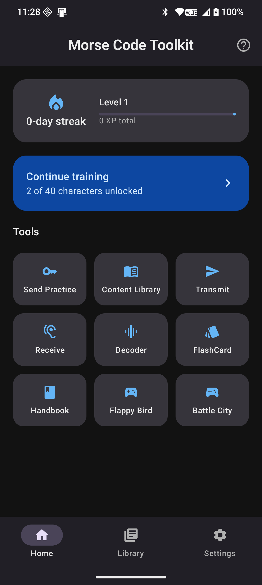
  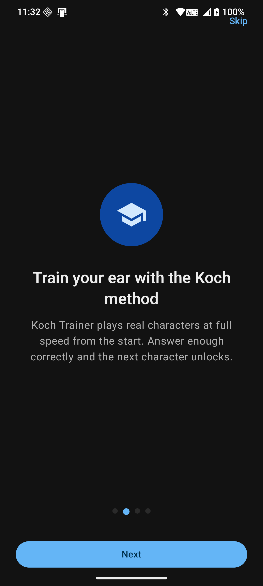
  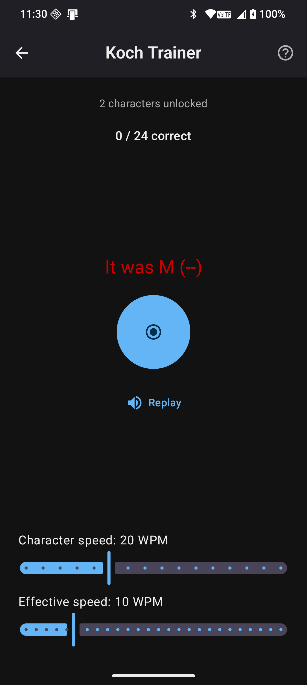
  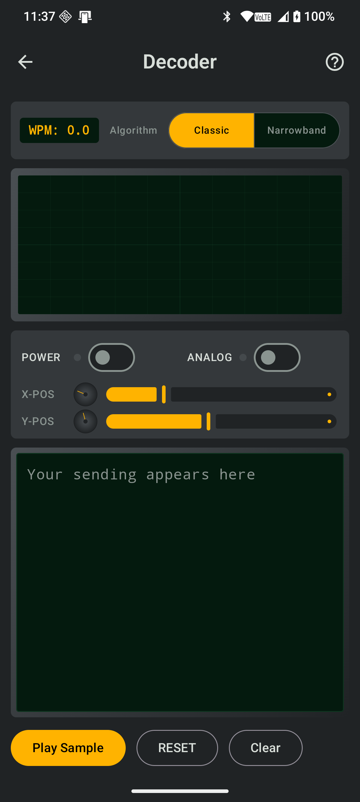
</p>

## Features

- **Home dashboard** — streak/XP tracking, a "continue training" shortcut back into the Koch Trainer, and a tool grid for every screen.
- **Koch Trainer** — the Koch method of learning Morse: characters play at full speed from the very first lesson, and new characters unlock only once you're answering accurately.
- **Transmit** — encode letters, words or free text into Morse (flash/tone/vibration).
- **Receive** — practice decoding letters, words or free text.
- **Send Practice** — key a target word or callsign by hand on an on-screen straight key and see it decoded live.
- **Decoder** — listens through the device microphone and decodes live Morse audio in real time, styled as a bench oscilloscope, with a choice of two detection modes (see below).
- **Flashcards** — quick drill through the Morse alphabet.
- **Content Library** — reference material for Q-codes, prosigns, callsigns and sample QSOs.
- **Handbook** — reference material.
- **Settings** — theme, transmit/receive modes, decoder sample rate, flashcard behavior, training-progress reset, and tutorial replay, all in one place.
- **Games** — Flappy Bird and Battle City, controlled via Morse input, running on a bundled 2D/OpenGL game engine.
- **In-app tutorials** — a first-launch onboarding tour, a Home-screen coach-mark walkthrough, and short "how this works" tips on every tool screen (see [In-app tutorials](#in-app-tutorials) below).

## Screenshots

<table>
  <tr>
    <td align="center">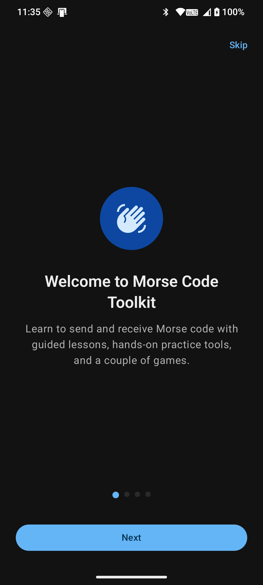<br><sub>First-launch onboarding</sub></td>
    <td align="center">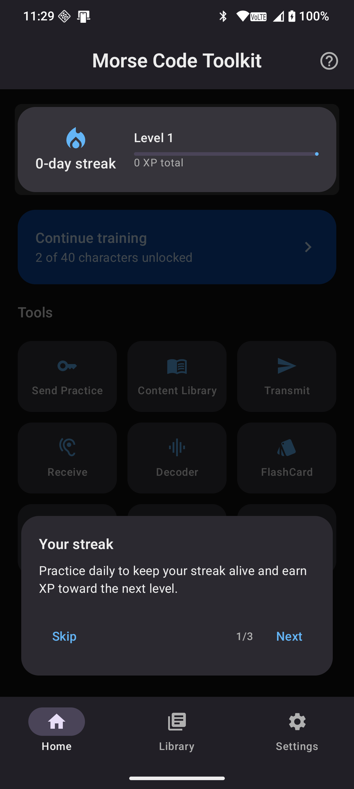<br><sub>Home coach-mark tour</sub></td>
    <td align="center"><br><sub>Home dashboard</sub></td>
    <td align="center">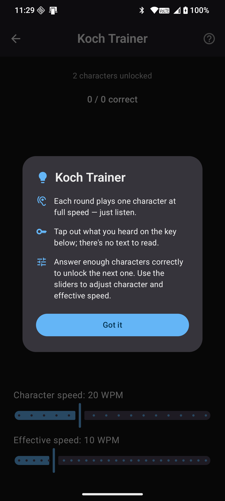<br><sub>Koch Trainer tip dialog</sub></td>
  </tr>
  <tr>
    <td align="center"><br><sub>Koch Trainer in progress</sub></td>
    <td align="center">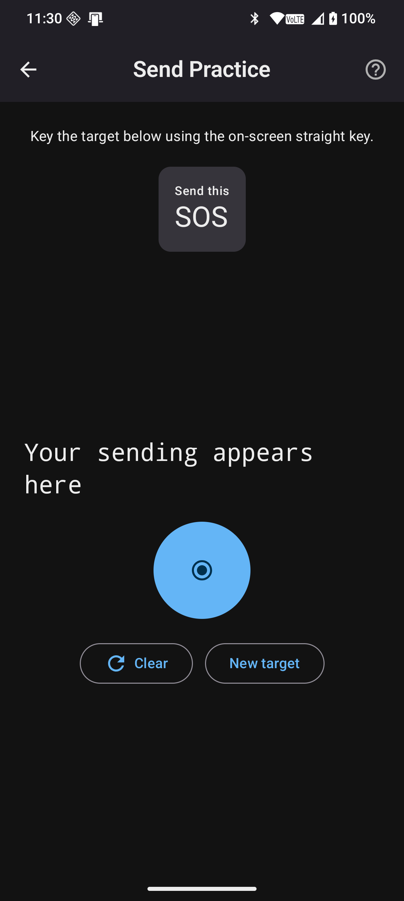<br><sub>Send Practice</sub></td>
    <td align="center">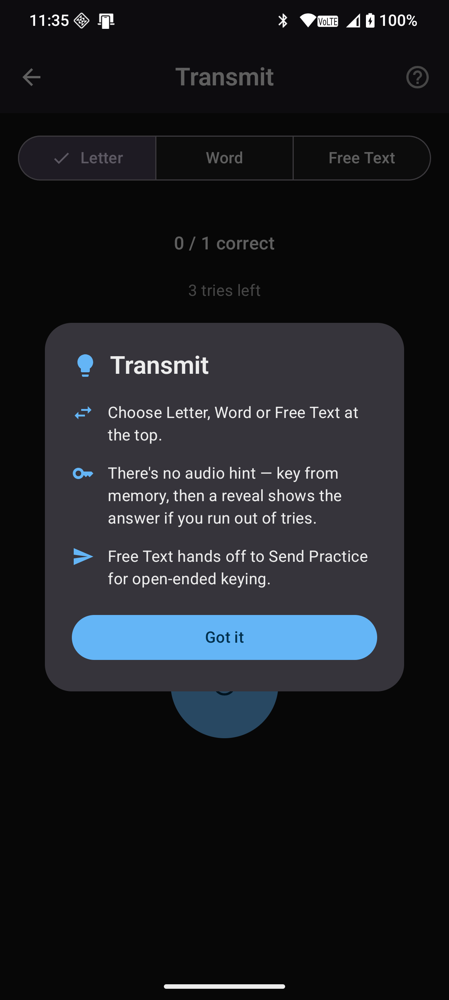<br><sub>Transmit tip dialog</sub></td>
    <td align="center">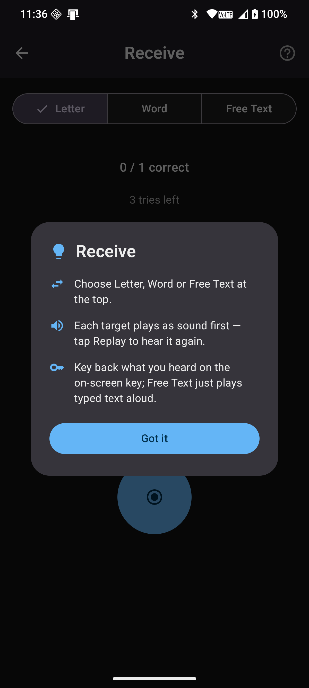<br><sub>Receive tip dialog</sub></td>
  </tr>
  <tr>
    <td align="center">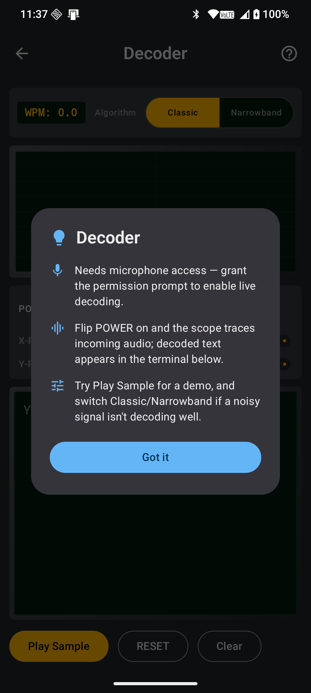<br><sub>Decoder tip dialog</sub></td>
    <td align="center"><br><sub>Live audio decoder</sub></td>
    <td align="center">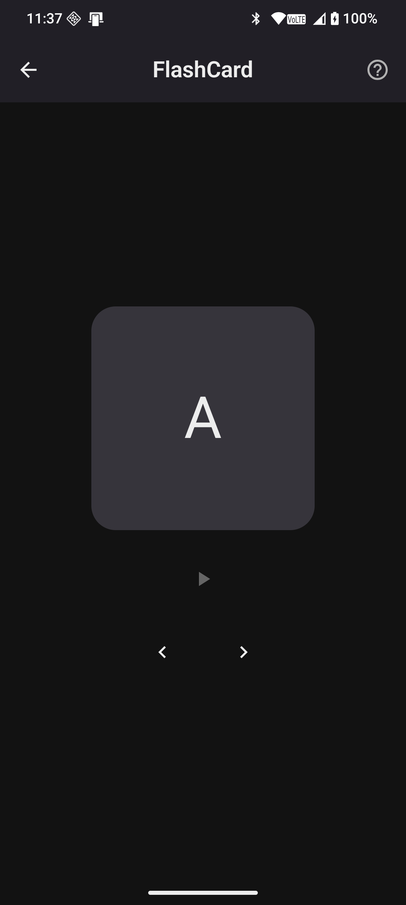<br><sub>Flashcards</sub></td>
    <td align="center">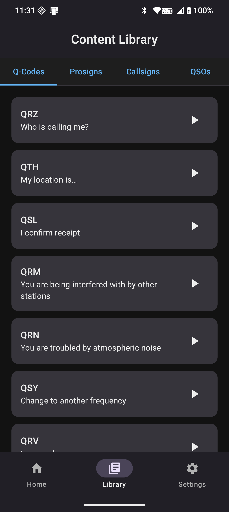<br><sub>Content Library</sub></td>
  </tr>
  <tr>
    <td align="center" colspan="4">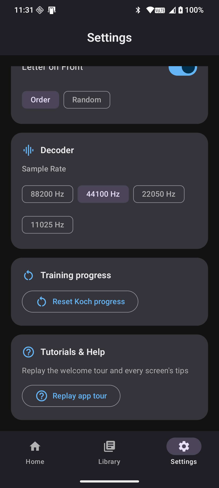<br><sub>Settings — replay tutorials anytime</sub></td>
  </tr>
</table>

## User guide

### Getting started

The first time you open the app, a four-page **onboarding tour** introduces what the app does, the Koch training method, the practice tools, and how progress tracking works. Swipe through it or tap **Skip**; either way you land on the **Home** dashboard afterward. The first time you visit Home, a **coach-mark tour** dims the rest of the screen and walks you through the streak card, the "Continue training" shortcut, and the tools grid, one at a time.

You never have to hunt for this again — see [In-app tutorials](#in-app-tutorials) for how to bring any of it back.

### Home

The dashboard you land on every time. It shows:

- **Streak & level** — a day-streak counter and a level/XP bar that fills as you practice.
- **Continue training** — jumps straight into the Koch Trainer at your current unlocked character set.
- **Tools grid** — one tile per screen: Send Practice, Content Library, Transmit, Receive, Decoder, FlashCard, Handbook, and the two games.

The bottom navigation bar (Home / Library / Settings) is always available from these three top-level screens.

### Koch Trainer

The recommended way to actually learn Morse. Unlike flashcards or a printed chart, the Koch method never asks you to *read* the code — it plays a single character at full speed and you answer by tapping it out on the on-screen key. Get enough answers right and the next character in the sequence unlocks; the **Character speed** and **Effective speed** sliders (Farnsworth timing) let you tune how fast letters sound versus how much gap you get to think between them.

### Send Practice

A sandbox for keying: a target word, abbreviation, or callsign is shown, you key it out on the straight key, and your input is decoded live underneath as you go. **Clear** resets your attempt; **New target** picks another word (occasionally swapping in a randomly generated callsign via the built-in callsign drill).

### Transmit / Receive

The classic drill pair, each with **Letter**, **Word**, and **Free Text** modes:

- **Transmit** shows you a target with no audio hint — you key from memory, and get a limited number of tries before the answer is revealed.
- **Receive** plays the target as sound first (with a **Replay** button), and you key back what you heard.

Free Text in both modes hands off to Send Practice / Receive's own type-and-play field for open-ended text rather than duplicating a third sandbox.

### Decoder

Turns your microphone into a Morse-to-text decoder in real time, styled as a bench oscilloscope panel — POWER and ANALOG toggles, X-POS/Y-POS trace controls, and a phosphor-green scope screen tracing the incoming tone. Requires the `RECORD_AUDIO` permission on first use. **Play Sample** plays a bundled demo clip so you can see it decode without needing a real Morse source at hand. Two detection algorithms are available:

- **Classic** (default) — a broadband magnitude-threshold detector; simple and generally the more robust option.
- **Narrowband** — a Goertzel single-tone detector that's more selective against background noise, at the cost of only tracking one frequency band.

### Flashcards

A simple flip-card deck through the whole alphabet, numbers and punctuation. Tap the card to flip between the letter and its Morse pattern, use the arrow buttons to move to the next card (sequential or shuffled, per Settings), and tap the play icon to hear the current pattern.

### Content Library

Reference material browsable by category: **Q-codes**, **Prosigns**, **Callsigns**, and sample **QSOs** (simulated on-air exchanges), each with a play button to hear it in Morse.

### Settings

Everything configurable lives here: theme (system/light/dark), transmit/receive mode and letter-type filters, keypad WPM and input speed, play-sound and volume, flashcard face/order, decoder sample rate, a training-progress reset, and — new — **Tutorials & Help**, covered next.

## In-app tutorials

Every tutorial surface is designed to be seen once automatically and revisited on demand, never to block you:

| Surface | When it appears | How to bring it back |
|---|---|---|
| **Onboarding pager** | Once, on first app launch | Settings → Tutorials & Help → **Replay app tour** |
| **Home coach-mark tour** | Once, on first visit to Home | Tap the **?** icon in the Home top bar |
| **Per-screen tip dialog** (Koch Trainer, Send Practice, Transmit, Receive, Decoder, FlashCard) | Once, on first visit to that screen | Tap the **?** icon in that screen's top bar |

Tapping **Replay app tour** in Settings resets every one of the flags above at once, so the next launch (and next visit to each tool screen) shows its tutorial again — handy after a UI change, or just to see the tour again. Everything is tracked independently of your theme and training-progress settings, so replaying tutorials never touches your streak, XP, or unlocked characters.

## Project structure

- `app/` — the Android application (Compose UI, transmit/receive/decoder screens, navigation drawer, ViewModels).
- `decoder/` — a pure-JVM (no Android dependencies) library module holding the audio-to-Morse decoding core: the timing state machine, the broadband and narrowband tone detectors, and the shared Morse lookup tables. Extracted from `app/` so the decoding logic can be unit tested with plain JUnit and reasoned about independently of Android. `app/` depends on it for the actual mic-capture/UI plumbing.
- `gameengine/` — an in-tree Android library module containing the Guidebee Game Engine (Java game framework + JNI/OpenGL ES 2.0 + Box2D native code, built via `ndkBuild`). The two games in `app/` depend on this module directly; there is no external `game-engine` artifact.

### Decoder architecture

- `DecoderViewModel` (`app/`) owns the mic-capture lifecycle, UI state and settings persistence, surviving rotation/navigation; `DecoderScreen` is a thin Compose observer of its `StateFlow`.
- `AudioDecoderController` (`app/`) wraps `AudioRecord`, exposing capture as a suspend function driven by a coroutine (`viewModelScope.launch { controller.capture() }`) rather than a raw `Thread`.
- `AudioMorseCodeDecoder` (`decoder/`) supports two `DetectionMode`s, switchable from the Decoder screen and persisted across launches:
  - **Classic (broadband)** — the original, simpler magnitude-threshold detector; the default, and generally the more robust of the two.
  - **Narrowband** — a Goertzel-based single-tone detector with a self-adjusting decaying-peak-follower threshold; more selective against background noise, but currently a secondary option to Classic.
- `MorseCodePatternMatch` (`decoder/`) is the dot/dash/letter/word timing state machine. It adapts to the sender's actual WPM using a median of recent dot/dash lengths (rather than reacting to any single element), which bounds how much a single noisy or atypical element can swing calibration.

### Tutorial architecture

- `TutorialPreference` (`app/…/training/`) is a small SharedPreferences store, independent of `ThemePreference` and `ConfigInfo`, tracking which tutorials have been seen (`onboarding_seen`, plus one `seen_<key>` flag per tool screen).
- `OnboardingScreen` is a `HorizontalPager`-based first-launch walkthrough, wired into `MorseApp`'s NavHost as its own route; whether it or Home is the start destination is decided once per process from `TutorialPreference.hasSeenOnboarding`.
- `CoachMarkOverlay` / `CoachMarkState` (`ui/CoachMark.kt`) implement a reusable spotlight tour: composables register their on-screen bounds via `Modifier.coachMarkAnchor`, and the overlay dims the screen with a `BlendMode.Clear` cutout around the current step's anchor, alongside a bottom instruction card.
- `TutorialDialog` (`ui/TutorialDialog.kt`) is the shared "how this screen works" popup (icon + title + a handful of one-line tips) used by every tool screen.

## Requirements

- JDK 17+
- Android SDK with platform/build-tools for API level 37 installed
- Android NDK `21.4.7075529` (pinned in `gameengine/build.gradle` for the native engine build)

## Building

```
./gradlew assembleDebug      # build the debug APK
./gradlew installDebug       # build and install on a connected device/emulator
./gradlew :decoder:test      # run the decoder's plain-JUnit test suite (no emulator needed)
./gradlew :app:testDebugUnitTest  # run app-level unit tests, incl. decoding the bundled sample wav
```

Gradle wrapper is pinned to Gradle 9.7.1; the Android Gradle Plugin version is set in the root `build.gradle`.

## Notable configuration

- `minSdk 21`, `compileSdk`/`targetSdk 37`.
- `RECORD_AUDIO` permission is required for the Decoder screen.
- The `gameengine` module builds its native library via `externalNativeBuild { ndkBuild { ... } }` pointing at `gameengine/src/main/jni/Android.mk`; no manual native build step is needed — Gradle invokes `ndkBuild` automatically as part of the normal build.
- Native game-engine libraries are linked with 16 KB ELF LOAD-segment alignment for compatibility with Android devices using 16 KB memory pages.
