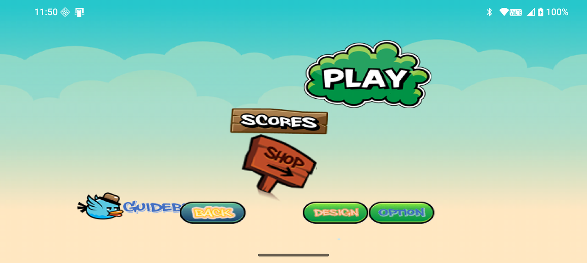
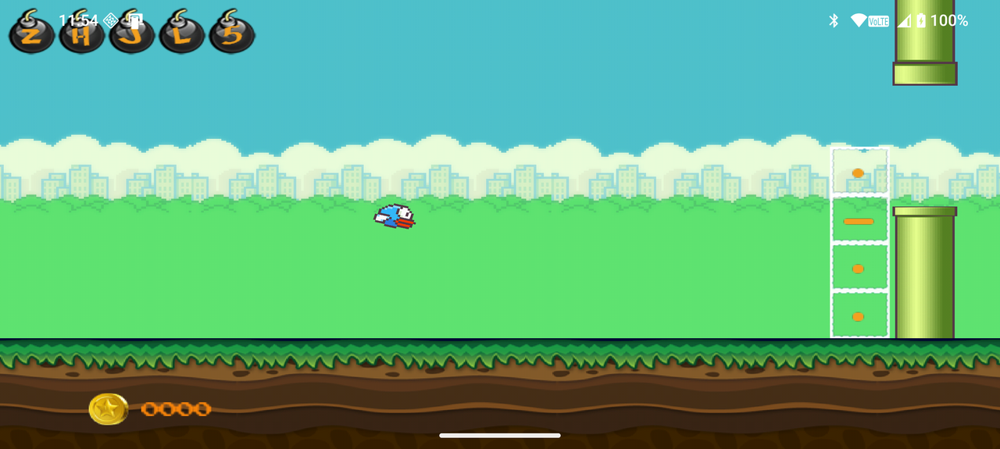
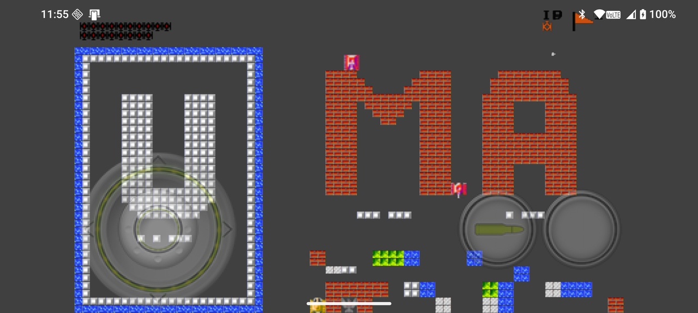

# Guidebee Game Engine

The `gameengine/` module is an in-tree copy of the **Guidebee Game Engine (GGE)** — an
Android-focused 2D game framework whose core APIs and rendering pipeline trace back to
[libGDX](https://libgdx.com/), but which trades libGDX's cross-platform goals for a
simpler, Android-only API surface. Instead of aiming to run everywhere, GGE leans into
being an Android library: it ships as an Android Gradle module, drives its OpenGL ES 2.0
rendering straight off a `GLSurfaceView`, and its game-loop lifecycle is just the
Activity lifecycle.

This fork lives at [GuidebeeGameEngine](https://github.com/GuidebeeGameEngine/GuidebeeGameEngine)
upstream. In this repository it isn't an external dependency — the full engine source
(Java framework + JNI/Box2D native code) sits under `gameengine/` and is built as part
of the normal Gradle build (see [Building](../README.md#building) in the main README).
The Morse Code Toolkit's two arcade mini-games, **Flappy Bird** and **Battle City**
(`app/src/main/java/au/com/guidebee/morsetoolkit/activity/{flappybird,battlecity}/`),
are ordinary GGE games that also happen to teach Morse code — this document walks
through the engine using them as the running examples.

<p align="center">
  
  
</p>
<p align="center">
  
</p>

## Core features

- **Two scene-graph APIs, at two levels of abstraction** — a libGDX-style
  `Stage`/`Actor`/`Group` scene graph with layout widgets (`com.guidebee.game.scene`,
  `com.guidebee.game.ui`), and underneath it, a `LayerManager`/`Sprite`/`TiledLayer` API
  modeled on the old Java ME `javax.microedition.lcdui.game` package
  (`com.guidebee.game.microedition`) for porting MIDlet-era games. See
  [Two ways to build a game](#two-ways-to-build-a-game) below.
- **Box2D physics**, compiled from C++ via `ndkBuild` and exposed as
  `com.guidebee.game.physics` (`World`, `Body`, joints, fixtures), with pixel↔Box2D-unit
  conversion helpers on `GameEngine` (`toBox2D`/`toPixel`).
- **An Entity System Framework** (`com.guidebee.game.entity`) for composing game logic
  out of entities/directors/signals rather than deep inheritance hierarchies.
- **Actions & a Tween Engine** (`com.guidebee.game.ui.actions`) for animating actor
  properties (position, rotation, scale, color) declaratively instead of hand-rolling
  per-frame interpolation.
- **SVG rendering** (`com.guidebee.game.engine.platform.svg`) for resolution-independent
  vector art.
- **Collision detection helpers** (`com.guidebee.game.scene.collision`) for the common
  AABB/circle/polygon cases that don't need full Box2D simulation.
- **TextureAtlas-driven asset pipeline** — a `ResourceManager` (`GameEngine.assetManager`)
  loads textures, atlases, sounds, music and tiled maps asynchronously, the same pattern
  libGDX users will recognize.

## Module layout

```
gameengine/src/main/
├── java/com/guidebee/
│   ├── game/               # public API: GameEngine, Screen, GamePlay, Input, Audio...
│   │   ├── activity/       # GameActivity / BaseGameActivity — the Android entry points
│   │   ├── scene/          # Stage, Actor, Group — the scene-graph API
│   │   ├── microedition/   # LayerManager, Sprite, TiledLayer — the MIDP-style API
│   │   ├── ui/             # Table, Button, Skin, Touchpad, GameController, actions/
│   │   ├── physics/        # Box2D Java bindings (World, Body, Joint, Fixture...)
│   │   ├── entity/         # Entity System Framework
│   │   ├── graphics/       # Texture, TextureAtlas, TextureRegion, Animation, Batch
│   │   └── audio/          # Sound, Music
│   ├── math/               # Vector2/3, Matrix, Interpolation, geometry
│   └── drawing/            # 2D vector drawing primitives
└── jni/
    ├── Box2D/              # upstream Box2D C++ sources
    └── Wrapper/            # JNI glue exposing Box2D to com.guidebee.game.physics
```

`gameengine/build.gradle` builds the native side via
`externalNativeBuild { ndkBuild { path = "src/main/jni/Android.mk" } }` — Gradle invokes
`ndkBuild` automatically, no manual native build step is required. See the main
README's [Notable configuration](../README.md#notable-configuration) for the pinned NDK
version and the 16 KB page-size alignment requirement.

## The lifecycle: Activity → GamePlay → Screen

Every GGE game is a three-level chain, mirroring libGDX's `Application`/`ApplicationListener`/`Screen`
split:

1. **`GameActivity`** (`com.guidebee.game.activity`) — a normal Android `Activity`
   subclass that owns the `GLSurfaceView` and forwards the Android lifecycle into the
   engine.
2. **`GamePlay`** (`com.guidebee.game.GamePlay`, implements `ApplicationListener`) — one
   per game; loads shared assets once in `create()` and swaps between `Screen`s.
3. **`Screen`** (or its adapter, `ScreenAdapter`) — one per game screen (menu, gameplay,
   score, shop, ...); receives `render(delta)` every frame plus `pause`/`resume`/`resize`.

Flappy Bird's chain, end to end:

```java
// FlappyBirdGameActivity — the Android entry point
public class FlappyBirdGameActivity extends GameActivity {
    @Override
    public void onCreate(Bundle savedInstanceState) {
        super.onCreate(savedInstanceState);
        Configuration config = new Configuration();
        config.useAccelerometer = false;
        config.useCompass = false;
        View gameView = initializeForView(new FlappyBirdGamePlay(this), config);
        setContentView(gameView);
    }
}

// FlappyBirdGamePlay — loads assets once, then hands off to the first screen
public class FlappyBirdGamePlay extends GamePlay {
    @Override
    public void create() {
        loadAssets();                       // assetManager.load(...) + finishLoading()
        setScreen(new MainWindow(this));    // the main-menu screen
    }
}

// FlappyBirdScene — the actual gameplay screen, driving a Stage every frame
public class FlappyBirdScene extends ScreenAdapter {
    private final FlappyBirdStage sceneStage;

    @Override
    public void render(float delta) {
        graphics.clearScreen(0, 0, 0.2f, 1);
        sceneStage.act();
        sceneStage.draw();
    }
}
```

`gamePlay.setScreen(new FlappyBirdScene(gamePlay))` (wired up from a menu button in
`MainWindow`) is how the game moves from menu to gameplay — the same pattern
`ScoreWindow`, `StoreWindow`, `OptionWindow` and `DesignWindow` use for the rest of
Flappy Bird's screens.

## Two ways to build a game

GGE ships **two** scene-graph APIs built on the same `Stage` base class, and the two
in-tree games each pick a different one — which makes them a good side-by-side
comparison.

### Scene2D-style: `Stage` + `Actor` (Flappy Bird)

Flappy Bird uses the higher-level API: a `Stage` holds a tree of `Actor`s, each actor
implements its own `act(delta)`/`draw(batch, alpha)`, and the stage walks the tree once
a frame. `FlappyBirdStage` (`extends Stage`) composes the whole game out of actors —
`Bird`, `Background`, `Playground`, `StartButton`, `GameOver`, plus HUD components added
via `addHUDComponent(...)`:

```java
public class FlappyBirdStage extends Stage {
    public FlappyBirdStage(Viewport viewport, FlappyBirdGamePlay gamePlay) {
        super(viewport);
        bird = new Bird();
        addActor(bird);
        playground = new Playground();
        addActor(playground);
        // ...
        score = new Score();
        addHUDComponent(score);
        challengeLetter = new ChallengeLetter();
        addHUDComponent(challengeLetter);
    }
}
```

An `Actor` subclass owns its own per-frame behavior. `Bird.act(delta)` is a compact
example of hand-rolled physics on top of the scene graph — gravity integration, a touch
check, and a rotation clamp, all in maybe fifteen lines:

```java
@Override
public void act(float delta) {
    velocity.add(0, GRAVITY, 0);
    velocity.scl(delta);
    position.add(MOVEMENT * delta, velocity.y, 0);
    if (isLive) {
        if (input.isTouched()) {           // GameEngine.input polled directly
            rotateBy(30 * delta);
            velocity.y = 250;               // "flap"
        } else {
            rotateBy(-20 * delta);
        }
    }
    setY(position.y);
}
```

Flapping animation frames come from `Animation` over `TextureRegion`s cut out of a
`TextureAtlas` (`flappybird.atlas`) — the standard libGDX-style sprite-sheet workflow.

### MIDP-style: `LayerManager` + `Sprite` (Battle City)

Battle City instead uses the lower-level, Java ME-flavored API: `LayerManager`
(itself a `Stage` subclass) manages a z-ordered list of `Layer`s — typically `Sprite`s
and `TiledLayer`s — much like `javax.microedition.lcdui.game.LayerManager` did for MIDP
games. This is the API path GGE offers for porting old Java ME games with minimal
rewriting.

```java
public class BattleCityGameScene extends ScreenAdapter implements GameControllerListener {

    class BattleCityLayerManager extends LayerManager {
        @Override
        public void drawExtra(Batch batch) {
            drawScoreBar(batch);           // custom overlay drawn every frame
        }
    }

    private final BattleCityLayerManager layerManager;

    public BattleCityGameScene() {
        layerManager = new BattleCityLayerManager(new FitViewport(gameWorldWidth, gameWoldHeight));
        battleField = new BattleField(xTiles, yTiles);
        layerManager.append(battleField);   // append(), not addActor()
    }

    @Override
    public void render(float delta) {
        layerManager.act();
        applyGameLogic();                   // spawn/score/win-loss state machine
        layerManager.draw(battleFieldX, battleFieldY);
    }
}
```

Tanks, bullets and explosions (`actors/tank/Tank.java`, `Bullet.java`, `Explosion.java`)
are `Sprite` subclasses appended to the same `LayerManager`, and the whole game's state
machine (enemy spawn timing, power-ups, win/lose) lives in plain
`BattleCityGameScene.applyGameLogic()`/`render()` rather than being distributed across
per-actor `act()` overrides — closer to how a MIDP game's single `GameCanvas` loop would
have been structured.

Pick whichever style fits the game you're porting or building: `Stage`/`Actor` for a
scene built up declaratively from independent, self-updating pieces; `LayerManager`/
`Sprite` for a more centralized, MIDP-style game loop.

## UI and animation with Actions

Menu screens are built from `com.guidebee.game.ui`'s `Table`/`Button`/`Image`/`Skin` —
a layout system libGDX developers will recognize — and animated declaratively with
`Actions`, rather than by hand-updating properties in `act()`. Flappy Bird's main menu
runs its bouncing logo entirely as a chained `Actions` sequence:

```java
Image birdImage = new Image(uiSkin, "guidebeeit");
table.add(birdImage);
birdImage.addAction(
    forever(
        sequence(
            moveTo(150, 100, 3f, Interpolation.circle),
            delay(1.0f),
            moveTo(500, 150, 3f, Interpolation.swingIn),
            rotateBy(360f, 2f),
            delay(1.0f),
            moveTo(150, 300, 3f, Interpolation.elastic)
        )));

playButton.addListener(new EventListener() {
    @Override
    public boolean handle(Event event) {
        gamePlay.setScreen(new FlappyBirdScene(gamePlay));
        return true;
    }
});
```

`Actions.forever/sequence/delay/moveTo/rotateBy/scaleTo/...` compose into arbitrarily
complex timelines without any per-frame bookkeeping in your own code — the tween engine
underneath handles interpolation and timing.

## Input: touch polling vs. a virtual game pad

GGE exposes input two ways, and the two games each use a different one:

- **Direct polling** — `Bird.act()` above just asks `GameEngine.input.isTouched()`
  every frame. Fine for a single-button game like Flappy Bird.
- **A virtual joystick + buttons** — Battle City renders an on-screen `GameController`
  (a `Touchpad` plus fire/second buttons, skinned from atlas regions) and implements
  `GameControllerListener` to translate touchpad/button events into the same
  `KeyEvent` D-pad codes a physical gamepad would send:

```java
GameController gameController = new GameController(
        touchBackgroundDrawable, touchKnobDrawable,
        shootDrawable, shootPressedDrawable,
        secondaryDrawable, secondaryPressedDrawable);
gameController.addGameControllerListener(this);
layerManager.setGameController(gameController);

@Override
public void KnobMoved(Touchpad touchpad, Direction direction) {
    int gameAction = 0;
    switch (direction) {
        case EAST: gameAction = KeyEvent.KEYCODE_DPAD_RIGHT; break;
        case NORTH: gameAction = KeyEvent.KEYCODE_DPAD_UP; break;
        // WEST / SOUTH follow the same pattern
    }
    playerTank.keyPressed(gameAction);
}
```

Routing both touch and hardware input through the same `KeyEvent` codes means
`PlayerTank` doesn't need to know or care which input source is driving it.

## Audio

`com.guidebee.game.audio.Sound` (short effects, `assetManager.load("sfx_wing.ogg", Sound.class)`)
and `Music` (streamed background tracks) are loaded through the same `ResourceManager`
as everything else. Flappy Bird wraps both behind a tiny settings-aware helper rather
than calling them directly:

```java
public static void playSound(Sound sound) {
    if (Configuration.soundOn) sound.play(Configuration.userSettings.soundVolume);
    else sound.stop();
}
```

## Physics: available, not required

Full Box2D simulation (`com.guidebee.game.physics.World`, bodies, fixtures, joints) is
compiled into the engine and ready to use — `GameEngine.world`,
`GameEngine.toBox2D(pixels)` / `toPixel(box2dUnits)`, and the default velocity/position
solver iteration counts all live as static fields on `GameEngine` for exactly that
purpose. Neither Flappy Bird nor Battle City actually needs a full rigid-body simulation
— Flappy Bird integrates its own gravity in `Bird.act()`, and Battle City is a grid/tile
game with simple AABB collision — so both opt for lightweight hand-rolled physics
instead. Reach for `com.guidebee.game.physics` directly when a game needs real rigid
bodies, joints or contact callbacks.

## Where the Morse code actually lives

Both games are otherwise-ordinary GGE games; the Morse-teaching layer is added entirely
in `app/`, on top of the engine, in two places:

- **Flappy Bird's HUD** — `hud/ChallengeLetter.java` is a `Table`-based HUD component
  (added via `addHUDComponent`) that renders the current target letter's dot/dash
  pattern using a dedicated `morsecode.atlas` (dot/dash/letter glyph regions), updated
  every frame from `FlappyBirdStage.act()`.
- **Battle City's level generation** — `BattleField.readBattlefieldFromLedLetter()`
  picks two random letters, renders each as a dot-matrix character bitmap
  (`LedLetters.LedDotMatrices`), and additionally encodes the first letter's Morse
  pattern as a literal run of brick tiles (`.` → a short run, `-` → a long run) along
  the bottom of the map. The screenshot above shows this: the walls spell out real
  letters in brick, and the game is regenerated with a new pair of letters every level.

If you're extending either game, this is the layer to look at — the engine plumbing
above it (`Stage`, `LayerManager`, `Actions`, atlases, audio) is unchanged from upstream
GGE.

## Building and running the games

The games build as part of the normal `app` module — there's no separate build step:

```
./gradlew :app:assembleDebug     # builds the engine + app together
./gradlew :app:installDebug      # install, then launch "Flappy Bird" / "Battle City" from the app's Home screen
```

See the main [README](../README.md#building) for full build/requirements details
(JDK, Android SDK/NDK versions, native build notes).

## Upstream tutorials

The original engine's wiki has narrower, engine-only tutorials that still apply to the
copy in `gameengine/` (graphics, input, sound, tiled maps, SVG, the microedition API,
UI/HUD components, cameras/viewports, Actions) plus a separate Box2D series (bodies,
shapes, joints, ray casts, sensors, collision filters):
[GuidebeeGameEngine wiki](https://github.com/GuidebeeGameEngine/GuidebeeGameEngine/wiki).
This document instead grounds every concept in the two games actually shipping in this
repo — treat the wiki as the deeper reference for engine features Flappy Bird and
Battle City don't happen to exercise.
