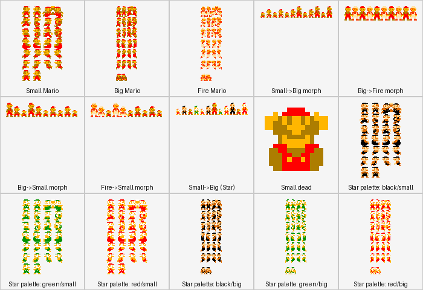
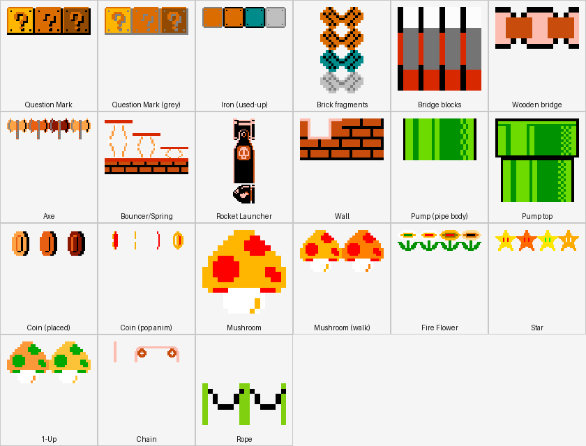

# Mario Game Mechanics & Extension Guide

This document explains **how the ported Mario game actually works** — the physics model,
the actor/collision architecture, the level-data pipeline, and the sprite-sheet/atlas
system — and gives step-by-step recipes for extending it (new levels, new enemies, new
bricks/items, new hazards). It's written for a developer who has never touched this
codebase before and needs to add content to it, most immediately as prep for the
[reskin](MARIO_RESKIN_PLAN.md).

It assumes the engine background in [GAME_ENGINE.md](GAME_ENGINE.md) (`LayerManager`/
`Sprite`/`TiledLayer`, the microedition API) and complements, rather than repeats, the
three planning documents:

- [MARIO_PORT_PLAN.md](MARIO_PORT_PLAN.md) / [MARIO_PORT_PLAN_PHASE2.md](MARIO_PORT_PLAN_PHASE2.md)
  — the *history* of how the port was built, step by step, with design rationale for each
  decision. This document is the *as-built reference* for the finished result — read the
  plan docs if you want to know *why* something is shaped the way it is; read this one to
  know *what it is and how to add to it*.
- [MARIO_RESKIN_PLAN.md](MARIO_RESKIN_PLAN.md) — the plan for replacing every Nintendo-derived
  asset with original art at a higher resolution. §13 and §16 of this document (sprite
  sheets, reskin scope) are the technical reference that plan's asset-authoring work
  builds on.
- [MARIO_LEVEL_ATLAS.md](MARIO_LEVEL_ATLAS.md) — every one of the 55 shipped levels,
  world by world, with a schematic minimap and full tile/enemy/checkpoint breakdown for
  each — the "how scenes are designed" companion to this document's actor/system focus.
- [MARIO_PLAYER_GUIDE.md](MARIO_PLAYER_GUIDE.md) — the player-facing manual (controls,
  power-ups, enemy field guide, world tour) with visuals pulled from the actual game art.

All 8 worlds (~55 levels) are implemented and playable today, on placeholder
Nintendo-derived art — see the phase-2 doc's "Decisions locked in" for the distribution
gate that stays in force until the reskin lands.

## Table of contents

1. [Architecture recap](#1-architecture-recap)
2. [Coordinate system and the tile grid](#2-coordinate-system-and-the-tile-grid)
3. [The frame loop](#3-the-frame-loop)
4. [Player mechanics](#4-player-mechanics)
5. [The world model: `MarioWorld`](#5-the-world-model-marioworld)
6. [Collision system](#6-collision-system)
7. [Level data: schema and pipeline](#7-level-data-schema-and-pipeline)
8. [Tile-type dispatch registry](#8-tile-type-dispatch-registry)
9. [Actor catalog](#9-actor-catalog)
10. [Checkpoints and teleports](#10-checkpoints-and-teleports)
11. [Camera, HUD, and game state](#11-camera-hud-and-game-state)
12. [Debug/QA tooling](#12-debugqa-tooling)
13. [Sprite sheets and the atlas system](#13-sprite-sheets-and-the-atlas-system)
14. [Recipes: extending the game](#14-recipes-extending-the-game)
15. [Appendix: full asset and sound tables](#15-appendix-full-asset-and-sound-tables)
16. [Reskin scope & priority](#16-reskin-scope--priority)

---

## 1. Architecture recap

Same three-level chain as Flappy Bird/Battle City
(`Activity → GamePlay → Screen`), using the **microedition** (`LayerManager`/`Sprite`/
`TiledLayer`) API because the world is a dense 32px tile grid with dozens of concurrent
actors:

```
MarioGameActivity                      (Android entry point)
  └─ MarioGamePlay                     (loads mario-common.atlas/audio once)
       ├─ MarioMenuScreen              (world/level select, MarioSaveState-backed)
       └─ MarioGameScreen              (extends ScreenAdapter — the core gameplay loop)
            ├─ LayerManager            (append-order z-stack: background → world → player → fx)
            │    └─ MarioWorld extends TiledLayer   (static grid + actor lists)
            ├─ Player extends Layer    (not a Sprite — see §4)
            ├─ collision/*Resolver     (one static method per interaction pair, §6)
            └─ hud/{ScoreHud,PauseOverlay}, debug/DebugPanel
```

All gameplay code lives under
`app/src/main/java/au/com/guidebee/morsetoolkit/activity/mario/`, organized as:

| Package | Contents |
|---|---|
| `actors/player` | `Player`, `PlayerPowerState` |
| `actors/bricks` | Interactive block/pipe/scenery-solid actors (`Sprite` subclasses) |
| `actors/enemies` | Everything extending `Enemy` |
| `actors/items` | Pickups (`Collectible` implementations) |
| `actors/hazards` | Non-enemy contact-damage actors (`Hazard` implementations) |
| `actors/lifts` | Moving platforms (`LiftSurface` implementations) |
| `actors/projectiles` | Fired/thrown things (fireballs, hammers) |
| `actors/scenery` | Purely decorative, non-collided actors |
| `collision` | Static resolver classes, one per interaction pair |
| `level` | `LevelDefinition` (data), `LevelLoader` (data → actors), `LevelCatalog`, `LevelNumbering` |
| `world` | `MarioWorld`, `MarioContext`, `CameraController`, `SpawnController`, `TileMovement`, `OscillatorClock` |
| `state` | `GameStateController`, `MarioSaveState` |
| `hud`, `fx`, `debug`, `input`, `screen` | as named |

---

## 2. Coordinate system and the tile grid

- **`MarioConfiguration.TILE_SIZE = 32`** world pixels per tile — every level's tile
  coordinates (`Tile.x`/`Tile.y` in `LevelDefinition`) are multiplied by this to get world
  pixels.
- **Y-down**: `MarioGameScreen`'s camera is set up y-down (`gdxCamera.setToOrtho(true, ...)`),
  matching the original desktop Java2D engine's own convention. Y increases *downward*.
  This matters for anything that reads/writes raw texture regions directly (see
  `MarioResourceManager.uiSkinYDown()`'s font-flip patch, and the atlas packer's per-cell
  vertical flip in §13).
- **Viewport**: `VIEWPORT_WIDTH/HEIGHT = 20×15 tiles` (640×480 world px) — a fixed "camera
  window" size the `CameraController` follows the player through; independent of actual
  screen resolution (`FitViewport`/`ExtendViewport` scale it, and pinch-zoom can widen it
  — see `MarioGameScreen`'s zoom-detector section).
- **`MarioConfiguration.MAX_DELTA_SECONDS = 1/30`**: every per-frame delta is clamped to
  this before reaching any actor's `act()`, so a slow first frame (asset loading, level
  spawn) never lets gravity punch an actor clean through a thin floor in one step.

---

## 3. The frame loop

`MarioGameScreen.render(delta)` runs, every frame, in this fixed order (this is the
single most important thing to internalize — a new interaction pair almost always slots
into this list as one more line):

```java
layerManager.act(paused ? 0f : delta);        // every Layer's own act(): Player, enemies,
                                               // bricks, lifts, fx, hazards, projectiles...
if (!paused) {
    PlayerCollisionResolver.resolvePickups(player, world);
    EnemyCollisionResolver.resolve(player, world);
    EnemyToEnemyResolver.resolve(world);
    ProjectileCollisionResolver.resolve(world);
    LiftCollisionResolver.resolve(player, world);
    HazardCollisionResolver.resolve(player, world);
    AxeResolver.resolve(player, world);
    TeleportResolver.resolve(level.teleports, player);
}
// ...
layerManager.draw();
// ...
Axe touchedAxe = AxeResolver.findTriggered(player, world);        // boss-finale trigger
LevelDefinition.Checkpoint hit = CheckpointResolver.findTouched(level.checkpoints, player);
```

Notes on the ordering:

- **Player-vs-static-tile collision is *not* in this list** — it's resolved inline inside
  `Player.act()`/`moveXWithCollision`/`moveYWithCollision`, because it's the same tile-grid
  algorithm `MarioWorld.containsImpassableArea` provides, not a separate actor-pair check
  (see §6).
- **Every list iterated by a resolver is snapshotted before iterating** where a callback
  can mutate it mid-loop (e.g. `EnemyCollisionResolver` copies `world.getEnemies()` because
  `EnemyTurtle.onStomped` spawning a `TurtleShell` appends to that same live list).
- **Checkpoint/axe detection runs *after* `draw()`**, not before — they drive a scripted
  state-machine transition (level-complete, boss finale) that the *next* frame's render
  reacts to, not this one's.

---

## 4. Player mechanics

`Player` (`actors/player/Player.java`, ~1150 lines) is the largest single class and the
one most worth understanding deeply — it's a hand-rolled physics/state machine, **not** a
`Sprite`. It extends `Layer` directly because growing/shrinking swaps the entire frame
strip and frame size (32×32 "player" → 32×64 "big_player"/"fire_player"), and
`microedition.Sprite` binds its region/frame-grid at construction with no runtime setter.

### 4.1 The "frames" unit

Every physics constant (`ACCEL`, `GRAVITY_STEP`, `JUMP_BASE`, ...) was tuned in the
original engine as "per `update()` call", implicitly assuming a fixed ~60fps loop. Rather
than re-derive each into a px/sec figure, this port keeps every constant **verbatim** and
scales it by `frames = delta * PHYSICS_FPS` (`PHYSICS_FPS = 60`) each frame — "how many
original 60fps ticks did this real frame cover". At exactly 60fps this reduces to the
original formula exactly. **If you're tuning feel, work in this "per-tick" unit, not
px/sec** — that's what every existing constant is expressed in.

### 4.2 Movement constants

| Constant | Value | Meaning |
|---|---|---|
| `ACCEL` | 2 | Horizontal acceleration per tick |
| `FRICTION` | 1 | Horizontal deceleration per tick (both toward zero and turbo-release easing) |
| `MAX_SPEED` | 60 | Normal run cap |
| `MAX_SPEED_TURBO` | 100 | Cap while the run button is held (ground only — never while swimming) |
| `AUTO_WALK_MAX_SPEED` / `AUTO_WALK_ACCEL` | 40 / 1 | Slower, gentler cap used only while `forcedCommand` drives a scripted walk (flagpole slide-to-checkpoint, the axe/bridge finale) |
| `GRAVITY_STEP` / `GRAVITY_CAP` | 0.42 / 10 | Per-tick fall acceleration and terminal velocity |
| `JUMP_BASE` | -11 | Base jump impulse; `± speed/JUMP_SPEED_BONUS_DIVISOR(60)` adds a speed-scaled bonus/penalty depending on direction of travel |
| `BOUNCER_LAUNCH_GRAVITY` | -22 | A `Bouncer`'s relaunch — roughly double a normal jump |
| `WATER_GRAVITY_STEP` / `WATER_GRAVITY_CAP` | 0.1 / 2 | Sea-level gravity (much gentler) |
| `WATER_JUMP_GRAVITY` | -3.5 | A tap-to-paddle impulse — fires on every press, no on-ground gate |
| `WATER_GROUNDED_SPEED_CAP` | 30 | Speed cap while walking the sea floor (vs. free-swimming's 60) |
| `WATER_SURFACE_Y` | 64 | Absolute world Y every Sea level's water surface sits at (hardcoded, not derived from level data) |

### 4.3 Power states



`PlayerPowerState` is a 3-value enum carrying `(width, height, atlasRegionName)`:

| State | Size | Region |
|---|---|---|
| `SMALL` | 32×32 | `player` |
| `BIG` | 32×64 | `big_player` |
| `FIRE` | 32×64 | `fire_player` |

`grow()` advances `SMALL → BIG → FIRE` (already-Fire is a no-op that still plays the
powerup jingle); `shrink()` goes `FIRE → SMALL` directly (**not** through Big — matches
the original) or `BIG → SMALL`, or triggers death if already Small. Both play a full morph
flipbook animation (`beginTransition`) before actually swapping `powerState` — the player
is frozen (its own `act()` early-returns) for the transition's duration, but the *world*
keeps running, so both methods guard against re-entering mid-transition (a second hit
landing mid-morph would otherwise read the stale, not-yet-applied `powerState`).

### 4.4 State machine summary

| State field | Set by | Cleared by | Effect |
|---|---|---|---|
| `transitionFrames != null` | `grow()`/`shrink()` | `updateTransition` finishing the strip | Freezes `Player.act()`, plays the morph flipbook |
| `dyingAnimated` | `beginDeathAnimation()` (enemy-hit-while-Small) | Falling off the level's bottom | Launch-up-then-fall "you died" beat, then respawn |
| `invincibleTimer` | Post-shrink / post-death | Counts down | Blink-visible flicker; blocks further `shrink()` |
| `starTimer` | `collectStar()` | Counts down | Color-cycling palette-swap render; kills on touch instead of hurting |
| `shieldTimer` | `setInvincibleFor()` (scripted sequences only) | Counts down | Same invincibility gate as the above two, but never blinks |
| `ducking` | Holding down, Big/Fire only | Released | Selective *collision* pass-through (not a hitbox resize — see `DUCK_HEAD_ROOM_PX`/`DUCK_OVERHEAD_CLEARANCE_PX`) |
| `water` | `setWater()` at level load (`Sea` attribute) | Never (whole-level, not per-tile) | Swaps in the entire water constant block + swim/paddle input |
| `forcedCommand` | `MarioGameScreen` (scripted sequences) | `clearForcedCommand()` | Overrides `input.poll()` for the flagpole walk / boss-finale auto-walk |

A pit-fall (`getY() > world height + 200px`) is **instant and silent** (`die()` — no
death animation, no sound) — distinct from the enemy-hit-while-Small death, which is
animated and does play `smb_mariodie`. Both respawn at `(checkpointX, checkpointY)`,
which advances automatically (`updateCheckpoint`) every second the player is grounded and
not on a lift, once they've moved >1000px from the last saved point.

### 4.5 Collision resolution (tile side)

`moveXWithCollision`/`moveYWithCollision` do discrete, final-position-only collision
against `world.containsImpassableArea(...)` (§6), then snap to the tile boundary and zero
the relevant velocity component. Landing on an `InteractiveBrick` that happens to be a
`Bouncer` is special-cased right there (relaunches instead of standing); landing that hits
a brick from below calls `brick.hitFromBelow(player)` before deciding whether to keep
falling (a still-active brick after the hit, e.g. a multi-hit `Bank`, keeps blocking; a
newly-deactivated one lets the player pass through the space it used to occupy).

---

## 5. The world model: `MarioWorld`

`MarioWorld extends TiledLayer` is one level's entire mutable state. It holds:

- The **tile grid** itself (`TiledLayer`'s own cell array) — only two non-zero cell
  values exist: `MarioConfiguration.TILE_STONE = 1`, `TILE_CHOCOLATE = 2`. These are
  **purely static, indestructible terrain**.
- Six **actor lists**, each just an `ArrayList` the relevant `LevelLoader.spawnX` method
  populates and the relevant `*CollisionResolver` iterates:

  | List | Element type | Populated by |
  |---|---|---|
  | `bricks` | `InteractiveBrick` | `spawnBricks` |
  | `collectibles` | `Collectible` | `spawnItems`, plus bricks spawning items on hit |
  | `enemies` | `Enemy` | `spawnEnemies` |
  | `fireBalls` | `FireBall` | `Player.applyFire` |
  | `lifts` | `LiftSurface` | `spawnLifts` |
  | `hazards` | `Hazard` | `spawnHazards`, plus `Boss` throwing `BossFire`/`Hammer` |
  | `axes` | `Axe` | `spawnHazards` |

### Why bricks and pipes aren't tile cells

Two tile-shaped things are deliberately **not** part of the static grid, both `Sprite`
actors instead:

- **Breakable/interactive bricks** (`Brick`, `Bank`, `QuestionMark`, ...) — they need to
  animate, dispense items, and deactivate; a `TiledLayer` cell can't do any of that.
- **Pipes (`pump`)** — the source art is 64×32 (2 tiles wide), which doesn't fit a
  uniform-grid `TiledLayer` cell without distortion.

`containsImpassableArea` (§6) folds the brick list back into the same "is this rectangle
solid" query so the rest of collision code never needs to know the difference.

---

## 6. Collision system

There is **no single collision manager** — each interaction *pair* is one static method,
called once per frame in the fixed order from §3. This intentionally replaces the
original engine's 17 explicit `CollisionManager` pair objects with the same total number
of checks and far less setup boilerplate.

| Resolver | Pair | Notes |
|---|---|---|
| `Player` (inline, not a resolver class) | Player ↔ static tile grid + `InteractiveBrick`s | Discrete, final-position AABB test each axis; see §4.5 |
| `PlayerCollisionResolver.resolvePickups` | Player ↔ `Collectible` | Any-side touch |
| `EnemyCollisionResolver.resolve` | Player ↔ `Enemy` | AABB overlap-axis test decides stomp (small Y-overlap + player's center above) vs. side-touch; awards `STOMP_SCORE=100` |
| `EnemyToEnemyResolver.resolve` | `Enemy` ↔ `Enemy` | Only for types where `bouncesOffEnemies()==true` (ground-walkers); items structurally excluded (separate list) |
| `ProjectileCollisionResolver.resolve` | `FireBall`/thrown things ↔ `Enemy`/tiles | Explosion + `smb_bump` on a wall hit, silent on an enemy hit |
| `LiftCollisionResolver.resolve` | Player ↔ `LiftSurface` | Re-derived every frame (a lift moves, so this can't be baked into the tile grid the way ground contact is) |
| `HazardCollisionResolver.resolve` | Player ↔ `Hazard` | Always hurts (no stomp option — a `Hazard` can't be stomped/killed) |
| `AxeResolver.resolve` / `.findTriggered` | Player ↔ `Axe` | Wall-clamp while untriggered; one-shot trigger past that |
| `TeleportResolver.resolve` | Player ↔ `LevelDefinition.TeleportLink` | Repositions X only, same level (no level swap) |
| `CheckpointResolver.findTouched` | Player ↔ `LevelDefinition.Checkpoint` | Cross-level jump / bonus-area entry — see §10 |

**Adding a new interaction pair almost always means adding one more resolver class (or
one more branch in an existing one) and one more line in `MarioGameScreen.render`'s fixed
sequence from §3** — see the recipes in §14.

### The `containsImpassableArea` algorithm

`MarioWorld.containsImpassableArea(x, y, width, height[, duckAboveY])` — the same
technique as Battle City's `BattleField.containsImpassableArea`, adapted to floating-point
position:

1. Convert the rectangle's four edges to a tile-column/row range (floor division by
   `TILE_SIZE`, clamped to the grid).
2. Return `true` if any cell in that range is non-zero.
3. Otherwise, return `true` if any **active** `InteractiveBrick` overlaps the rectangle
   (and, if `duckAboveY` is finite, sits below that line — see `Player#ducking`'s doc for
   why only Player's own movement passes this).

`EPSILON = 0.001f` pulls a rectangle's far/bottom edge a hair back inside the tile it's
flush against, avoiding a one-frame ground/airborne flicker when a resting actor's
position rounds exactly onto a tile boundary.

---

## 7. Level data: schema and pipeline

Levels are **data, not code** — a one-time offline converter
(`tools/mario-level-converter`) ran the original engine's 58+ `Level_XX`/`BonusAreaXX`
Java classes and serialized their `Construct[]` output to JSON, once, under
`app/src/main/assets/mario/levels/level_<N>.json`. `LevelDefinition.parse(json)` reads
that back into a plain, engine-independent data class at runtime.

### 7.1 `LevelDefinition` shape

```java
levelNumber, sourceClass, backgroundColor, time, type, posX, posY,
backgroundImage, attribute, levelLength, bombs, bombsTurnOff,
flyingFishes, flyingFishesLength, levelName,
tiles: List<Tile>, checkpoints: List<Checkpoint>, teleports: List<TeleportLink>
```

**`Tile`** — one placement (mirrors the original's `Construct`):

| Field | Meaning |
|---|---|
| `type` | A string key `LevelLoader`'s switch statements dispatch on — see §8 for the full registry |
| `x`, `y` | Tile-grid position |
| `lengthX`, `lengthY` | Footprint in tiles (most types are 1×1; bricks/terrain runs, `tree`, `Wall`, `pump` are wider/taller) |
| `extraInfo` | Free-form string, meaning depends on `type` (e.g. `"CW"`/`"ACW"` for `FireBar` spin direction) |
| `bridgeLength` | Overloaded per type — a `BalenceLift`'s horizontal span to its child, `Lift`'s "how many source tiles wide" |
| `patrolLength` | A patrol enemy's range in tiles, or a `Boss`'s bridge-end bound (`maxXPx = patrolLength * TILE_SIZE`) |

**`Checkpoint`** — a level-transition trigger: `kind` (the original CheckPoints subclass
name — `"CheckPoints"`, `"InsidePumpHorzontally"`, `"WhyYouDOThis"`, ...), `x`/`y`
(exact trigger position, not tile-snapped), `nextLevel`, `locX`/`locY` (spawn tile in the
target level). Note `nextLevel` uses the char literals 97/98 ('a'/'b') for World 1's two
bonus areas — preserved as-is from the original.

**`TeleportLink`** — `inX`/`inY`/`outX`/`outY`, a same-level pipe-warp pair.

### 7.2 `LevelCatalog` / `LevelNumbering`

`LevelCatalog.load(levelNumber)` reads+caches `mario/levels/level_<N>.json`.
`LevelNumbering.WORLD_LEVELS` is the `int[8][]` table mapping level numbers to their
"World-Level" label (e.g. 82 → "8-2") for the menu and HUD — World 8 alone has 8 entries,
ending in the `845` finale.

### 7.3 `LevelLoader`: turning data into a world

Four phases, called in this order from `MarioGameScreen`'s setup:

1. **`createWorld(level)`** — sizes a `MarioWorld` to the level's tile extent and bakes
   `stone`/`chocolate` tiles into the grid (`populateStaticGeometry`). Also picks *which*
   themed `tiles` composite region to draw from (`staticTilesRegion` — Ground/UnderGround/
   Castle/Sea/CloudsNight/Clowd, independent of a level's real `attribute` in the
   CloudsNight/Clowd cases — see §13.2).
2. **`spawnBricks(level)`** — every `InteractiveBrick`. Requires `MarioContext.init(...)`
   to already be called (bricks register into `MarioContext.world()` and append via
   `MarioContext.spawn(...)`).
3. **`spawnEnemies(level)`** — every `Enemy` (ground-walkers, patrol variants, fire-bar
   rings, the boss, water enemies).
4. **`spawnHazards(level)`** — `Axe`, static `BossFire` placements.
5. **`spawnItems(level)`** — placed (not dispensed-from-a-brick) collectibles — just
   `Coin` today.
6. **`spawnLifts(level)`** — moving platforms.
7. **`spawnScenery(level)`** — flagpole, castles, lava, decorative walls/backgrounds;
   returns the `FlagPole` (or `null`) so `MarioGameScreen` can wire its touch reaction.

`LevelLoader` is a pure dispatcher: every `case` in every switch statement is a couple of
lines that construct one actor and hand it to `MarioContext` — see §8 for the full table
and §14.4 for how to add a new one.

---

## 8. Tile-type dispatch registry

Every `LevelDefinition.Tile.type` string `LevelLoader` currently understands, grouped by
which `spawn*` method reads it. **This is the master list to check before assuming a
mechanic needs new code** — many "new enemy" ideas turn out to be a new `case` reusing an
existing actor class.

### Static terrain (`populateStaticGeometry`)

| `type` | Result |
|---|---|
| `stone` | `TILE_STONE` cell |
| `chocolate` | `TILE_CHOCOLATE` cell |
| *(anything else)* | ignored here — handled by a later phase or not at all |

### Interactive bricks (`spawnBricks`)

| `type` | Actor | Notes |
|---|---|---|
| `Brick` | `Brick` | Breakable (Big/Fire) or bonks (Small) |
| `Bank` | `Bank` | Multi-hit coin dispenser, ~1.67s window |
| `QuestionMark` | `QuestionMark(insideItem="CoinInside")` | |
| `QuestionMarkWithMushroom` | `QuestionMark(insideItem="Mashroom")` | Mushroom if Small, Flower if already Big+ |
| `BrickWithStar` | `BrickWithStar` | Reveals a `Star`, becomes `Iron` after |
| `InvisibleBrckWith1Up` | `InvisibleBrck(insideItem="1UP")` | |
| `InvisibleBrckWithCoin` | `InvisibleBrck(insideItem="CoinInside")` | |
| `BrickWithMushroom` | `BankWithItem(insideItem="Mashroom")` | Themed-brick-styled reveal, not a "?" |
| `BrickWith1UP` | `BankWithItem(insideItem="1UP")` | |
| `BrickWithCoin` | `BankWithItem(insideItem="CoinInside")` | |
| `WoodenBridge` | `WoodenBridge` | Plain static platform |
| `Iron` | `Iron` | Permanent, indestructible |
| `BridgeBloks` | `Brick` with `"bridge_blocks"` region | Boss-bridge segment, same class as a normal `Brick` |
| `tree` | `Tree` (top row) + `Scenery` (trunk) | Only in `"GreenAndTrees"`-type levels |
| `pump` | `Pump` (+ `PiranhaPlant` if `lengthY≥3`) | Plant spawn excluded for `levelName=="OrangePump"` and pipes <3 tiles tall |
| `PumpWarp` | `Pump` | Renders identically to `pump`; the actual warp is data-driven via `teleports[]`, not this tile |
| `HoriImage` | 2×`Pump` (64×64 halves) | |
| `PumpImage` | `Pump` | Single-cell pump-look decoration |
| `RocketLauncher` | `RocketLauncher` (head) + `RocketLauncherBody`×N | |
| `Bouncer` | `Bouncer` + linked `Spring` (decorative, one tile above) | |

### Enemies (`spawnEnemies`)

| `type` | Actor |
|---|---|
| `EnemyMushroom` | `EnemyMashroom` |
| `EnemyTurtle` | `EnemyTurtle` |
| `Helmet` | `Helmet` (color from level attribute — `dark`/`white`/`normal`) |
| `Monkey` | `Monkey` |
| `FlyingTurtle` | `FlyingTurtle` (`"normal"` on Ground, `"dark"` elsewhere) |
| `SonOfABuitch` | `SonOfABuitch` |
| `EnemyTurtlePatrol` | `EnemyTurtlePatrol` (bounded by `patrolLength`) |
| `FlyingTurtlePatrol` | `FlyingTurtlePatrol` (bobs vertically) |
| `FireBar` | 6× `OrbitingFireball` around a pivot |
| `BigFireBar` | 12× `OrbitingFireball` around a pivot |
| `Boss` | `Boss(hammerMode=false)` |
| `BossHammer` | `Boss(hammerMode=true)` |
| `FishGrey` / `FishGreyUpDown` / `FishRed` / `FishRedUpDown` | `FishyWater(type=1..4)` |
| `OctoPussy` | `OctoPussy` |

### Hazards (`spawnHazards`)

| `type` | Actor |
|---|---|
| `Axe` | `Axe` (invisible wall + boss-finale trigger) |
| `BossFire` | `BossFire` (static drifting flame) |

### Items (`spawnItems`)

| `type` | Actor |
|---|---|
| `Coin` | `Coin` |

### Lifts (`spawnLifts`)

| `type` | Actor |
|---|---|
| `Lift_UpDown` / `Lift_LeftRight` / `Lift_LeftRightInvert` / `LiftUP` / `LiftDown` | `Lift(Motion.*)` |
| `BalenceLift` | Linked `BalanceLiftPlatform` pair |
| `LiftFall` | `LiftFall` (one-shot collapse) |
| `LiftCar` | `LiftCar` (one-shot horizontal conveyor) |

### Scenery (`spawnScenery`)

| `type` | Result |
|---|---|
| `Lava` | `Scenery("lava")` per cell — kills only because it means falling out the level's bottom |
| `LavaBall` | `LavaBall` (fx) |
| `Water` | `Scenery("water")` backdrop |
| `Wall` | `Scenery("wall")` decorative vertical strip |
| `WhiteLine` | `Scenery("white_line")`, fixed 13-tile height |
| `Flag` | Rod + ball `Scenery` + `FlagPole` (the part that reacts to touch) |
| `SmallCastle` / `BigCastle` | `Scenery`, swapped to `bw_*` under CloudsNight |

Anything not in one of these tables is silently ignored by every `spawn*` method — a
level JSON can carry decorative/dead tile types (a few confirmed-dead ones are listed in
[MARIO_PORT_PLAN_PHASE2.md §7.1](MARIO_PORT_PLAN_PHASE2.md)) without breaking anything.

---

## 9. Actor catalog

### 9.1 Enemies (`extends Enemy`)


*(Every sprite above is extracted directly from the packed `mario-common.atlas`,
un-flipped to natural viewing orientation — see §13.4. This is the current
Nintendo-derived placeholder art pending the reskin, not final art.)*

`Enemy` (`actors/enemies/Enemy.java`) is the common base. It supplies:

- `walkAndFall(delta, gravity, walkSpeed)` — constant-speed walk + gravity + wall-bounce,
  a helper subclasses call from their own `act()` (not automatic — `TurtleShell` needs to
  sit motionless until kicked, which a fixed base `act()` would fight).
- `onStomped(player)` (default: `deactivate()`), `onTouchedSide(player)` (default: kill if
  `player.hasStar()`, else `player.shrink()`), `onDefeatedByProjectile()` (default:
  `deactivate()` unconditionally, even with a star) — **override whichever differ** for a
  new enemy type.
- `bouncesOffEnemies()` (default `false`) — opt in for `EnemyToEnemyResolver` to bounce
  this type off other opted-in enemies on contact.

| Class | Behavior |
|---|---|
| `EnemyMashroom` | Ground-walker. Every `Enemy` default applies unchanged — the simplest possible enemy. |
| `EnemyTurtle` | Ground-walker; stomping produces a `TurtleShell` instead of just dying (override in the concrete class, not shown in the base). |
| `EnemyTurtlePatrol` | Bounded to `[spawnX, spawnX + 32×patrolLength]`, turning at the bounds (not wall-bounce) |
| `FlyingTurtle` | Free-roaming, wall-bounces horizontally, gentle constant downward drift |
| `FlyingTurtlePatrol` | Never moves horizontally; bobs vertically around a center point via the shared `OscillatorClock` |
| `TurtleShell` | Unifies the original's stationary/moving shell pair via a `moving` flag |
| `Helmet` / `HelmetShell` | Buzzy-Beetle analog — walks like `EnemyTurtle` but **immune to fireballs** (confirmed by reading the source, not assumed); `HelmetShell` unifies stationary/moving like `TurtleShell` |
| `Monkey` | Patrols ±1 tile, throws a `Hammer` at the player on a random timer |
| `Spikey` / `SpikeyEgg` | **Never** safely stompable — every touch (any side, including straight down) is "star kills, else hurts" |
| `SonOfABuitch` | Lakitu analog — floats at a fixed height (hardcoded `y=80`, ignoring level data's own `y`), sways around the player's X, throws `SpikeyEgg` |
| `Boss` | See §9.1.1 |
| `OrbitingFireball` | One fireball of a `FireBar`/`BigFireBar` ring — see §9.1.2 |
| `PiranhaPlant` | Bobs a fixed 96px range out of a pipe; pauses retracted only while both near-bottom *and* the player is within 100px |
| `Rocket` | Fired by `RocketLauncher`; straight-line, no gravity, no tile collision; a stomp always destroys it |
| `FishyGround` | Ambient jumping-fish hazard (the `flyingFishes` level flag), not a placed enemy — see `SpawnController` |
| `FishyWater` | Sea-level Cheep-Cheep analog — straight swim, optional vertical bob |
| `OctoPussy` | Sea-level Bloober analog — rest-then-dart chase cycle |

#### 9.1.1 `Boss` — the reference "complex enemy" pattern

`Boss` (`actors/enemies/Boss.java`) is the best template to copy for a new
multi-behavior enemy: patrol ±3 tiles around spawn while the player is behind it, switch
to a steady chase once the player passes it, jump on a random timer, and (mode-dependent)
either breathe `BossFire` or throw `Hammer` on separate random timers — all bounded by a
`maxXPx` wall. Defeat is two-tiered:

- **Star touch/stomp** → instant `die(true)` (plays `smb_kick` + `smb_bowserfalls`,
  deactivates every *other* active enemy in the level too — matches the original).
- **Fire Mario fireballs** → `onDefeatedByProjectile()` decrements a 5-hit life counter,
  dies at `<0` (i.e. the 6th hit) via `die(false)` (no kick sound).
- **A plain stomp or side-touch without a star** just hurts the player (`shrink()`) —
  jumping on the boss's head alone never kills it, matching the classic games.

Level completion is **not gated on defeating the boss** — the "cleared this castle"
trigger is a separately-placed `"WhyYouDOThis"` checkpoint past it; walking past a boss
you didn't fight is legitimate.

#### 9.1.2 `OrbitingFireball` / `FireBar`

Not placed individually in level data — `LevelLoader.spawnFireBar` reads one `FireBar`/
`BigFireBar` tile and spawns 6 (or 12) `OrbitingFireball`s around that one pivot, each at
a different radius (`j * 16px`), all reading a **shared** angle from `OscillatorClock`
(the same clock `FlyingTurtlePatrol` reads) so every ring/bobbing enemy in a level stays
in sync. `extraInfo` (`"CW"`/`"ACW"`) sets spin direction.

### 9.2 Bricks (`extends InteractiveBrick`)



`InteractiveBrick` (`actors/bricks/InteractiveBrick.java`) supplies `isActive()`,
`overlaps(...)`, `deactivate()`, and one overridable hook: `hitFromBelow(player)`
(default: no-op — matches Stone/Pump/Iron's original no-op `HitFromDown()`).

| Class | `hitFromBelow` behavior |
|---|---|
| `Brick` | Big/Fire: breaks into 4 `BrickFragment`s. Small: bonks (hop + `smb_bump`), stays solid. |
| `Bank` | Dispenses a coin on every hit for ~1.67s from the first hit, then becomes `Iron` |
| `QuestionMark` | One-shot reveal (coin, or Mushroom/Flower depending on power state), becomes `Iron` |
| `BankWithItem` | Same reveal logic as `QuestionMark`, styled as a plain themed brick |
| `BrickWithStar` | One-shot `Star` reveal, becomes `Iron` |
| `InvisibleBrck` | Invisible until hit, then behaves like the reveal bricks above |
| `Iron`, `Pump`, `WoodenBridge`, `Tree` (canopy), `Bouncer`, `RocketLauncher(Body)` | No-op — permanent solid geometry |
| `Axe` | Not hit-reactive; see §9.3 |
| `TemporaryInvisibleBrick` | Not player-placed — `Brick` spawns one under itself for ~10 ticks after breaking, so something standing exactly on top doesn't fall through a frame early |

### 9.3 Hazards (`implements Hazard`)

Contact-damage actors that **cannot** be stomped, kicked, or killed by a fireball, and
award no stomp bounce — `HazardCollisionResolver` always just hurts on touch (star
excepted). `Axe` is a special hybrid: an unconditional invisible wall (`AxeResolver`,
every frame, regardless of height) *plus* a one-shot boss-finale trigger
(`AxeResolver.findTriggered`) that kicks off the bridge-collapse/boss-fall sequence in
`MarioGameScreen`. `BossFire` and `Hammer` (thrown or ambient) are the other two.

### 9.4 Lifts (`implements LiftSurface`)

`LiftSurface` supplies `getDeltaX()`, `getTopY()`, `isLandingSpot(...)`, and an optional
`onRidden()` hook (used only by `BalanceLiftPlatform`'s seesaw physics — a plain `Lift`'s
motion never depends on whether it's ridden).

| Class | Motion |
|---|---|
| `Lift` | One class, a `Motion` enum (`UP_DOWN`/`LEFT_RIGHT`/`LEFT_RIGHT_INVERT`/`UP`/`DOWN`) unifies the original's 5 near-identical classes |
| `BalanceLiftPlatform` | A seesaw pair — standing on either side sinks it and raises the linked other, decaying back to level when unridden |
| `LiftFall` | Sits still until ridden, then falls away forever at constant speed (never resets) |
| `LiftCar` | Sits still until ridden, then slides right forever at constant speed (never resets) |

### 9.5 Items (`implements Collectible`)

`CollectibleItem` supplies shared AABB/active-flag bookkeeping; `Collectible.onCollected
(player)` is any-side touch (matches the original's identical behavior regardless of
touch direction).

| Class | Effect |
|---|---|
| `Coin` | Score only |
| `Mushroom` | Grows the player |
| `Flower` | Grows to Fire (stationary, animated in place) |
| `Star` | Temporary invincibility; bounces like a ball while drifting sideways |
| `Life` | Extra life; falls under gravity with **no floor check** in the original (matches — see the class's own doc for the quirk this preserves) |

### 9.6 Projectiles

| Class | Notes |
|---|---|
| `FireBall` | Player's Fire attack — capped at 2 concurrent; launches already at terminal fall speed; bounces off ground; explodes on wall or enemy hit (wall: `smb_bump` + `fx.Explosion`; enemy: silent explosion) |
| `Hammer` | Two roles via two constructors: `Boss`'s continuous throw (externally-computed speed/gravity) and `Monkey`'s single toss |
| `BossFire` | Both a static placed hazard (Level 14's drifting flames) and `Boss`'s own thrown projectile — same class, two spawn sites |

### 9.7 Scenery (purely decorative, non-collided)


`Scenery` draws a fixed image at a fixed position with no collision participation at all
— the flagpole rod/ball, castles, lava, water backdrop, walls. `FlagPole` is the one part
of the flag that *does* react (the cloth, slides down once touched — `MarioGameScreen`'s
level-complete state machine drives this). `FlagWinBanner` is the small banner that rises
beside the castle once the real end-of-level checkpoint fires.

---

## 10. Checkpoints and teleports

**Checkpoints** (`CheckpointResolver`) are cross-level transitions — level-end flags, pipe
entrances into bonus areas, castle "fake-out" endings. Each has a `kind` string gating a
different trigger condition (ported from the original's per-ID switch):

| `kind` | Trigger condition |
|---|---|
| `InsidePumpHorzontally` | Holding right + on ground |
| `InsidePumpvertically` | Within 10px horizontally + holding down |
| `ClowdGoUP_CheckPoint` | Holding up (beanstalk climb entry) |
| `Clowd_CheckPoint` | Plain contact, but with a 640px-wide trigger box (a whole landing platform, not a point) |
| everything else (`CheckPoints`, `WhyYouDOThis`, ...) | Plain contact |

**Teleports** (`TeleportResolver`) are same-level pipe warps — touching a 32×96px zone at
`(inX+32, inY)` sets the player's `x` to `outX` and leaves `y` untouched (every teleport
pair in the shipped data sits at the same floor height on both ends).

---

## 11. Camera, HUD, and game state

- **`CameraController`** follows the player within the `VIEWPORT_WIDTH/HEIGHT` window,
  clamped to the level's edges.
- **`GameStateController`** — explicit state machine (`START`/`PLAYING`/`PAUSED`/
  `LEVEL_COMPLETE`/`GAME_OVER`) rather than scattered booleans; owns score/lives.
- **`ScoreHud`** — score, lives, world-level label (`LevelNumbering.label`), all rendered
  via the engine's bundled bitmap font (`MarioResourceManager.uiSkinYDown()`), not sliced
  digit-sprite art like Battle City/Flappy Bird use.
- **`MarioSaveState`** — `SharedPreferences`-backed set of cleared level numbers, read by
  `MarioMenuScreen` to grey out/lock unreached levels.

---

## 12. Debug/QA tooling

A debug-only layer (behind `BuildConfig.DEBUG`, absent from release builds) exists
specifically to make iterating on new content fast — **use it** when adding a new enemy
or level rather than replaying from the start every time:

- **Menu-level warp** — every level button is selectable in a debug build (tinted orange
  when unlocked only this way), bypassing `MarioSaveState`'s normal progression gate.
- **In-level warp panel** (`debug.DebugPanel`) — data-driven from the current level's own
  `LevelDefinition`: one warp button per checkpoint, one per "interesting" tile type
  (`Flag`, `Axe`, `Boss`, `Bouncer`, patrol enemies, `Monkey`, ...), plus manual tile-X/Y
  entry and a live position readout. **When adding a new tile type worth standing next
  to, add it to this panel's short allow-list** — it's designed to be extended as new
  mechanics land.
- **God mode / infinite lives / power-state cycling / time-scale** — `Player#
  setDebugInvincible`/`#debugCyclePowerState`, `MarioGameScreen#debugInfiniteLives`/
  `#debugTimeScale`.

---

## 13. Sprite sheets and the atlas system

### 13.1 Two-tier atlas structure

`tools/mario-atlas-packer/src/PackMarioAtlas.java` (an offline, dev-only tool — **not**
part of the Android build) packs every source PNG into libGDX-format `TextureAtlas`
files, split by `Theme`:

| Theme | Atlas file(s) | Loaded | Contents |
|---|---|---|---|
| `COMMON` | `mario-common.atlas` (+ `mario-common0.png`/`mario-common1.png` pages) | Once, for the whole app session | Player, all enemies/items, HUD, fonts, scenery, CloudsNight/Clowd composites — everything used regardless of a level's `attribute` |
| `GROUND` | `mario-ground.atlas` / `.png` | Only while the current level's `attribute=="Ground"` | brick/stone/chocolate (Ground look) |
| `UNDERGROUND` | `mario-underground.atlas` / `.png` | Only for `"UnderGround"` levels | Same set, UnderGround look |
| `CASTLE` | `mario-castle.atlas` / `.png` | Only for `"Castle"` levels | Same set, Castle look |
| `SEA` | `mario-sea.atlas` / `.png` | Only for `"Sea"` levels | Sea terrain/creatures + the ambient swim `bubble` |

`MarioResourceManager.loadTheme(attribute)` swaps the theme atlas on every level load
(unloading the previous one first), so a Ground level never keeps Castle-only art
resident — see `region(name)`, which searches the common atlas first, then whichever
theme atlas is currently loaded.

Each `.atlas` file is plain libGDX atlas-data text: a page image filename, page
`size`/`format`/`filter`/`repeat` header, then one block per region:

```
player
  rotate: false
  xy: 886, 902
  size: 128, 224
  orig: 128, 224
  offset: 0, 0
  index: -1
```

Pages are 2048×2048 (`PAGE_SIZE`), shelf-packed tallest-first, 2px padding
(`PADDING`) between regions. `filter: Nearest,Nearest` is hardcoded — appropriate for
blocky pixel-art scaling; revisit if the reskin's new art leans smoother/painterly (see
[MARIO_RESKIN_PLAN.md §4.2](MARIO_RESKIN_PLAN.md)).

### 13.2 Region naming and the theming convention

Region *names* are stable regardless of which physical atlas holds them (e.g.
`"brick_underground"` always means the UnderGround-look brick tile, whether that's still
one shared atlas or, as now, its own theme atlas) — `MarioResourceManager.themedRegion
(base, attribute)` picks `<base>` / `<base>_underground` / `<base>_castle` / `<base>_sea`
by a level's attribute, matching the original engine's repeated
`if("Ground"/"UnderGround"/...)` branches throughout its tile-spawning switch.

**Static terrain tiles** are pre-composited by the packer into one 2-cell, 64×32
`TerrainTile` sheet per theme (cell 1 = stone, cell 2 = chocolate — matching
`MarioConfiguration.TILE_STONE`/`TILE_CHOCOLATE`), rather than shipping 6+ separate
single-tile regions. Two extra composites live in `COMMON` for cases that need a *look*
independent of the level's real `attribute`: `tiles_cloudsnight` (World 6's one
black-and-white level; its real attribute is still `"Ground"`) and `tiles_clowd` (the
5 pure-climb beanstalk levels). `LevelLoader.staticTilesRegion` picks between all of
these.

### 13.3 Frame-strip slicing convention

Every multi-frame asset is packed as **one whole, unsliced strip image** — the packer
records each region's `cols × rows` frame-grid shape as a comment/log line (see the
`ASSETS` table, §15.1), but doesn't pre-slice it. Actor code slices at load time:

```java
TextureRegion region = MarioResourceManager.region("player");   // one whole 128x224 image
TextureRegion[][] frames = region.split(32, 32);                 // -> [7][4] grid
```

This is exactly what `microedition.Sprite(TextureRegion, frameWidth, frameHeight)` does
internally too — most actors just pass the *unsliced* region straight into their `Sprite`
superclass constructor along with a frame size, and never call `.split(...)` directly
(`Player` is the exception, since it isn't a `Sprite` — see §4).

**Frame index convention** (every `player`/`big_player`/`fire_player` region, 4 cols × 7
rows): `0`/`1` = idle right/left, `2`/`3` = airborne right/left, `4`-`6` = walk-right
cycle, `7` = skid-right, `8`-`10` = walk-left cycle, `11` = skid-left, `16`-`19` =
swim-sink (right/left pairs), `20`-`23` = swim-rise, `24`/`25` = duck/crouch right/left.
Enemy frame layouts vary by asset — check the constructing actor's own `split(...)` call
and any frame-index comments (e.g. `Boss`'s own doc: `0`/`1` = look-left idle, `4`/`5` =
look-right idle, `2` = spitting-fire pose).

### 13.4 Two packing-time transforms to know about

1. **Magenta masking** (`applyMagentaMask`) — replicates the original engine's
   `BaseLoader(bsIO, Color.MAGENTA)` default: any pixel that's an *exact* RGB match for
   magenta becomes fully transparent. Applied unconditionally to every source asset
   (a no-op for real-alpha PNGs) — several original sources (`turtle.png`,
   `EnemyTurtlePatrol.png`) are opaque, magenta-background images relying on this
   convention rather than real alpha. **New reskin art with a transparent background
   (real alpha) needs no special handling here** — the mask is only ever a no-op for it.
2. **Per-cell vertical flip** (`drawFlippedPerCell`) — every source image is drawn into
   the atlas page with each individual `cols × rows` cell flipped top-to-bottom in place.
   This compensates for the engine's y-down texture convention (§2) — without it, sprites
   would render upside down. **This is why the `Info`/`Info2` HUD-overlay screenshot
   assets look mirrored/upside-down when viewed as raw atlas pages** — they're single
   whole-image (1×1) "cells", so the flip inverts the entire image, which is expected and
   harmless for how they're actually drawn in-game.

### 13.5 How to regenerate the atlases

```
bash tools/mario-atlas-packer/pack.sh
```

Source PNGs currently come from the original desktop game's own asset tree (a path
outside this repo — see [MARIO_RESKIN_PLAN.md](MARIO_RESKIN_PLAN.md) for why that's a
distribution blocker). Repointing `PackMarioAtlas.main`'s `sourceDir` argument at a new,
original asset directory (matching every entry's `cols × rows` frame-grid shape exactly)
is the reskin's actual mechanical step — see that plan's §4.4.4.

---

## 14. Recipes: extending the game

### 14.1 Add a new level

1. If porting from the original engine's source, run `tools/mario-level-converter`
   against the relevant `Level_XX`/`BonusAreaXX` class to produce
   `mario/levels/level_<N>.json`. For a wholly new level, hand-author JSON matching
   §7.1's schema (`levelNumber`, `attribute`, a `tiles[]` array of `{type, x, y,
   lengthX, lengthY, extraInfo, bridgeLength, patrolLength}`, `checkpoints[]`,
   `teleports[]`).
2. Every `tiles[].type` you use must already exist in §8's registry — if not, see the
   relevant recipe below to add it first.
3. Add the level number to `LevelNumbering.WORLD_LEVELS` (or leave it out for a bonus
   area addressed only via a checkpoint's `nextLevel`).
4. Smoke-test via the debug menu-level warp (§12) rather than playing every prior level
   to reach it.

### 14.2 Add a new static terrain look (new theme variant)

Only needed for a genuinely new *theme* (a new world palette), not a new tile *type*.
Add source PNGs + a new `TerrainTile` entry in `PackMarioAtlas` (or reuse an existing
`Theme`), re-run the packer, and add a branch in `LevelLoader.staticTilesRegion` if the
new look needs picking by something other than plain `attribute`.

### 14.3 Add a new interactive brick

1. Create a class extending `InteractiveBrick`, override `hitFromBelow(player)` for
   anything beyond "solid, no reaction" (the default no-op).
2. Add its source art to `PackMarioAtlas.ASSETS` (theme + region name + `cols × rows`),
   re-run the packer.
3. Add a `case` in `LevelLoader.spawnBricks` mapping a new `tile.type` string to your
   class (see the existing table in §8 for the pattern — most are one line via
   `forEachCell(tile, (x, y) -> add(new YourBrick(x, y, level.attribute)))`).
4. Reference the new `type` in a level JSON's `tiles[]`.

### 14.4 Add a new enemy actor — full checklist

This is the most common extension and the one the reskin/future content work will do
most. Using `Enemy` as the base:

1. **Art**: add the source strip PNG to `PackMarioAtlas.ASSETS` (pick `Theme.COMMON`
   unless the enemy is genuinely theme-exclusive, matching every existing enemy's own
   choice — see §13.1's table for why), note its `cols × rows` frame-grid, re-run the
   packer.
2. **Class**: create `actors/enemies/YourEnemy.java extends Enemy`. In the constructor,
   call `super(region, frameWidth, frameHeight, x, y, movingRight)`. Implement `act
   (float delta)` — for a simple ground-walker, this can be just:
   ```java
   @Override
   public void act(float delta) {
       super.act(delta);
       if (!isActive()) return;
       walkAndFall(delta, GRAVITY_STEP, WALK_SPEED);
   }
   ```
   For anything with a state machine (patrol/chase/throw), use `Boss` (§9.1.1) as the
   template rather than a plain ground-walker.
3. **Reactions**: override only what differs from `Enemy`'s defaults:
   - `onStomped(player)` — default dies; override if it should spawn a shell (`EnemyTurtle`
     pattern), be unstompable (`Spikey` pattern — override to always call
     `onTouchedSide`-equivalent logic), or something else.
   - `onTouchedSide(player)` — default hurts unless starred.
   - `onDefeatedByProjectile()` — default dies unconditionally; override for fireball
     immunity (`Helmet` pattern — make it a no-op) or a hit-counter (`Boss` pattern).
   - `bouncesOffEnemies()` — return `true` if it should turn around on contact with
     another opted-in enemy.
4. **Level dispatch**: add a `case` in `LevelLoader.spawnEnemies` mapping a `tile.type`
   string to your constructor (see §8's table for the pattern — most are one line via
   `addEnemy(new YourEnemy(...))` or, for a per-cell placement, `forEachCell(tile, (x, y)
   -> addEnemy(new YourEnemy(x, y)))`).
5. **Sound** (if it plays one): add entries to `MarioResourceManager.SOUND_EFFECTS` and
   the corresponding `.wav` under `assets/mario/audio/` if the sound doesn't already
   exist (check §15.2's list first — most reactions reuse an existing effect like
   `smb_kick`/`smb_stomp`).
6. **Debug panel** (optional but recommended): add the new tile type to `DebugPanel`'s
   "interesting tile types" allow-list (§12) so QA can warp straight to it.
7. **Level data**: place it via a `tiles[]` entry with your new `type` string.
8. **Test**: warp to it via the debug panel, verify stomp/side-touch/fireball reactions
   each match your intended design, and — if it's meant to interact with other enemies —
   verify `EnemyToEnemyResolver` behaves as expected.

### 14.5 Add a new item/collectible

1. Create a class extending `CollectibleItem` (or implementing `Collectible` directly if
   it doesn't need the shared AABB bookkeeping), implement `onCollected(player)`.
2. Add art to the packer (usually `Theme.COMMON`).
3. Either spawn it directly (add a `case` in `LevelLoader.spawnItems` for a level-placed
   item) or have a brick's `hitFromBelow` spawn it via `MarioContext.world().
   addCollectible(...)` + `MarioContext.spawn(...)` (the `QuestionMark`/`Mushroom`/
   `Flower` pattern in §9.2).

### 14.6 Add a new hazard

Implement `Hazard` (`isActive()`, `overlaps(...)`, `getY()`, `getHeight()`), add a `case`
in `LevelLoader.spawnHazards` calling `MarioContext.world().addHazard(...)` +
`MarioContext.spawn(...)`. `HazardCollisionResolver` needs no changes — it already
iterates the shared `hazards` list generically.

### 14.7 Add a new moving platform

Implement `LiftSurface` (`getDeltaX()`, `getTopY()`, `isLandingSpot(...)`, optionally
override `onRidden()` for `BalanceLiftPlatform`-style linked physics), add a `case` in
`LevelLoader.spawnLifts`. `LiftCollisionResolver` iterates the shared `lifts` list
generically — no changes needed there either.

### 14.8 Add a new sound or music track

Drop the `.wav` under `assets/mario/audio/`, add its key (no extension) to
`MarioResourceManager.SOUND_EFFECTS` (one-shot effects) or `MUSIC_TRACKS` (looping,
keyed by level `attribute`), call `MarioResourceManager.sound("your_key").play()` /
`.music("YourAttribute")` from the relevant actor.

---

## 15. Appendix: full asset and sound tables

### 15.1 Full sprite-sheet asset table

Every entry currently in `PackMarioAtlas.ASSETS` — theme, region name (what you pass to
`MarioResourceManager.region(...)`), and its frame-grid shape (`cols × rows`, for
`region.split(frameWidth, frameHeight)` where `frameWidth = imageWidth/cols`,
`frameHeight = imageHeight/rows`). Regenerate this list yourself at any time by running
the packer — it prints exactly this table (`Region -> (cols x rows) frame grid`) to
stdout on every run.

**Terrain (theme-specific, one 32×32 tile each unless noted):**

`brick` (Ground), `brick_underground`, `brick_castle`, `stone`, `stone_underground`,
`stone_castle`, `chocolate`, `chocolate_underground`, `chocolate_castle`, `brick_sea`,
`stone_sea`, `stone_castle_sea`, `chocolate_sea` (Sea), `bubble` (Sea, 4×1 — ambient swim
particle).

**Pipes/pumps (COMMON unless noted):** `pump`, `pump_top`, `pump_castle`,
`pump_top_castle` (Castle), `pump_sea`, `pump_top_sea` (Sea), `plant` (2×1), `plant_dark`
(2×1), `hori_image` (2×1).

**Blocks/reveal items (all COMMON):** `question_mark` (3×1), `question_mark_grey` (3×1),
`mashroom`, `mashrooms` (2×1), `flower` (4×1), `coin_anim` (4×1), `star` (4×1),
`brick_peaces` (2×4), `one_up` (2×1), `coin` (3×1), `iron` (4×1), `bridge_blocks`,
`explosion` (3×1).

**Enemies (all COMMON):** `enemy` (2×4), `turtle` (4×1), `turtle_dark` (4×1),
`turtle_shell`, `turtle_shell_dark`, `turtle_shell_red`, `turtle_shell_flip`,
`turtle_shell_flip_dark`, `turtle_shell_flip_red`, `enemy_turtle_patrol` (4×1),
`flying_turtle_patrol` (4×1), `flying_turtle` (4×1), `flying_turtle_dark` (4×1), `monkey`
(3×2), `helmet` (4×1), `helmet_dark` (4×1), `helmet_white` (4×1), `helmet_shell`,
`helmet_shell_dark`, `helmet_shell_white`, `son_of_a_buitch` (2×1), `spikey_egg` (2×1),
`spikey` (4×1), `boss` (3×2), `boss_fire` (2×1), `fish_grey` (2×1), `fish_red` (2×1),
`octopussy` (2×1), `bw_hammer` (4×1 — from `CloudsNight/Hammer.png`; the original always
uses this regardless of level theme), `fire_ball` (4×1), `lava`, `lava_ball` (2×1),
`water`, `axe` (4×1).

**World mechanics/scenery (all COMMON):** `wall` (2×1), `rocket_launcher` (1×4),
`bouncer`, `spring` (3×1), `wooden_bridge`, `white_line`, `chain` (4×1), `rope`,
`small_castle`, `big_castle`, `tree` (5×2), `lift`, `mountain`, `clouds`, `cloudsnight`,
`fence`, `fence2`, `sea_background`, `bw_stone`, `bw_chocolate`, `bw_tree` (5×2),
`bw_small_castle`, `bw_big_castle`, `bw_bouncer`, `bw_rocket_launcher` (1×4),
`stone_clowd`.

**Flag/level-end (all COMMON):** `flag`, `flag_top`, `flag_sphere`, `flag_fence`,
`flag_sphere_fence`, `flag_win`, `another_castle_message`, `quest_complete`.

**Player (all COMMON):** `player` (4×7), `big_player` (4×7), `fire_player` (4×7),
`small_to_big_mario` (12×1), `big_to_fire_mario` (10×1), `big_to_small_mario` (10×1),
`fire_to_small_mario` (10×1), `small_to_big_star_mario` (12×1), `small_dead_mario`,
`small_black_mario` (4×7), `small_green_mario` (4×7), `small_red_mario` (4×7),
`big_black_mario` (4×7), `big_green_mario` (4×7), `big_red_mario` (4×7) — the last 6 are
the Star-invincibility color-cycle palette swaps.

**HUD (all COMMON):** `font` (16×3), `info`, `info2`.

**Terrain composites** (packer-generated, not a source PNG): `tiles` (per theme, 2×1 —
cell 1=stone, cell 2=chocolate for that theme), `tiles_cloudsnight` (COMMON),
`tiles_clowd` (COMMON), `tiles_sea` / `tiles_castle_sea` (SEA).

### 15.2 Full sound/music table

**Sound effects** (`MarioResourceManager.SOUND_EFFECTS`, one-shot): `smb_1-up`,
`smb_bowserfalls`, `smb_bowserfire`, `smb_breakblock`, `smb_bump`, `smb_coin`,
`smb_fireball`, `smb_fireworks`, `smb_flagpole`, `smb_gameover`, `smb_jump-small`,
`smb_jump-super`, `smb_kick`, `smb_mariodie`, `smb_pause`, `smb_pipe`, `smb_powerup`,
`smb_powerup_appears`, `smb_stage_clear`, `smb_stomp`, `smb_vine` (loaded, never played —
dead in the original too), `smb_warning` (loaded, never played — dead in the original
too), `smb_world_clear`.

**Music tracks** (`MarioResourceManager.MUSIC_TRACKS`, keyed by level `attribute` or
`"Star"`): `Ground`, `UnderGround`, `Castle`, `Star`, `Sea`.

## 16. Reskin scope & priority

Concrete numbers for scoping [MARIO_RESKIN_PLAN.md](MARIO_RESKIN_PLAN.md)'s art-authoring
work, computed directly from the shipped atlases (§13) and level data
([MARIO_LEVEL_ATLAS.md §12](MARIO_LEVEL_ATLAS.md#12-whole-game-placement-totals)) — not
estimates.

### 16.1 Headline numbers

| Metric | Count |
|---|---|
| Distinct visual assets to redraw (atlas regions / sprite sheets) | **129** |
| Total individual animation frames across all of them | **603** |
| Sound effects to replace | 23 (2 of which — `smb_vine`/`smb_warning` — are loaded but never played; safe to drop instead of replacing) |
| Music tracks to replace | 5 |
| User-facing text strings to rewrite | 3 today (home-screen label, launcher label, menu title) — see [MARIO_RESKIN_PLAN.md §1.3](MARIO_RESKIN_PLAN.md) |

### 16.2 By category

| Category | Sheets | Frames | Reskin note |
|---|---|---|---|
| Player | 15 | 307 | **The single biggest line item — but see §16.3, most of this isn't "new" art** |
| Enemies (incl. plants/fish/boss) | 30 | 85 | The largest *headcount* of distinct characters to design |
| Items/pickups (coins, power-ups, "?" block, brick fragments) | 11 | 38 | Small count, very high on-screen frequency — see §16.4 |
| Bricks/world mechanisms (pipes, bouncer, rocket launcher, axe, bridge, chain/rope) | 17 | 33 | Mostly static/near-static art, low animation complexity |
| Hazards/projectiles (fireball, lava, hammer, explosion, swim bubble) | 6 | 18 | Small, high-reuse effects |
| Scenery/backdrops (castles, trees, flags, parallax backgrounds) | 24 | 42 | Includes 5 CloudsNight-specific "bw_" variants that may not need separate art if the reskin's night level uses a shader/tint instead (see §16.5) |
| Static terrain (brick/stone/chocolate/pipe recolors × 5 themes) | 23 | 30 | Trivial per-tile complexity (mostly 1×1 32px tiles), but ×5 theme variants each |
| HUD | 3 | 50 | `font` alone is 48 of those frames — a bitmap glyph set, not character art (see §16.5) |

### 16.3 Player: 307 frames sounds huge, isn't really 307 unique drawings

Of the player category's 15 sheets:

- **3 are the real base characters** to design and animate: Small (4×7=28 frames), Big
  (4×7=28), Fire (4×7=28) — **84 frames of genuinely new character art**, following the
  frame-index convention in §13.3 (idle/airborne/walk-cycle/skid/swim/duck poses).
- **4 are transition/morph flipbooks** between those states (Small→Big, Big→Fire,
  Big→Small, Fire→Small, Small→Big-while-starred) — 12+10+10+10+12 = 54 frames, but these
  are short in-between poses connecting art you're already drawing for the 3 base states,
  not independent character designs.
- **6 are Star-invincibility palette swaps** (`small_black_mario`, `small_green_mario`,
  `small_red_mario`, `big_black_mario`, `big_green_mario`, `big_red_mario` — 4×7=28 frames
  each, 168 frames total) that exist purely to reproduce the classic "flashing colors"
  invincibility effect (`Player.updateStarColorCycle`, §4.4). **These do not need to be
  hand-drawn at all** — a palette-swap/hue-shift filter applied at authoring time (or even
  at runtime, if the new engine work wants to go that far) over the finished Small/Big art
  reproduces the same effect for a fraction of the effort. Budget these as a post-process
  step, not 168 frames of original art.
- **`small_dead_mario` is a single static pose** — the sprite `Player.paint()` draws for
  the entire enemy-hit-while-Small death animation (`dyingAnimated`, §4.4: launch up, then
  fall). One frame of real art, not an animation.

**Practical takeaway: budget full character-animation effort for ~84 base frames + ~54
transition frames (~138 frames, across 3 power states), not 307.**

### 16.4 Reskin priority, by on-screen frequency

Cross-referencing [MARIO_LEVEL_ATLAS.md §12](MARIO_LEVEL_ATLAS.md#12-whole-game-placement-totals)'s
placement counts against this table's asset list gives a concrete "what to draw first"
order — an asset placed hundreds of times pays back reskin effort far faster than one
placed once:

1. **Player** (all 8 worlds, every frame of every level) and **`Brick`** (318 placements)
   and the **static terrain tiles** (`stone`/`chocolate`, baked into every level's entire
   floor/wall geometry) — by far the highest-visibility art in the game.
2. **`EnemyMushroom`** (127 placements) and **`pump`**/pipes (118) and **`tree`** (109) —
   the next tier of "seen in nearly every level."
3. **`EnemyTurtle`**/turtle shell family (62), **`FireBar`**'s fireball art (59, reused
   from the player's own fireball projectile — see §13.1's asset table), **`Iron`** (55),
   **`QuestionMark`**/**`Bank`** family (45+23), **`FlyingTurtle`** (44).
4. Everything else — the remaining ~15 enemy types and ~10 brick/mechanism types each
   appear in single digits to low double digits of placements (see the full table in
   [MARIO_LEVEL_ATLAS.md §12](MARIO_LEVEL_ATLAS.md#12-whole-game-placement-totals)) —
   lowest reskin urgency, though still needed for full coverage before the P2.8 gate
   closes (per [MARIO_RESKIN_PLAN.md §5](MARIO_RESKIN_PLAN.md)).

### 16.5 Assets that might not need original art at all

Worth a product decision before commissioning art for these — each has a plausible
non-art-asset alternative:

- **`font`/`info`/`info2`** (HUD) — `font` is a bitmap glyph atlas; a system/bundled font
  (the same `uiSkin()`/`uiSkinYDown()` bitmap font already used for `ScoreHud`, see
  `MarioResourceManager`) could replace it with zero new art. `info`/`info2` are debug
  help-overlay screenshots (see §13.4's note on how they look when viewed raw) — confirm
  they're still reachable/needed before including them in the art brief at all.
- **The 6 Star-recolor player sheets** — see §16.3; a palette-swap filter, not hand-drawn
  art.
- **The 5 CloudsNight `bw_*` variants** (`bw_stone`, `bw_chocolate`, `bw_tree`,
  `bw_small_castle`, `bw_big_castle`, `bw_bouncer`, `bw_rocket_launcher`, `bw_hammer`) —
  since the *mechanic* is a straightforward reskin-time palette choice (this is one level
  in the whole game — Level 6-3, see
  [MARIO_LEVEL_ATLAS.md §6](MARIO_LEVEL_ATLAS.md#6-world-6--the-night-level)), a runtime
  tint/desaturation shader over the normal Ground art is a legitimate alternative to
  drawing 8 separate night-variant sheets, if the new engine work wants to spend a small
  amount of shader effort to save a larger amount of art effort.
- **Per-theme terrain recolors** (`brick`/`stone`/`chocolate` × Ground/UnderGround/Castle/
  Sea, `pump`/`pump_top` × Castle/Sea) — genuinely simple enough (flat-colored 32px tiles)
  that a first-pass palette variation from one base tile design is a reasonable scope
  reduction versus 5 fully independent tile designs, if the new art style supports it.
