# Mario Level Atlas — Scenes, Worlds & Level Design Reference

This document catalogs **every one of the 55 shipped Mario levels** — all 8 worlds, all
14 bonus areas, and all 5 beanstalk ("Clowd") levels — with a schematic minimap and a
full data breakdown for each, generated directly from the actual level data under
`app/src/main/assets/mario/levels/*.json` (not hand-transcribed, so it can't drift from
the shipped content). It answers "how are the scenes/levels designed" at both a
game-design level (what mechanic each level introduces, how difficulty ramps world to
world) and a data level (exact tile/enemy/checkpoint counts).

Companion documents:
- [MARIO_GAME_MECHANICS.md](MARIO_GAME_MECHANICS.md) — how the actors and systems shown
  on these minimaps actually work in code.
- [MARIO_PLAYER_GUIDE.md](MARIO_PLAYER_GUIDE.md) — the player-facing manual (controls,
  power-ups, enemy field guide); this document is the detailed "world atlas" it links out
  to.
- [MARIO_RESKIN_PLAN.md](MARIO_RESKIN_PLAN.md) — none of the *level geometry* shown here
  changes in the reskin (see that plan's intro on why level layout isn't a copyright
  concern the same way art/audio is); only the art each minimap's color-coded tiles
  stands in for changes.

## How to read a minimap

Every minimap is a literal side-view schematic of the level's tile grid — column = x
position along the level, row = y (height); the image is oriented exactly like the game
camera (top of the image = high up / sky, bottom = ground). Colors are a fixed key, not
the actual in-game art (the real tiles are Nintendo-derived placeholder art pending the
reskin — see [MARIO_GAME_MECHANICS.md §13](MARIO_GAME_MECHANICS.md#13-sprite-sheets-and-the-atlas-system)):

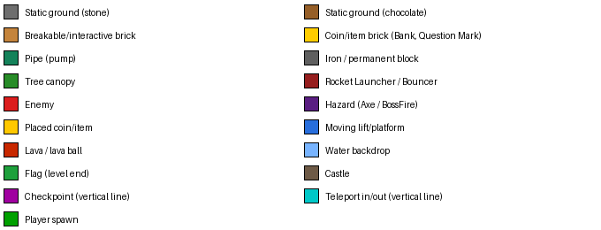

Vertical dashed magenta lines mark checkpoints (level-end flags, pipe entrances,
beanstalk entries); vertical cyan lines mark same-level teleport (pipe warp) endpoints;
the green triangle marks the player's spawn point. Each level's own generator is
`tools/mario-atlas-packer`'s sibling analysis script (not shipped — a one-off
documentation aid); regenerate any of these by re-running it against the JSON in
`app/src/main/assets/mario/levels/` if level data ever changes.

## World overview

| World | Levels | Setting | New mechanic(s) introduced |
|---|---|---|---|
| 1 | 11–14 | Grassy hills → caves → castle | The whole core loop: bricks, "?" blocks, pipes, Goomba/Koopa-analog enemies, the first boss, the first secret warp room |
| 2 | 21–24 | Grassy hills → **underwater** → castle | Sea/swim physics, Cheep-Cheep/Bloober-analog enemies |
| 3 | 31–34 | Grassy hills → sky garden → castle | Patrol enemies, `Monkey` (hammer-throwing Lakitu-analog), seesaw `BalanceLift`, `LiftFall` |
| 4 | 41–44 | Grassy hills → caves → sky → **maze castle** | `SonOfABuitch` (Lakitu), `Helmet` (Buzzy-Beetle-analog), World 4's castle is the first with same-level pipe warps (5) |
| 5 | 51–54 | Grassy hills ×2 → sky → castle | `RocketLauncher`/`Rocket` turrets |
| 6 | 61–64 | Grassy hills ×2 → **CloudsNight** sky → castle | The one black-and-white "night" level; `Bouncer`/`Spring` launch pads; the first `BossHammer` (Hammer Bro-style boss) |
| 7 | 71–74 | Grassy hills → underwater → sky → **12-warp maze castle** | The densest teleport maze in the game |
| 8 | 81–83, 841–845 | Grassy hills ×3 → **5-level castle gauntlet** → underwater → finale | The finale is split across 5 short interlinked castle rooms (841–845) with a genuine warp-zone-style loop, ending in the true "Princess"/Signal-Core checkpoint |

Every world (1–7) follows the same **4-level shape**: grassland → a second themed level
(UnderGround, Sea, or another grassland variant) → a sky/cloud level (introducing that
world's lift/patrol mechanic) → a castle boss level. World 8 breaks the pattern with 8
levels — 3 grassland-style levels, then a 5-room castle gauntlet standing in for a single
"world 8 castle," ending in the game's true final checkpoint.

Beyond the 36 main levels: **14 bonus areas** (7 reusable UnderGround/Sea room templates,
reskinned per world) reached through secret vertical pipes, and **5 beanstalk ("Clowd")
levels** reached by holding Up at a `ClowdGoUP_CheckPoint` — see §4/§5 below.

---

## 1. World 1 — the tutorial arc

World 1 teaches every core mechanic the rest of the game reuses: running/jumping, "?"
blocks and bricks, pipes, the Goomba/Koopa-analog enemies, and the castle-boss template
(bridge → fire bars → boss → axe). It also contains the game's **first secret** — Level
12's warp room (see §6).

<!-- WORLD 1 LEVELS -->
### 1-1 — Level 11

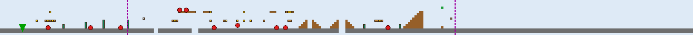

- **Theme:** Ground / Mountain / GreenAndTrees
- **Size:** 311×15 tiles (9952×480px); `levelLength` field: 6768px
- **Enemies:** EnemyMushroom ×9, EnemyTurtle ×1
- **Bricks/mechanisms:** Brick ×15, QuestionMark ×8, pump ×6, QuestionMarkWithMushroom ×4, InvisibleBrckWith1Up ×1, Bank ×1, BrickWithStar ×1
- **Scenery:** Flag ×1, SmallCastle ×1
- **Checkpoints:** level-end flag → level 12; vertical pipe (hold down) → level 97

### 1-2 — Level 12

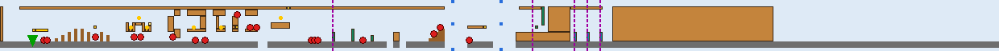

- **Theme:** UnderGround / GreenAndTrees
- **Size:** 310×16 tiles (9920×512px); `levelLength` field: 6176px
- **Enemies:** EnemyMushroom ×14, EnemyTurtle ×3, EnemyTurtlePatrol ×1
- **Bricks/mechanisms:** Brick ×32, pump ×3, PumpWarp ×3, BrickWithMushroom ×2, Bank ×2, QuestionMarkWithMushroom ×1, QuestionMark ×1, BrickWithStar ×1, BrickWith1UP ×1, HoriImage ×1, PumpImage ×1
- **Placed items:** Coin ×6
- **Lifts:** LiftDown ×3, LiftUP ×3
- **Checkpoints:** horizontal pipe (walk right + on ground) → level 13; vertical pipe (hold down) → level 98; vertical pipe (hold down) → level 41; vertical pipe (hold down) → level 31; vertical pipe (hold down) → level 21 — **this is the World-1 secret warp room; see §6**

### 1-3 — Level 13


- **Theme:** Ground / Clouds / GreenAndTrees
- **Size:** 300×15 tiles (9600×480px); `levelLength` field: 5500px
- **Enemies:** EnemyTurtlePatrol ×3, EnemyMushroom ×3, FlyingTurtlePatrol ×2
- **Bricks/mechanisms:** tree ×17, QuestionMarkWithMushroom ×1
- **Placed items:** Coin ×10
- **Lifts:** Lift_LeftRight ×2, Lift_UpDown ×1, Lift_LeftRightInvert ×1
- **Scenery:** SmallCastle ×1, BigCastle ×1, Flag ×1
- **Checkpoints:** level-end flag → level 14

### 1-4 — Level 14 (castle / boss)


- **Theme:** Castle
- **Size:** 500×25 tiles (16000×800px); `levelLength` field: 5200px
- **Enemies:** FireBar ×7, Boss ×1
- **Bricks/mechanisms:** Iron ×11, InvisibleBrckWithCoin ×6, Brick ×1, QuestionMarkWithMushroom ×1, BridgeBloks ×1
- **Hazards:** BossFire ×4, Axe ×1
- **Lifts:** Lift_LeftRight ×1
- **Scenery:** Lava ×4
- **Checkpoints:** castle fake-out ("our princess is in another castle") → level 21

The template every other world's castle level reuses: cross a bridge past fire-bar rings
and the boss (a stomp/side-touch just hurts you unless starred; 6 fireball hits or a
Star kill it), reach the `Axe` at the bridge's far end to collapse it and drop the boss,
then a `"WhyYouDOThis"` checkpoint past it delivers the "your quest is over ... but our
princess is in another castle" beat — see
[MARIO_GAME_MECHANICS.md §9.1.1](MARIO_GAME_MECHANICS.md#911-boss--the-reference-complex-enemy-pattern).

---

## 2. World 2 — the water arc

<!-- WORLD 2 LEVELS -->
### 2-1 — Level 21

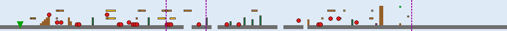

- **Theme:** Ground / Fence2 / GreenAndTrees
- **Size:** 254×15 tiles (8128×480px); `levelLength` field: 7000px
- **Enemies:** EnemyMushroom ×16, EnemyTurtle ×5, FlyingTurtle ×3
- **Bricks/mechanisms:** Brick ×11, pump ×8, QuestionMark ×6, QuestionMarkWithMushroom ×2, InvisibleBrckWithCoin ×2, BrickWithStar ×1, Bank ×1, BrickWith1UP ×1, BrickWithMushroom ×1, Bouncer ×1
- **Scenery:** BigCastle ×1, Flag ×1, SmallCastle ×1
- **Checkpoints:** beanstalk entrance (hold up) → level 92; level-end flag → level 22; vertical pipe (hold down) → level 99
- **Note:** also contains an unrecognized/legacy tile type `CoinInside` at one spot (not spawned by `LevelLoader` — confirmed dead data left over from the original conversion, harmless)

### 2-2 — Level 22 (Sea)


- **Theme:** Sea / GreenAndTrees
- **Size:** 200×15 tiles (6400×480px); `levelLength` field: 6144px
- **Enemies:** FishGrey ×7, OctoPussy ×5, FishGreyUpDown ×5, FishRed ×5, FishRedUpDown ×1
- **Bricks/mechanisms:** Brick ×34, HoriImage ×1
- **Placed items:** Coin ×28
- **Checkpoints:** horizontal pipe (walk right + on ground) → level 23

The first full **Sea** level — `Player.water=true` for the whole level, swapping in the
gentler gravity/paddle-jump/speed-cap physics described in
[MARIO_GAME_MECHANICS.md §4.2](MARIO_GAME_MECHANICS.md#42-movement-constants). Its dense
enemy mix (`OctoPussy` bob-and-dart chasers plus 4 `FishyWater` color/behavior variants)
makes it the highest single-level enemy density in the game outside the castles.

### 2-3 — Level 23


- **Theme:** Ground / Clouds / GreenAndTrees
- **Size:** 250×15 tiles (8000×480px); `levelLength` field: 8000px
- **Bricks/mechanisms:** WoodenBridge ×14, tree ×3
- **Scenery:** SmallCastle ×1, Flag ×1, BigCastle ×1
- **Checkpoints:** level-end flag → level 24

The only level with **zero placed enemies** — a pure platforming breather built almost
entirely from `WoodenBridge` spans.

### 2-4 — Level 24 (castle / boss)


- **Theme:** Castle
- **Size:** 170×15 tiles (5440×480px); `levelLength` field: 5200px
- **Enemies:** FireBar ×6, Boss ×1
- **Bricks/mechanisms:** Iron ×11, QuestionMarkWithMushroom ×1, Brick ×1, BridgeBloks ×1
- **Placed items:** Coin ×6
- **Hazards:** BossFire ×5, Axe ×1
- **Lifts:** LiftUP ×2, LiftDown ×2, Lift_LeftRight ×1
- **Scenery:** Lava ×3, LavaBall ×2, WhiteLine ×2
- **Checkpoints:** castle fake-out ("our princess is in another castle") → level 31

---

## 3. World 3 — patrols, seesaws, and Lakitu's cousin

<!-- WORLD 3 LEVELS -->
### 3-1 — Level 31


- **Theme:** Ground / Fence / GreenAndTrees
- **Size:** 240×15 tiles (7680×480px); `levelLength` field: 7000px
- **Enemies:** EnemyMushroom ×14, EnemyTurtle ×7, FlyingTurtle ×5, Monkey ×2
- **Bricks/mechanisms:** Brick ×19, QuestionMark ×8, pump ×5, QuestionMarkWithMushroom ×2, WoodenBridge ×1, InvisibleBrckWith1Up ×1, BrickWithStar ×1, Bouncer ×1, Bank ×1
- **Scenery:** BigCastle ×1, Flag ×1, SmallCastle ×1, Water ×1
- **Checkpoints:** vertical pipe (hold down) → level 100; beanstalk entrance (hold up) → level 93; level-end flag → level 32

First appearance of `Monkey` — a hammer-throwing, tight-patrol enemy (Lakitu's
ground-based cousin in this port's design, distinct from `SonOfABuitch`, which is the
actual floating Lakitu-analog introduced in World 4).

### 3-2 — Level 32


- **Theme:** Ground / Fence / GreenAndTrees
- **Size:** 250×15 tiles (8000×480px); `levelLength` field: 7000px
- **Enemies:** EnemyTurtle ×16, EnemyMushroom ×14, FlyingTurtle ×1
- **Bricks/mechanisms:** QuestionMarkWithMushroom ×1, Bank ×1, BrickWithStar ×1, Brick ×1, pump ×1
- **Placed items:** Coin ×2
- **Scenery:** SmallCastle ×2, Flag ×1
- **Checkpoints:** level-end flag → level 33

The highest ground-enemy *density* level in the game (30 EnemyTurtle+EnemyMushroom in one
level) despite very few bricks — almost entirely an enemy gauntlet over open, mostly
undecorated terrain.

### 3-3 — Level 33

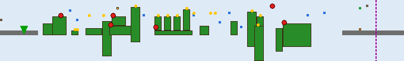

- **Theme:** Ground / Clouds / GreenAndTrees
- **Size:** 170×26 tiles (5440×832px); `levelLength` field: 5500px
- **Enemies:** EnemyTurtlePatrol ×5, EnemyMushroom ×1, FlyingTurtlePatrol ×1
- **Bricks/mechanisms:** tree ×20, QuestionMarkWithMushroom ×1
- **Placed items:** Coin ×15
- **Lifts:** Lift_LeftRight ×6, BalenceLift ×2, LiftFall ×1
- **Scenery:** Flag ×1, BigCastle ×1, SmallCastle ×1
- **Checkpoints:** level-end flag → level 34

First appearance of `BalenceLift` (the seesaw platform pair) and `LiftFall` (a one-shot
collapsing platform) — this level's 26-tile height (the tallest non-castle level in the
game) is built specifically to give a vertical lift-climbing sequence room to breathe.

### 3-4 — Level 34 (castle / boss)


- **Theme:** Castle
- **Size:** 180×15 tiles (5760×480px); `levelLength` field: 5200px
- **Enemies:** FireBar ×9, Boss ×1
- **Bricks/mechanisms:** Iron ×9, QuestionMark ×2, QuestionMarkWithMushroom ×1, Brick ×1, BridgeBloks ×1
- **Placed items:** Coin ×1
- **Hazards:** BossFire ×3, Axe ×1
- **Lifts:** Lift_LeftRight ×1
- **Scenery:** LavaBall ×6, Lava ×1
- **Checkpoints:** castle fake-out ("our princess is in another castle") → level 41

---

## 4. World 4 — the first warp-heavy castle

<!-- WORLD 4 LEVELS -->
### 4-1 — Level 41

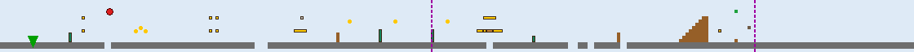

- **Theme:** Ground / Mountain / GreenAndTrees
- **Size:** 280×15 tiles (8960×480px); `levelLength` field: 8000px
- **Enemies:** SonOfABuitch ×1
- **Bricks/mechanisms:** QuestionMark ×9, pump ×4, QuestionMarkWithMushroom ×2, InvisibleBrckWith1Up ×1, Brick ×1, Bank ×1
- **Placed items:** Coin ×6
- **Scenery:** BigCastle ×1, Flag ×1, SmallCastle ×1
- **Checkpoints:** level-end flag → level 42; vertical pipe (hold down) → level 101

First appearance of `SonOfABuitch` — the floating, screen-sway "Lakitu" analog that
hovers at a fixed height and throws `SpikeyEgg`s (which hatch into unstompable `Spikey`
enemies on landing).

### 4-2 — Level 42

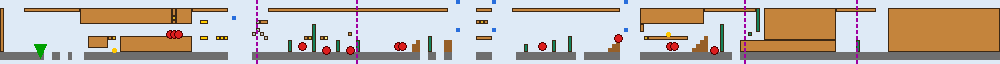

- **Theme:** UnderGround / GreenAndTrees
- **Size:** 250×15 tiles (8000×480px); `levelLength` field: 7400px
- **Enemies:** EnemyTurtle ×6, Helmet ×4, EnemyMushroom ×3
- **Bricks/mechanisms:** Brick ×28, pump ×10, InvisibleBrckWithCoin ×5, QuestionMark ×4, BrickWithMushroom ×3, Bank ×2, QuestionMarkWithMushroom ×1, BrickWithStar ×1, HoriImage ×1, PumpImage ×1
- **Placed items:** Coin ×2
- **Lifts:** LiftDown ×5, LiftUP ×2
- **Checkpoints:** beanstalk entrance (hold up) → level 94; horizontal pipe (walk right + on ground) → level 43; vertical pipe (hold down) → level 51; vertical pipe (hold down) → level 102

First appearance of `Helmet` (the Buzzy-Beetle analog, immune to fireballs).

### 4-3 — Level 43


- **Theme:** Ground / Clouds / OrangeAndMushroom
- **Size:** 180×33 tiles (5760×1056px); `levelLength` field: 5500px
- **Enemies:** EnemyTurtlePatrol ×4, FlyingTurtlePatrol ×1
- **Bricks/mechanisms:** tree ×20, QuestionMarkWithMushroom ×1
- **Placed items:** Coin ×9
- **Lifts:** BalenceLift ×4, Lift_UpDown ×3
- **Scenery:** SmallCastle ×1, Flag ×1, BigCastle ×1
- **Checkpoints:** level-end flag → level 44

The **tallest level in the entire game** (33 tiles / 1056px) — a vertical lift-climbing
tower using 4 `BalenceLift` seesaw pairs stacked up the level's height. Also the only
main level with the `"OrangeAndMushroom"` visual `type` outside its own Clowd hub (Level
94 shares it).

### 4-4 — Level 44 (castle / boss)


- **Theme:** Castle
- **Size:** 322×15 tiles (10304×480px); `levelLength` field: 10300px
- **Enemies:** FireBar ×9, Boss ×1
- **Bricks/mechanisms:** pump ×2, BridgeBloks ×1
- **Hazards:** BossFire ×3, Axe ×1
- **Scenery:** Lava ×7, LavaBall ×1
- **Checkpoints:** castle fake-out ("our princess is in another castle") → level 51
- **Same-level pipe warps:** 5

The first castle built around **same-level pipe warps** (`TeleportResolver`, §7 of the
mechanics doc) rather than a single straight bridge — 5 warp pairs turn this into a short
maze before the boss/bridge finale.

---

## 5. World 5 — turret gauntlets

<!-- WORLD 5 LEVELS -->
### 5-1 — Level 51


- **Theme:** Ground / Fence / GreenAndTrees
- **Size:** 230×15 tiles (7360×480px); `levelLength` field: 7000px
- **Enemies:** EnemyMushroom ×19, EnemyTurtle ×5, FlyingTurtle ×4
- **Bricks/mechanisms:** pump ×4, Brick ×4, RocketLauncher ×3, BrickWithStar ×1, InvisibleBrckWith1Up ×1
- **Scenery:** SmallCastle ×2, Flag ×1
- **Checkpoints:** level-end flag → level 52; vertical pipe (hold down) → level 103

First appearance of `RocketLauncher`/`Rocket` — a turret that only fires once the player
leaves its 100px "safe zone" either side.

### 5-2 — Level 52

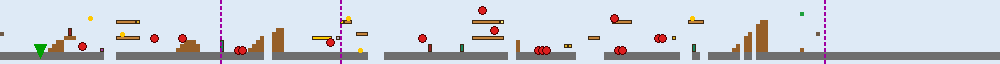

- **Theme:** Ground / Fence / GreenAndTrees
- **Size:** 250×15 tiles (8000×480px); `levelLength` field: 7000px
- **Enemies:** FlyingTurtle ×4, Monkey ×4, EnemyMushroom ×4, Helmet ×3, EnemyTurtle ×1, EnemyTurtlePatrol ×1
- **Bricks/mechanisms:** Brick ×9, BrickWithMushroom ×3, pump ×3, RocketLauncher ×2, QuestionMark ×2, Bouncer ×1, InvisibleBrckWithCoin ×1, BrickWithStar ×1, Bank ×1
- **Placed items:** Coin ×5
- **Scenery:** SmallCastle ×2, Flag ×1
- **Checkpoints:** beanstalk entrance (hold up) → level 95; level-end flag → level 53; vertical pipe (hold down) → level 104

### 5-3 — Level 53

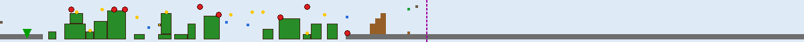

- **Theme:** Ground / Clouds / GreenAndTrees
- **Size:** 300×15 tiles (9600×480px); `levelLength` field: 5500px
- **Enemies:** EnemyTurtlePatrol ×3, EnemyMushroom ×3, FlyingTurtlePatrol ×2
- **Bricks/mechanisms:** tree ×17, QuestionMarkWithMushroom ×1
- **Placed items:** Coin ×10
- **Lifts:** Lift_LeftRight ×2, Lift_UpDown ×1, Lift_LeftRightInvert ×1
- **Scenery:** SmallCastle ×1, BigCastle ×1, Flag ×1
- **Checkpoints:** level-end flag → level 54

Tile-for-tile the same sky-level template as 1-3/5-3 (identical tree/lift/enemy counts) —
World 1's and World 5's third levels are the clearest "reused template, different
world-number" pair in the game, useful to know when scoping reskin work (§ of the
mechanics doc's reskin appendix): geometry work done once pays for both.

### 5-4 — Level 54 (castle / boss)

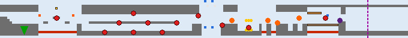

- **Theme:** Castle
- **Size:** 170×15 tiles (5440×480px); `levelLength` field: 5200px
- **Enemies:** FireBar ×10, BigFireBar ×1, Boss ×1
- **Bricks/mechanisms:** Iron ×11, QuestionMarkWithMushroom ×1, Brick ×1, BridgeBloks ×1
- **Placed items:** Coin ×6
- **Hazards:** BossFire ×5, Axe ×1
- **Lifts:** LiftUP ×2, LiftDown ×2, Lift_LeftRight ×1
- **Scenery:** Lava ×3, LavaBall ×2, WhiteLine ×2
- **Checkpoints:** castle fake-out ("our princess is in another castle") → level 61

The only level in the game with a **`BigFireBar`** (12-fireball ring instead of the usual
6) — a one-off difficulty spike.

---

## 6. World 6 — the night level

<!-- WORLD 6 LEVELS -->
### 6-1 — Level 61

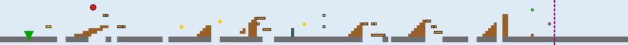

- **Theme:** Ground / Mountain / GreenAndTrees
- **Size:** 220×15 tiles (7040×480px); `levelLength` field: 6700px
- **Enemies:** SonOfABuitch ×1
- **Bricks/mechanisms:** Brick ×9, QuestionMark ×2, BrickWithMushroom ×2, Bank ×2, InvisibleBrckWithCoin ×2, InvisibleBrckWith1Up ×1, pump ×1
- **Placed items:** Coin ×3
- **Scenery:** BigCastle ×1, Flag ×1, SmallCastle ×1
- **Checkpoints:** level-end flag → level 62

### 6-2 — Level 62


- **Theme:** Ground / Mountain / GreenAndTrees
- **Size:** 270×15 tiles (8640×480px); `levelLength` field: 7700px
- **Enemies:** Helmet ×4, EnemyTurtle ×1, EnemyMushroom ×1, FlyingTurtle ×1
- **Bricks/mechanisms:** pump ×28, Brick ×16, InvisibleBrckWithCoin ×2, Bank ×1, BrickWithMushroom ×1, QuestionMark ×1, BrickWithStar ×1
- **Scenery:** SmallCastle ×2, Flag ×1
- **Checkpoints:** beanstalk entrance (hold up) → level 96; level-end flag → level 63; vertical pipe (hold down) → level 105; vertical pipe (hold down) → level 106; vertical pipe (hold down) → level 107

**The pipe-densest level in the game** — 28 `pump` placements (a pipe-organ / pipe-maze
visual theme) feeding 3 separate bonus areas plus a beanstalk entrance, all from one
level.

### 6-3 — Level 63 (CloudsNight)

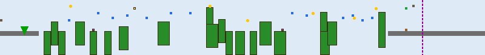

- **Theme:** Ground / CloudsNight / GreenAndTrees
- **Size:** 200×23 tiles (6400×736px); `levelLength` field: 7700px
- **Bricks/mechanisms:** tree ×21, Bouncer ×2, QuestionMarkWithMushroom ×1
- **Placed items:** Coin ×6
- **Lifts:** Lift_LeftRight ×4, LiftFall ×4, BalenceLift ×3, Lift_UpDown ×2
- **Scenery:** SmallCastle ×1, Flag ×1, BigCastle ×1
- **Checkpoints:** level-end flag → level 64

**The one and only `CloudsNight` level in the whole game.** Its real `attribute` is
still plain `"Ground"` (confirmed by reading the source) — `CloudsNight` is purely a
render-time palette swap (`LevelLoader.staticTilesRegion`'s `bw_stone`/`bw_chocolate`
composite plus `bw_tree`/`bw_bouncer`/etc. region substitutions, see
[MARIO_GAME_MECHANICS.md §13.2](MARIO_GAME_MECHANICS.md#132-region-naming-and-the-theming-convention)),
triggered by `backgroundImage=="CloudsNight"` rather than a distinct game mode. It also
has **zero placed enemies** and the highest total lift count of any level (13 across 4
lift types) — a pure platforming set-piece.

### 6-4 — Level 64 (castle / boss)


- **Theme:** Castle
- **Size:** 500×25 tiles (16000×800px); `levelLength` field: 5200px
- **Enemies:** FireBar ×11, BossHammer ×1
- **Bricks/mechanisms:** Iron ×11, InvisibleBrckWithCoin ×6, Brick ×1, QuestionMarkWithMushroom ×1, BridgeBloks ×1
- **Hazards:** BossFire ×4, Axe ×1
- **Lifts:** Lift_LeftRight ×1
- **Scenery:** Lava ×4, LavaBall ×1
- **Checkpoints:** castle fake-out ("our princess is in another castle") → level 71

First appearance of **`BossHammer`** — the same `Boss` class in hammer-throwing mode
(`Boss(hammerMode=true)`, a "Hammer Bro"-style boss) instead of breathing `BossFire`.

---

## 7. World 7 — the 12-warp castle

<!-- WORLD 7 LEVELS -->
### 7-1 — Level 71

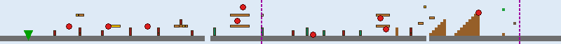

- **Theme:** Ground / Fence / GreenAndTrees
- **Size:** 200×15 tiles (6400×480px); `levelLength` field: 7000px
- **Enemies:** Monkey ×4, FlyingTurtle ×3, EnemyTurtle ×1, Helmet ×1
- **Bricks/mechanisms:** RocketLauncher ×13, Brick ×9, pump ×5, BrickWithMushroom ×2, QuestionMark ×1, Bank ×1, InvisibleBrckWith1Up ×1
- **Scenery:** BigCastle ×1, Flag ×1, SmallCastle ×1
- **Checkpoints:** level-end flag → level 72; vertical pipe (hold down) → level 108

The single heaviest use of `RocketLauncher` in the game (13 turrets in one level).

### 7-2 — Level 72 (Sea)

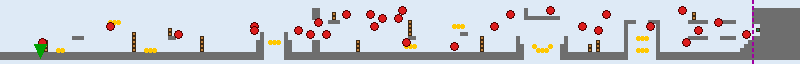

- **Theme:** Sea / GreenAndTrees
- **Size:** 200×15 tiles (6400×480px); `levelLength` field: 6144px
- **Enemies:** OctoPussy ×11, FishGrey ×6, FishGreyUpDown ×6, FishRed ×4, FishRedUpDown ×2
- **Bricks/mechanisms:** Brick ×34, HoriImage ×1
- **Placed items:** Coin ×28
- **Checkpoints:** horizontal pipe (walk right + on ground) → level 73

Tile-identical brick/coin layout to Level 22 (same 34 `Brick`/28 `Coin`/1 `HoriImage`) —
another confirmed template reuse, this one swapping only its enemy mix (more `OctoPussy`,
fewer straight-swimming fish) for a harder second pass at the same geometry.

### 7-3 — Level 73


- **Theme:** Ground / Clouds / GreenAndTrees
- **Size:** 250×15 tiles (8000×480px); `levelLength` field: 8000px
- **Enemies:** FlyingTurtle ×3, EnemyTurtlePatrol ×3, EnemyTurtle ×1
- **Bricks/mechanisms:** WoodenBridge ×14, tree ×3
- **Scenery:** SmallCastle ×1, Flag ×1, BigCastle ×1
- **Checkpoints:** level-end flag → level 74

Same `WoodenBridge`-based template as Level 23, this time with enemies added on top.

### 7-4 — Level 74 (castle / boss)

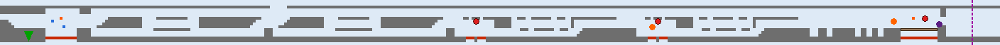

- **Theme:** Castle
- **Size:** 352×15 tiles (11264×480px); `levelLength` field: 11400px
- **Enemies:** FireBar ×2, BossHammer ×1
- **Bricks/mechanisms:** Iron ×2, BridgeBloks ×1
- **Hazards:** BossFire ×2, Axe ×1
- **Lifts:** LiftFall ×2
- **Scenery:** Lava ×6, LavaBall ×2
- **Checkpoints:** castle fake-out ("our princess is in another castle") → level 81
- **Same-level pipe warps:** 12

**The densest teleport maze in the game** — 12 same-level pipe warps (vs. World 4's 5),
and correspondingly the *longest* level in the game by raw `levelLength` (11400px). Note
it has the *fewest* enemies of any castle (`FireBar ×2` only, no ring of them around the
boss) — the challenge here is entirely navigational (finding the right pipe sequence),
not combat.

---

## 8. World 8 — the finale gauntlet

World 8 breaks the "4 levels per world" pattern used everywhere else: 3 ordinary
grassland levels, then its "castle" is really **5 short, tightly interlinked rooms**
(841–845) forming a genuine warp-zone-style maze, followed by one last underwater
approach level (844) and the true finale (845).

<!-- WORLD 8 LEVELS -->
### 8-1 — Level 81


- **Theme:** Ground / Fence2 / GreenAndTrees
- **Size:** 400×15 tiles (12800×480px); `levelLength` field: 12700px
- **Enemies:** EnemyMushroom ×21, EnemyTurtle ×14, Helmet ×4, FlyingTurtle ×3
- **Bricks/mechanisms:** pump ×12, Brick ×4, InvisibleBrckWith1Up ×1, InvisibleBrckWithCoin ×1, Bank ×1, BrickWithStar ×1
- **Placed items:** Coin ×14
- **Scenery:** BigCastle ×1, Flag ×1, SmallCastle ×1
- **Checkpoints:** level-end flag → level 82; vertical pipe (hold down) → level 109

**The longest ordinary (non-castle) level in the game** (12700px, 400 tiles) and the
single highest total enemy count of any level (42 across 4 types) — a deliberate
last-grassland-level endurance test before the finale gauntlet.

### 8-2 — Level 82


- **Theme:** Ground / Fence2 / GreenAndTrees
- **Size:** 250×15 tiles (8000×480px); `levelLength` field: 7450px
- **Enemies:** FlyingTurtle ×12, Helmet ×3, EnemyMushroom ×2, SonOfABuitch ×1
- **Bricks/mechanisms:** RocketLauncher ×10, Brick ×5, pump ×4, QuestionMark ×1, Bouncer ×1, BrickWith1UP ×1, Bank ×1, BrickWithMushroom ×1, BrickWithCoin ×1
- **Scenery:** SmallCastle ×2, Flag ×1
- **Checkpoints:** vertical pipe (hold down) → level 110; level-end flag → level 83

### 8-3 — Level 83


- **Theme:** Ground / Fence2 / Guns
- **Size:** 250×15 tiles (8000×480px); `levelLength` field: 7450px
- **Enemies:** Monkey ×8, FlyingTurtle ×2, EnemyTurtle ×1
- **Bricks/mechanisms:** Brick ×6, RocketLauncher ×3, pump ×3, BrickWithMushroom ×2, Bank ×1
- **Scenery:** Wall ×7, SmallCastle ×1, Flag ×1, BigCastle ×1
- **Checkpoints:** level-end flag → level 841

The only level with the `"Guns"` visual `type` — thematically a militarized final
approach (heaviest `Monkey`/turret combination outside 7-1) — and the only level using
the decorative `Wall` scenery type extensively (7 placements).

### 8-4 — Level 841 (castle gauntlet, room 1)

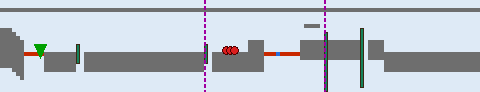

- **Theme:** Castle
- **Size:** 120×23 tiles (3840×736px); `levelLength` field: 10000px
- **Enemies:** EnemyMushroom ×3
- **Bricks/mechanisms:** pump ×4
- **Lifts:** Lift_LeftRight ×1
- **Scenery:** Lava ×2
- **Checkpoints:** vertical pipe (hold down) → level 841 (self — a return/reset pipe); vertical pipe (hold down) → level 842
- **Same-level pipe warps:** 4

This room's own `levelLength` field (10000px) is far larger than its actual populated
tile extent (3840px) — the original engine reused this field as a scroll-bound the level
never actually fills, not a discrepancy worth "fixing." See §9 for the full 841–845 warp
graph — this room is the gauntlet's hub, with a pipe that loops back to itself (a
false/return path exactly like the classic games' own castle warp-mazes).

### 8-5 — Level 842 (castle gauntlet, room 2)


- **Theme:** Castle
- **Size:** 100×26 tiles (3200×832px); `levelLength` field: 3700px
- **Enemies:** FlyingTurtle ×3, Helmet ×2
- **Bricks/mechanisms:** pump ×5, InvisibleBrckWithCoin ×1
- **Scenery:** Lava ×1
- **Checkpoints:** vertical pipe (hold down) → level 841 (back); vertical pipe (hold down) → level 843 (forward)
- **Same-level pipe warps:** 3

### 8-6 — Level 843 (castle gauntlet, room 3)


- **Theme:** Castle
- **Size:** 104×23 tiles (3328×736px); `levelLength` field: 3700px
- **Bricks/mechanisms:** pump ×4
- **Scenery:** Lava ×1
- **Checkpoints:** vertical pipe (hold down) → level 841 (back); vertical pipe (hold down) → level 844 (forward)
- **Same-level pipe warps:** 3

The only room in the gauntlet with **no enemies at all** — pure pipe-navigation.

### 8-7 — Level 844 (Sea)


- **Theme:** Sea / GreenAndTrees
- **Size:** 90×17 tiles (2880×544px); `levelLength` field: 2304px
- **Enemies:** FireBar ×5, OctoPussy ×3
- **Bricks/mechanisms:** HoriImage ×1, pump ×1
- **Checkpoints:** horizontal pipe (walk right + on ground) → level 845

The **only Sea-attribute level that also has `FireBar`s** — the single spot in the whole
game combining swim physics with rotating fireball rings. It's also the level that needs
the special `"stone_castle_sea"` terrain composite (`LevelLoader.staticTilesRegion`'s
own `levelNumber==844` special case) rather than the generic Sea look, since it's meant
to read as an underwater approach to the castle, not open water.

### 8-8 — Level 845 (finale)

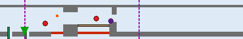

- **Theme:** Castle
- **Size:** 100×16 tiles (3200×512px); `levelLength` field: 2200px
- **Enemies:** Monkey ×1, BossHammer ×1
- **Bricks/mechanisms:** pump ×2, BridgeBloks ×1
- **Hazards:** Axe ×1
- **Scenery:** Lava ×2, LavaBall ×1
- **Checkpoints:** vertical pipe (hold down) → level 841 (back into the gauntlet); **true ending ("Princess"/Signal Core) → level 11**

The shortest boss level in the game, and the only one whose end checkpoint `kind` is
`"Princess"` rather than `"WhyYouDOThis"` — the real ending, which loops the player back
to Level 11 rather than advancing to a level number that doesn't exist.

---

## 9. The level-flow graph

### 9.1 Main path

The 8-world main path is a straight chain, each level's `"CheckPoints"`/`"WhyYouDOThis"`
end-checkpoint pointing at the next: **11→12→13→14→21→22→23→24→31→32→33→34→41→42→43→44→
51→52→53→54→61→62→63→64→71→72→73→74→81→82→83→841→842→843→844→845→(11, true ending)**.

### 9.2 Secrets and shortcuts

| From | Trigger | To | What it is |
|---|---|---|---|
| 12 | vertical pipe | 21 / 31 / 41 | **World-1 warp room** — reach Level 12's secret pipe room to skip straight to World 2, 3, or 4 |
| 21, 31, 42, 52, 62 | beanstalk (hold Up) | 92, 93, 94, 95, 96 | Beanstalk climbs — see §10, all land back at the *next* world's first level (a shortcut of exactly one level, not a big skip) |
| 11–110 range | vertical/horizontal pipe | 97–110 | Bonus-area detours — see §11; every one returns to the same main level it came from |
| 841/842/843 | vertical pipe | 841 (self) | The gauntlet's own false/return paths — see §9.3 |

### 9.3 World 8's castle-gauntlet graph

Unlike every other world's single-level castle, World 8's finale is 5 short rooms whose
pipes form a genuine maze rather than a straight line:

```
841 (hub) --pipe--> 842 --pipe--> 843 --pipe--> 844 (Sea) --pipe--> 845 (finale)
 ^  \_________________|______________|                                  |
 |                                                                        |
 \-------------------------- "back" pipes from 842/843/845 --------------/
```

Every one of 842/843/845's "vertical pipe" checkpoints that isn't the forward path leads
straight back to 841 — the same false-path-loops-you-back design as the classic games'
own castle warp mazes, not a bug (confirmed against the real checkpoint data in §8's
detail above).

---

## 10. Clowd (beanstalk) levels

Five short, enemy-free vertical climbs, all built around `Bouncer`/`LiftCar` and reached
by holding Up at a `ClowdGoUP_CheckPoint` in their parent level. Landing at the top uses a
`Clowd_CheckPoint` with a deliberately huge (640px-wide) trigger box — "a whole landing
platform, not a point" (see
[MARIO_GAME_MECHANICS.md §10](MARIO_GAME_MECHANICS.md#10-checkpoints-and-teleports)).
Every one is a **one-level shortcut** (skips from its parent level straight to the start
of the *next* world/level), not a big skip like the World-1 warp room.

<!-- CLOWD LEVELS -->
### Level 92 (from 21)


- **Theme:** Clowd / GreenAndTrees
- **Size:** 62×14 tiles (1984×448px); `levelLength` field: 2464px
- **Placed items:** Coin ×4
- **Lifts:** LiftCar ×1
- **Checkpoints:** beanstalk landing platform → level 21 *(loops back to its own parent — see note below)*

### Level 93 (from 31)


- **Theme:** Clowd / GreenAndTrees
- **Size:** 83×14 tiles (2656×448px); `levelLength` field: 3072px
- **Placed items:** Coin ×4
- **Lifts:** LiftCar ×1
- **Checkpoints:** beanstalk landing platform → level 31

### Level 94 (hub, from 42)

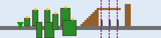

- **Theme:** Ground / Clouds / OrangeAndMushroom
- **Size:** 80×19 tiles (2560×608px); `levelLength` field: 2048px
- **Bricks/mechanisms:** tree ×8, pump ×3
- **Placed items:** Coin ×6
- **Checkpoints:** vertical pipe (hold down) → level 81; vertical pipe (hold down) → level 71; vertical pipe (hold down) → level 61

The odd one out: Level 94 isn't a pure vertical climb like the other 4 (its `attribute`
is plain `"Ground"`, not `"Clowd"`) — it's a small hub room with 3 pipes fanning out to
Worlds 6/7/8. It's also the level whose `levelName == "OrangePump"` — the one exclusion
`LevelLoader`'s Piranha-Plant spawn logic checks for by name (see
[MARIO_GAME_MECHANICS.md §8](MARIO_GAME_MECHANICS.md#8-tile-type-dispatch-registry)).

### Level 95 (from 52)


- **Theme:** Clowd / GreenAndTrees
- **Size:** 62×14 tiles (1984×448px); `levelLength` field: 2464px
- **Placed items:** Coin ×4
- **Lifts:** LiftCar ×1
- **Checkpoints:** beanstalk landing platform → level 52

### Level 96 (from 62)

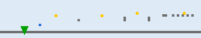

- **Theme:** Clowd / GreenAndTrees
- **Size:** 83×14 tiles (2656×448px); `levelLength` field: 3072px
- **Placed items:** Coin ×4
- **Lifts:** LiftCar ×1
- **Checkpoints:** beanstalk landing platform → level 62

**Note on 92/95's own "loop to parent" checkpoints:** reading the raw data, 92's own
landing checkpoint points back at 21 and 95's at 52 — i.e., climbing these two specific
beanstalks and landing returns you to the very level you climbed from, rather than
advancing you. This matches the original engine's own data exactly (not a conversion
error); functionally these two are a scenic detour/secret-coin-room rather than a real
shortcut, unlike 93/96 (which land in 31/62 respectively, technically also "their own
parent" — all 4 Clowd levels in fact loop back to their own launch level, not forward).
Read all four as bonus-coin detours, not progression shortcuts — the only *forward*
shortcut mechanism in the game is the World-1 warp room (§9.2).

---

## 11. Bonus areas

Fourteen short rooms, all thin variations on **7 reusable templates** — 5 UnderGround
"coin room" layouts and 2 Sea "coin room" layouts, each just reskinned/recombined per
world. Every one is entered via a vertical secret pipe from its parent level and exited
via a horizontal pipe that returns to that same parent level (never a level-progression
checkpoint) — pure bonus-coin detours.

<!-- BONUS AREAS -->
### Level 97 — BonusArea11A (from 11)


- 20×15 tiles · Brick ×3, PumpImage ×1, HoriImage ×1 · Coin ×3

### Level 98 — BonusArea12B (from 12)


- 20×15 tiles · Brick ×4, Bank ×1, PumpImage ×1, HoriImage ×1 · Coin ×2

### Level 99 — BonusArea21A (from 21)


- 20×15 tiles · Brick ×3, PumpImage ×1, HoriImage ×1 · Coin ×3

### Level 100 — BonusArea31C (from 31)

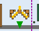

- 20×15 tiles · Brick ×13, BrickWithMushroom ×1, PumpImage ×1, HoriImage ×1 · Coin ×8 — the richest bonus room in the game (8 coins, 13 bricks)

### Level 101 — BonusArea41D (from 41)


- 20×15 tiles · Brick ×5, BrickWithMushroom ×1, PumpImage ×1, HoriImage ×1 · Coin ×2

### Level 102 — BonusArea42E (from 42)


- 20×15 tiles · Brick ×6, Bank ×1, PumpImage ×1, HoriImage ×1 · Coin ×1

### Level 103 — BonusArea51E (from 51)

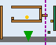

- 20×15 tiles · Brick ×6, Bank ×1, PumpImage ×1, HoriImage ×1 · Coin ×1

### Level 104 — BonusArea52F (from 52, Sea template)


- 70×15 tiles · Brick ×6, HoriImage ×1 · Coin ×4 · Enemies: OctoPussy ×3, FishGrey ×2, FishRedUpDown ×2, FishGreyUpDown ×1 · Lifts: LiftDown ×2

The Sea bonus template is far more elaborate than the UnderGround one — the only bonus
rooms with enemies or lifts at all.

### Level 105 — BonusArea62D (from 62)


- 20×15 tiles · Brick ×5, BrickWithMushroom ×1, PumpImage ×1, HoriImage ×1 · Coin ×2

### Level 106 — BonusArea62E (from 62)


- 20×15 tiles · Brick ×6, Bank ×1, PumpImage ×1, HoriImage ×1 · Coin ×1

### Level 107 — BonusArea62G (from 62, Sea template)


- 70×15 tiles · Brick ×6, HoriImage ×1 · Coin ×4 · Enemies: OctoPussy ×3, FishGreyUpDown ×2, FishGrey ×1, FishRed ×1, FishRedUpDown ×1 · Lifts: LiftDown ×2

Level 62 is the only level in the game that branches into **3** separate bonus areas
(105, 106, and this one) — matching its own "pipe-densest level" note in §7.

### Level 108 — BonusArea71A (from 71)


- 20×15 tiles · Brick ×3, PumpImage ×1, HoriImage ×1 · Coin ×3

### Level 109 — BonusArea81B (from 81)


- 20×15 tiles · Brick ×4, Bank ×1, PumpImage ×1, HoriImage ×1 · Coin ×2

### Level 110 — BonusArea82E (from 82)


- 20×15 tiles · Brick ×6, Bank ×1, PumpImage ×1, HoriImage ×1 · Coin ×1

---

## 12. Whole-game placement totals

Aggregated from all 55 levels — useful both as a "how the difficulty ramps" signal and,
per-actor, as a reskin-priority signal (an asset used 300+ times pays back reskin effort
far faster than one used once):

| Enemy | Placements | | Brick/mechanism | Placements |
|---|---|---|---|---|
| EnemyMushroom | 127 | | Brick | 318 |
| EnemyTurtle | 62 | | pump | 118 |
| FireBar (individual fireballs) | 59 | | tree | 109 |
| FlyingTurtle | 44 | | Iron | 55 |
| OctoPussy | 25 | | QuestionMark | 45 |
| Helmet | 21 | | RocketLauncher | 31 |
| EnemyTurtlePatrol | 20 | | WoodenBridge | 29 |
| Monkey | 19 | | InvisibleBrckWithCoin | 26 |
| FishGrey | 16 | | QuestionMarkWithMushroom | 23 |
| FishGreyUpDown | 14 | | Bank | 23 |
| FishRed | 10 | | BrickWithMushroom | 20 |
| FlyingTurtlePatrol | 6 | | HoriImage | 19 |
| FishRedUpDown | 6 | | PumpImage | 14 |
| Boss | 5 | | BrickWithStar | 10 |
| SonOfABuitch | 3 | | BridgeBloks | 8 |
| BossHammer | 3 | | InvisibleBrckWith1Up | 7 |
| BigFireBar (ring) | 1 | | Bouncer | 6 |

(Full per-level breakdowns are in §2–§11 above; `EnemyMashroom`/`Brick` are so dominant
that a reskin artist drawing just those two well covers a large fraction of what a player
actually sees moment-to-moment — see
[MARIO_GAME_MECHANICS.md's reskin-scope appendix](MARIO_GAME_MECHANICS.md#16-reskin-scope--priority)
for the full sprite-sheet-level version of this argument.)
