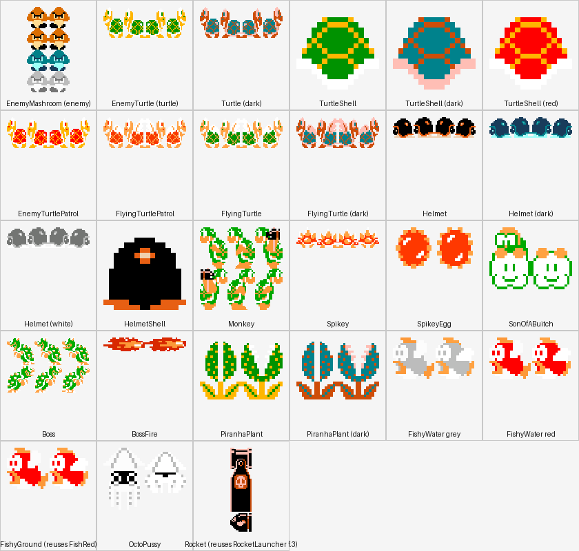
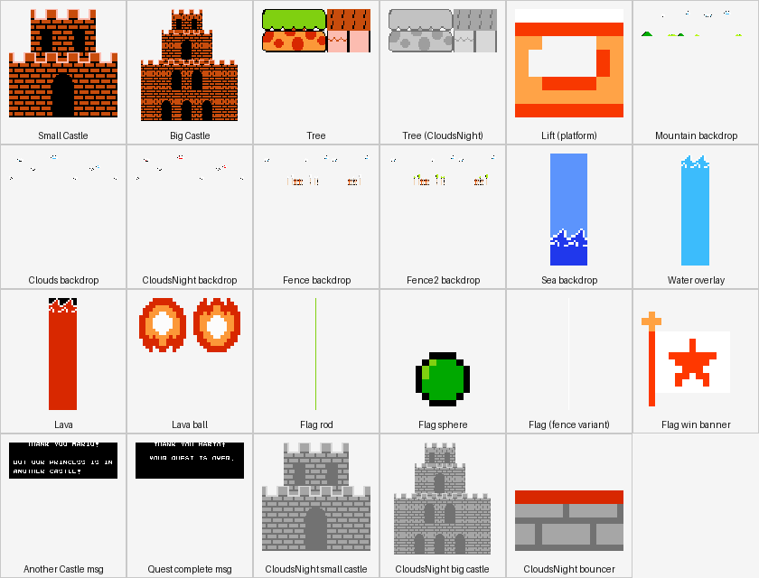

# Mario Game Mechanics & Extension Guide

This document explains **how the ported Mario game actually works** — the physics model,
the actor/collision architecture, the level-data pipeline, and the sprite-sheet/atlas
system — and gives step-by-step recipes for extending it (new levels, new enemies, new
bricks/items, new hazards). It's written for a developer who has never touched this
codebase before and needs to add content to it, most immediately as prep for the
[reskin](MARIO_RESKIN_PLAN.md).

It assumes the engine background in [GAME_ENGINE.md](../GAME_ENGINE.md) (`LayerManager`/
`Sprite`/`TiledLayer`, the microedition API) and complements, rather than repeats, the
three planning documents:

- [MARIO_PORT_PLAN.md](MARIO_PORT_PLAN.md) / [MARIO_PORT_PLAN_PHASE2.md](MARIO_PORT_PLAN_PHASE2.md)
  — the *history* of how the port was built, step by step, with design rationale for each
  decision. This document is the *as-built reference* for the finished result — read the
  plan docs if you want to know *why* something is shaped the way it is; read this one to
  know *what it is and how to add to it*.
- [MARIO_RESKIN_PLAN.md](MARIO_RESKIN_PLAN.md) — the plan for replacing every Nintendo-derived
  asset with original art at a higher resolution. §13 and §16 of this document (sprite
  sheets, reskin scope) are the technical reference that plan's asset-authoring work
  builds on.
- [MARIO_RESKIN_EXECUTION.md](MARIO_RESKIN_EXECUTION.md) — the actionable, resourced
  step-by-step reskin checklist (real asset-pack/tool links with checked license terms),
  built directly on this document's §16 scope numbers.
- [MARIO_LEVEL_ATLAS.md](MARIO_LEVEL_ATLAS.md) — every one of the 55 shipped levels,
  world by world, with a schematic minimap and full tile/enemy/checkpoint breakdown for
  each — the "how scenes are designed" companion to this document's actor/system focus.
- [MARIO_PLAYER_GUIDE.md](MARIO_PLAYER_GUIDE.md) — the player-facing manual (controls,
  power-ups, enemy field guide, world tour) with visuals pulled from the actual game art.

All 8 worlds (~55 levels) are implemented and playable today, on placeholder
Nintendo-derived art — see the phase-2 doc's "Decisions locked in" for the distribution
gate that stays in force until the reskin lands.

## Table of contents

1. [Architecture recap](#1-architecture-recap)
2. [Coordinate system and the tile grid](#2-coordinate-system-and-the-tile-grid)
3. [The frame loop](#3-the-frame-loop)
4. [Player mechanics](#4-player-mechanics)
5. [The world model: `MarioWorld`](#5-the-world-model-marioworld)
6. [Collision system](#6-collision-system)
7. [Level data: schema and pipeline](#7-level-data-schema-and-pipeline)
8. [Tile-type dispatch registry](#8-tile-type-dispatch-registry)
9. [Actor catalog](#9-actor-catalog)
10. [Checkpoints and teleports](#10-checkpoints-and-teleports)
11. [Camera, HUD, and game state](#11-camera-hud-and-game-state)
12. [Debug/QA tooling](#12-debugqa-tooling)
13. [Sprite sheets and the atlas system](#13-sprite-sheets-and-the-atlas-system)
14. [Recipes: extending the game](#14-recipes-extending-the-game)
15. [Appendix: full asset and sound tables](#15-appendix-full-asset-and-sound-tables)
16. [Reskin scope & priority](#16-reskin-scope--priority)

---

## 1. Architecture recap

Same three-level chain as Flappy Bird/Battle City
(`Activity → GamePlay → Screen`), using the **microedition** (`LayerManager`/`Sprite`/
`TiledLayer`) API because the world is a dense 32px tile grid with dozens of concurrent
actors:

```
MarioGameActivity                      (Android entry point)
  └─ MarioGamePlay                     (loads mario-common.atlas/audio once)
       ├─ MarioMenuScreen              (world/level select, MarioSaveState-backed)
       └─ MarioGameScreen              (extends ScreenAdapter — the core gameplay loop)
            ├─ LayerManager            (append-order z-stack: background → world → player → fx)
            │    └─ MarioWorld extends TiledLayer   (static grid + actor lists)
            ├─ Player extends Layer    (not a Sprite — see §4)
            ├─ collision/*Resolver     (one static method per interaction pair, §6)
            └─ hud/{ScoreHud,PauseOverlay}, debug/DebugPanel
```

All gameplay code lives under
`app/src/main/java/au/com/guidebee/morsetoolkit/activity/mario/`, organized as:

| Package | Contents |
|---|---|
| `actors/player` | `Player`, `PlayerPowerState` |
| `actors/bricks` | Interactive block/pipe/scenery-solid actors (`Sprite` subclasses) |
| `actors/enemies` | Everything extending `Enemy` |
| `actors/items` | Pickups (`Collectible` implementations) |
| `actors/hazards` | Non-enemy contact-damage actors (`Hazard` implementations) |
| `actors/lifts` | Moving platforms (`LiftSurface` implementations) |
| `actors/projectiles` | Fired/thrown things (fireballs, hammers) |
| `actors/scenery` | Purely decorative, non-collided actors |
| `collision` | Static resolver classes, one per interaction pair |
| `level` | `LevelDefinition` (data), `LevelLoader` (data → actors), `LevelCatalog`, `LevelNumbering` |
| `world` | `MarioWorld`, `MarioContext`, `CameraController`, `SpawnController`, `TileMovement`, `OscillatorClock` |
| `state` | `GameStateController`, `MarioSaveState` |
| `hud`, `fx`, `debug`, `input`, `screen` | as named |

---

## 2. Coordinate system and the tile grid

- **`MarioConfiguration.TILE_SIZE = 32`** world pixels per tile — every level's tile
  coordinates (`Tile.x`/`Tile.y` in `LevelDefinition`) are multiplied by this to get world
  pixels.
- **Y-down**: `MarioGameScreen`'s camera is set up y-down (`gdxCamera.setToOrtho(true, ...)`),
  matching the original desktop Java2D engine's own convention. Y increases *downward*.
  This matters for anything that reads/writes raw texture regions directly (see
  `MarioResourceManager.uiSkinYDown()`'s font-flip patch, and the atlas packer's per-cell
  vertical flip in §13).
- **Viewport**: `VIEWPORT_WIDTH/HEIGHT = 20×15 tiles` (640×480 world px) — a fixed "camera
  window" size the `CameraController` follows the player through; independent of actual
  screen resolution (`FitViewport`/`ExtendViewport` scale it, and pinch-zoom can widen it
  — see `MarioGameScreen`'s zoom-detector section).
- **`MarioConfiguration.MAX_DELTA_SECONDS = 1/30`**: every per-frame delta is clamped to
  this before reaching any actor's `act()`, so a slow first frame (asset loading, level
  spawn) never lets gravity punch an actor clean through a thin floor in one step.

---

## 3. The frame loop

`MarioGameScreen.render(delta)` runs, every frame, in this fixed order (this is the
single most important thing to internalize — a new interaction pair almost always slots
into this list as one more line):

```java
layerManager.act(paused ? 0f : delta);        // every Layer's own act(): Player, enemies,
                                               // bricks, lifts, fx, hazards, projectiles...
if (!paused) {
    PlayerCollisionResolver.resolvePickups(player, world);
    EnemyCollisionResolver.resolve(player, world);
    EnemyToEnemyResolver.resolve(world);
    ProjectileCollisionResolver.resolve(world);
    LiftCollisionResolver.resolve(player, world);
    HazardCollisionResolver.resolve(player, world);
    AxeResolver.resolve(player, world);
    TeleportResolver.resolve(level.teleports, player);
}
// ...
layerManager.draw();
// ...
Axe touchedAxe = AxeResolver.findTriggered(player, world);        // boss-finale trigger
LevelDefinition.Checkpoint hit = CheckpointResolver.findTouched(level.checkpoints, player);
```

Notes on the ordering:

- **Player-vs-static-tile collision is *not* in this list** — it's resolved inline inside
  `Player.act()`/`moveXWithCollision`/`moveYWithCollision`, because it's the same tile-grid
  algorithm `MarioWorld.containsImpassableArea` provides, not a separate actor-pair check
  (see §6).
- **Every list iterated by a resolver is snapshotted before iterating** where a callback
  can mutate it mid-loop (e.g. `EnemyCollisionResolver` copies `world.getEnemies()` because
  `EnemyTurtle.onStomped` spawning a `TurtleShell` appends to that same live list).
- **Checkpoint/axe detection runs *after* `draw()`**, not before — they drive a scripted
  state-machine transition (level-complete, boss finale) that the *next* frame's render
  reacts to, not this one's.

---

## 4. Player mechanics

`Player` (`actors/player/Player.java`, ~1150 lines) is the largest single class and the
one most worth understanding deeply — it's a hand-rolled physics/state machine, **not** a
`Sprite`. It extends `Layer` directly because growing/shrinking swaps the entire frame
strip and frame size (32×32 "player" → 32×64 "big_player"/"fire_player"), and
`microedition.Sprite` binds its region/frame-grid at construction with no runtime setter.

### 4.1 The "frames" unit

Every physics constant (`ACCEL`, `GRAVITY_STEP`, `JUMP_BASE`, ...) was tuned in the
original engine as "per `update()` call", implicitly assuming a fixed ~60fps loop. Rather
than re-derive each into a px/sec figure, this port keeps every constant **verbatim** and
scales it by `frames = delta * PHYSICS_FPS` (`PHYSICS_FPS = 60`) each frame — "how many
original 60fps ticks did this real frame cover". At exactly 60fps this reduces to the
original formula exactly. **If you're tuning feel, work in this "per-tick" unit, not
px/sec** — that's what every existing constant is expressed in.

### 4.2 Movement constants

| Constant | Value | Meaning |
|---|---|---|
| `ACCEL` | 2 | Horizontal acceleration per tick |
| `FRICTION` | 1 | Horizontal deceleration per tick (both toward zero and turbo-release easing) |
| `MAX_SPEED` | 60 | Normal run cap |
| `MAX_SPEED_TURBO` | 100 | Cap while the run button is held (ground only — never while swimming) |
| `AUTO_WALK_MAX_SPEED` / `AUTO_WALK_ACCEL` | 40 / 1 | Slower, gentler cap used only while `forcedCommand` drives a scripted walk (flagpole slide-to-checkpoint, the axe/bridge finale) |
| `GRAVITY_STEP` / `GRAVITY_CAP` | 0.42 / 10 | Per-tick fall acceleration and terminal velocity |
| `JUMP_BASE` | -11 | Base jump impulse; `± speed/JUMP_SPEED_BONUS_DIVISOR(60)` adds a speed-scaled bonus/penalty depending on direction of travel |
| `BOUNCER_LAUNCH_GRAVITY` | -22 | A `Bouncer`'s relaunch — roughly double a normal jump |
| `WATER_GRAVITY_STEP` / `WATER_GRAVITY_CAP` | 0.1 / 2 | Sea-level gravity (much gentler) |
| `WATER_JUMP_GRAVITY` | -3.5 | A tap-to-paddle impulse — fires on every press, no on-ground gate |
| `WATER_GROUNDED_SPEED_CAP` | 30 | Speed cap while walking the sea floor (vs. free-swimming's 60) |
| `WATER_SURFACE_Y` | 64 | Absolute world Y every Sea level's water surface sits at (hardcoded, not derived from level data) |

### 4.3 Power states


`PlayerPowerState` is a 3-value enum carrying `(width, height, atlasRegionName)`:

| State | Size | Region |
|---|---|---|
| `SMALL` | 32×32 | `player` |
| `BIG` | 32×64 | `big_player` |
| `FIRE` | 32×64 | `fire_player` |

`grow()` advances `SMALL → BIG → FIRE` (already-Fire is a no-op that still plays the
powerup jingle); `shrink()` goes `FIRE → SMALL` directly (**not** through Big — matches
the original) or `BIG → SMALL`, or triggers death if already Small. Both play a full morph
flipbook animation (`beginTransition`) before actually swapping `powerState` — the player
is frozen (its own `act()` early-returns) for the transition's duration, but the *world*
keeps running, so both methods guard against re-entering mid-transition (a second hit
landing mid-morph would otherwise read the stale, not-yet-applied `powerState`).

### 4.4 State machine summary

| State field | Set by | Cleared by | Effect |
|---|---|---|---|
| `transitionFrames != null` | `grow()`/`shrink()` | `updateTransition` finishing the strip | Freezes `Player.act()`, plays the morph flipbook |
| `dyingAnimated` | `beginDeathAnimation()` (enemy-hit-while-Small) | Falling off the level's bottom | Launch-up-then-fall "you died" beat, then respawn |
| `invincibleTimer` | Post-shrink / post-death | Counts down | Blink-visible flicker; blocks further `shrink()` |
| `starTimer` | `collectStar()` | Counts down | Color-cycling palette-swap render; kills on touch instead of hurting |
| `shieldTimer` | `setInvincibleFor()` (scripted sequences only) | Counts down | Same invincibility gate as the above two, but never blinks |
| `ducking` | Holding down, Big/Fire only | Released | Selective *collision* pass-through (not a hitbox resize — see `DUCK_HEAD_ROOM_PX`/`DUCK_OVERHEAD_CLEARANCE_PX`) |
| `water` | `setWater()` at level load (`Sea` attribute) | Never (whole-level, not per-tile) | Swaps in the entire water constant block + swim/paddle input |
| `forcedCommand` | `MarioGameScreen` (scripted sequences) | `clearForcedCommand()` | Overrides `input.poll()` for the flagpole walk / boss-finale auto-walk |

A pit-fall (`getY() > world height + 200px`) is **instant and silent** (`die()` — no
death animation, no sound) — distinct from the enemy-hit-while-Small death, which is
animated and does play `smb_mariodie`. Both respawn at `(checkpointX, checkpointY)`,
which advances automatically (`updateCheckpoint`) every second the player is grounded and
not on a lift, once they've moved >1000px from the last saved point.

### 4.5 Collision resolution (tile side)

`moveXWithCollision`/`moveYWithCollision` do discrete, final-position-only collision
against `world.containsImpassableArea(...)` (§6), then snap to the tile boundary and zero
the relevant velocity component. Landing on an `InteractiveBrick` that happens to be a
`Bouncer` is special-cased right there (relaunches instead of standing); landing that hits
a brick from below calls `brick.hitFromBelow(player)` before deciding whether to keep
falling (a still-active brick after the hit, e.g. a multi-hit `Bank`, keeps blocking; a
newly-deactivated one lets the player pass through the space it used to occupy).

---

## 5. The world model: `MarioWorld`

`MarioWorld extends TiledLayer` is one level's entire mutable state. It holds:

- The **tile grid** itself (`TiledLayer`'s own cell array) — only two non-zero cell
  values exist: `MarioConfiguration.TILE_STONE = 1`, `TILE_CHOCOLATE = 2`. These are
  **purely static, indestructible terrain**.
- Six **actor lists**, each just an `ArrayList` the relevant `LevelLoader.spawnX` method
  populates and the relevant `*CollisionResolver` iterates:

  | List | Element type | Populated by |
  |---|---|---|
  | `bricks` | `InteractiveBrick` | `spawnBricks` |
  | `collectibles` | `Collectible` | `spawnItems`, plus bricks spawning items on hit |
  | `enemies` | `Enemy` | `spawnEnemies` |
  | `fireBalls` | `FireBall` | `Player.applyFire` |
  | `lifts` | `LiftSurface` | `spawnLifts` |
  | `hazards` | `Hazard` | `spawnHazards`, plus `Boss` throwing `BossFire`/`Hammer` |
  | `axes` | `Axe` | `spawnHazards` |

### Why bricks and pipes aren't tile cells

Two tile-shaped things are deliberately **not** part of the static grid, both `Sprite`
actors instead:

- **Breakable/interactive bricks** (`Brick`, `Bank`, `QuestionMark`, ...) — they need to
  animate, dispense items, and deactivate; a `TiledLayer` cell can't do any of that.
- **Pipes (`pump`)** — the source art is 64×32 (2 tiles wide), which doesn't fit a
  uniform-grid `TiledLayer` cell without distortion.

`containsImpassableArea` (§6) folds the brick list back into the same "is this rectangle
solid" query so the rest of collision code never needs to know the difference.

---

## 6. Collision system

There is **no single collision manager** — each interaction *pair* is one static method,
called once per frame in the fixed order from §3. This intentionally replaces the
original engine's 17 explicit `CollisionManager` pair objects with the same total number
of checks and far less setup boilerplate.

| Resolver | Pair | Notes |
|---|---|---|
| `Player` (inline, not a resolver class) | Player ↔ static tile grid + `InteractiveBrick`s | Discrete, final-position AABB test each axis; see §4.5 |
| `PlayerCollisionResolver.resolvePickups` | Player ↔ `Collectible` | Any-side touch |
| `EnemyCollisionResolver.resolve` | Player ↔ `Enemy` | AABB overlap-axis test decides stomp (small Y-overlap + player's center above) vs. side-touch; awards `STOMP_SCORE=100` |
| `EnemyToEnemyResolver.resolve` | `Enemy` ↔ `Enemy` | Only for types where `bouncesOffEnemies()==true` (ground-walkers); items structurally excluded (separate list) |
| `ProjectileCollisionResolver.resolve` | `FireBall`/thrown things ↔ `Enemy`/tiles | Explosion + `smb_bump` on a wall hit, silent on an enemy hit |
| `LiftCollisionResolver.resolve` | Player ↔ `LiftSurface` | Re-derived every frame (a lift moves, so this can't be baked into the tile grid the way ground contact is) |
| `HazardCollisionResolver.resolve` | Player ↔ `Hazard` | Always hurts (no stomp option — a `Hazard` can't be stomped/killed) |
| `AxeResolver.resolve` / `.findTriggered` | Player ↔ `Axe` | Wall-clamp while untriggered; one-shot trigger past that |
| `TeleportResolver.resolve` | Player ↔ `LevelDefinition.TeleportLink` | Repositions X only, same level (no level swap) |
| `CheckpointResolver.findTouched` | Player ↔ `LevelDefinition.Checkpoint` | Cross-level jump / bonus-area entry — see §10 |

**Adding a new interaction pair almost always means adding one more resolver class (or
one more branch in an existing one) and one more line in `MarioGameScreen.render`'s fixed
sequence from §3** — see the recipes in §14.

### The `containsImpassableArea` algorithm

`MarioWorld.containsImpassableArea(x, y, width, height[, duckAboveY])` — the same
technique as Battle City's `BattleField.containsImpassableArea`, adapted to floating-point
position:

1. Convert the rectangle's four edges to a tile-column/row range (floor division by
   `TILE_SIZE`, clamped to the grid).
2. Return `true` if any cell in that range is non-zero.
3. Otherwise, return `true` if any **active** `InteractiveBrick` overlaps the rectangle
   (and, if `duckAboveY` is finite, sits below that line — see `Player#ducking`'s doc for
   why only Player's own movement passes this).

`EPSILON = 0.001f` pulls a rectangle's far/bottom edge a hair back inside the tile it's
flush against, avoiding a one-frame ground/airborne flicker when a resting actor's
position rounds exactly onto a tile boundary.

---

## 7. Level data: schema and pipeline

Levels are **data, not code** — a one-time offline converter
(`tools/mario-level-converter`) ran the original engine's 58+ `Level_XX`/`BonusAreaXX`
Java classes and serialized their `Construct[]` output to JSON, once, under
`app/src/main/assets/mario/levels/level_<N>.json`. `LevelDefinition.parse(json)` reads
that back into a plain, engine-independent data class at runtime.

### 7.1 `LevelDefinition` shape

```java
levelNumber, sourceClass, backgroundColor, time, type, posX, posY,
backgroundImage, attribute, levelLength, bombs, bombsTurnOff,
flyingFishes, flyingFishesLength, levelName,
tiles: List<Tile>, checkpoints: List<Checkpoint>, teleports: List<TeleportLink>
```

**`Tile`** — one placement (mirrors the original's `Construct`):

| Field | Meaning |
|---|---|
| `type` | A string key `LevelLoader`'s switch statements dispatch on — see §8 for the full registry |
| `x`, `y` | Tile-grid position |
| `lengthX`, `lengthY` | Footprint in tiles (most types are 1×1; bricks/terrain runs, `tree`, `Wall`, `pump` are wider/taller) |
| `extraInfo` | Free-form string, meaning depends on `type` (e.g. `"CW"`/`"ACW"` for `FireBar` spin direction) |
| `bridgeLength` | Overloaded per type — a `BalenceLift`'s horizontal span to its child, `Lift`'s "how many source tiles wide" |
| `patrolLength` | A patrol enemy's range in tiles, or a `Boss`'s bridge-end bound (`maxXPx = patrolLength * TILE_SIZE`) |

**`Checkpoint`** — a level-transition trigger: `kind` (the original CheckPoints subclass
name — `"CheckPoints"`, `"InsidePumpHorzontally"`, `"WhyYouDOThis"`, ...), `x`/`y`
(exact trigger position, not tile-snapped), `nextLevel`, `locX`/`locY` (spawn tile in the
target level). Note `nextLevel` uses the char literals 97/98 ('a'/'b') for World 1's two
bonus areas — preserved as-is from the original.

**`TeleportLink`** — `inX`/`inY`/`outX`/`outY`, a same-level pipe-warp pair.

### 7.2 `LevelCatalog` / `LevelNumbering`

`LevelCatalog.load(levelNumber)` reads+caches `mario/levels/level_<N>.json`.
`LevelNumbering.WORLD_LEVELS` is the `int[8][]` table mapping level numbers to their
"World-Level" label (e.g. 82 → "8-2") for the menu and HUD — World 8 alone has 8 entries,
ending in the `845` finale.

### 7.3 `LevelLoader`: turning data into a world

Four phases, called in this order from `MarioGameScreen`'s setup:

1. **`createWorld(level)`** — sizes a `MarioWorld` to the level's tile extent and bakes
   `stone`/`chocolate` tiles into the grid (`populateStaticGeometry`). Also picks *which*
   themed `tiles` composite region to draw from (`staticTilesRegion` — Ground/UnderGround/
   Castle/Sea/CloudsNight/Clowd, independent of a level's real `attribute` in the
   CloudsNight/Clowd cases — see §13.2).
2. **`spawnBricks(level)`** — every `InteractiveBrick`. Requires `MarioContext.init(...)`
   to already be called (bricks register into `MarioContext.world()` and append via
   `MarioContext.spawn(...)`).
3. **`spawnEnemies(level)`** — every `Enemy` (ground-walkers, patrol variants, fire-bar
   rings, the boss, water enemies).
4. **`spawnHazards(level)`** — `Axe`, static `BossFire` placements.
5. **`spawnItems(level)`** — placed (not dispensed-from-a-brick) collectibles — just
   `Coin` today.
6. **`spawnLifts(level)`** — moving platforms.
7. **`spawnScenery(level)`** — flagpole, castles, lava, decorative walls/backgrounds;
   returns the `FlagPole` (or `null`) so `MarioGameScreen` can wire its touch reaction.

`LevelLoader` is a pure dispatcher: every `case` in every switch statement is a couple of
lines that construct one actor and hand it to `MarioContext` — see §8 for the full table
and §14.4 for how to add a new one.

---

## 8. Tile-type dispatch registry

Every `LevelDefinition.Tile.type` string `LevelLoader` currently understands, grouped by
which `spawn*` method reads it. **This is the master list to check before assuming a
mechanic needs new code** — many "new enemy" ideas turn out to be a new `case` reusing an
existing actor class.

### Static terrain (`populateStaticGeometry`)

| `type` | Result |
|---|---|
| `stone` | `TILE_STONE` cell |
| `chocolate` | `TILE_CHOCOLATE` cell |
| *(anything else)* | ignored here — handled by a later phase or not at all |

### Interactive bricks (`spawnBricks`)

| `type` | Actor | Notes |
|---|---|---|
| `Brick` | `Brick` | Breakable (Big/Fire) or bonks (Small) |
| `Bank` | `Bank` | Multi-hit coin dispenser, ~1.67s window |
| `QuestionMark` | `QuestionMark(insideItem="CoinInside")` | |
| `QuestionMarkWithMushroom` | `QuestionMark(insideItem="Mashroom")` | Mushroom if Small, Flower if already Big+ |
| `BrickWithStar` | `BrickWithStar` | Reveals a `Star`, becomes `Iron` after |
| `InvisibleBrckWith1Up` | `InvisibleBrck(insideItem="1UP")` | |
| `InvisibleBrckWithCoin` | `InvisibleBrck(insideItem="CoinInside")` | |
| `BrickWithMushroom` | `BankWithItem(insideItem="Mashroom")` | Themed-brick-styled reveal, not a "?" |
| `BrickWith1UP` | `BankWithItem(insideItem="1UP")` | |
| `BrickWithCoin` | `BankWithItem(insideItem="CoinInside")` | |
| `WoodenBridge` | `WoodenBridge` | Plain static platform |
| `Iron` | `Iron` | Permanent, indestructible |
| `BridgeBloks` | `Brick` with `"bridge_blocks"` region | Boss-bridge segment, same class as a normal `Brick` |
| `tree` | `Tree` (top row) + `Scenery` (trunk) | Only in `"GreenAndTrees"`-type levels |
| `pump` | `Pump` (+ `PiranhaPlant` if `lengthY≥3`) | Plant spawn excluded for `levelName=="OrangePump"` and pipes <3 tiles tall |
| `PumpWarp` | `Pump` | Renders identically to `pump`; the actual warp is data-driven via `teleports[]`, not this tile |
| `HoriImage` | 2×`Pump` (64×64 halves) | |
| `PumpImage` | `Pump` | Single-cell pump-look decoration |
| `RocketLauncher` | `RocketLauncher` (head) + `RocketLauncherBody`×N | |
| `Bouncer` | `Bouncer` + linked `Spring` (decorative, one tile above) | |

### Enemies (`spawnEnemies`)

| `type` | Actor |
|---|---|
| `EnemyMushroom` | `EnemyMashroom` |
| `EnemyTurtle` | `EnemyTurtle` |
| `Helmet` | `Helmet` (color from level attribute — `dark`/`white`/`normal`) |
| `Monkey` | `Monkey` |
| `FlyingTurtle` | `FlyingTurtle` (`"normal"` on Ground, `"dark"` elsewhere) |
| `SonOfABuitch` | `SonOfABuitch` |
| `EnemyTurtlePatrol` | `EnemyTurtlePatrol` (bounded by `patrolLength`) |
| `FlyingTurtlePatrol` | `FlyingTurtlePatrol` (bobs vertically) |
| `FireBar` | 6× `OrbitingFireball` around a pivot |
| `BigFireBar` | 12× `OrbitingFireball` around a pivot |
| `Boss` | `Boss(hammerMode=false)` |
| `BossHammer` | `Boss(hammerMode=true)` |
| `FishGrey` / `FishGreyUpDown` / `FishRed` / `FishRedUpDown` | `FishyWater(type=1..4)` |
| `OctoPussy` | `OctoPussy` |

### Hazards (`spawnHazards`)

| `type` | Actor |
|---|---|
| `Axe` | `Axe` (invisible wall + boss-finale trigger) |
| `BossFire` | `BossFire` (static drifting flame) |

### Items (`spawnItems`)

| `type` | Actor |
|---|---|
| `Coin` | `Coin` |

### Lifts (`spawnLifts`)

| `type` | Actor |
|---|---|
| `Lift_UpDown` / `Lift_LeftRight` / `Lift_LeftRightInvert` / `LiftUP` / `LiftDown` | `Lift(Motion.*)` |
| `BalenceLift` | Linked `BalanceLiftPlatform` pair |
| `LiftFall` | `LiftFall` (one-shot collapse) |
| `LiftCar` | `LiftCar` (one-shot horizontal conveyor) |

### Scenery (`spawnScenery`)

| `type` | Result |
|---|---|
| `Lava` | `Scenery("lava")` per cell — kills only because it means falling out the level's bottom |
| `LavaBall` | `LavaBall` (fx) |
| `Water` | `Scenery("water")` backdrop |
| `Wall` | `Scenery("wall")` decorative vertical strip |
| `WhiteLine` | `Scenery("white_line")`, fixed 13-tile height |
| `Flag` | Rod + ball `Scenery` + `FlagPole` (the part that reacts to touch) |
| `SmallCastle` / `BigCastle` | `Scenery`, swapped to `bw_*` under CloudsNight |

Anything not in one of these tables is silently ignored by every `spawn*` method — a
level JSON can carry decorative/dead tile types (a few confirmed-dead ones are listed in
[MARIO_PORT_PLAN_PHASE2.md §7.1](MARIO_PORT_PLAN_PHASE2.md)) without breaking anything.

---

## 9. Actor catalog

### 9.0 Universal patterns — read this before designing a new actor

Every actor class in this game, however different its behavior, is built from a small,
consistent set of design moves. Learning these ten patterns is worth more than reading
any single actor's code, because a new actor almost always turns out to be "one of these,
recombined" rather than something genuinely new:

1. **Tick-scaled constants (`frames = delta * PHYSICS_FPS`).** Every actor's movement
   constants — speed, gravity, jump impulse, timers — are tuned as "per original 60fps
   tick," then scaled by real elapsed time this same way, first established for `Player`
   (§4.1) and repeated verbatim in `Enemy.walkAndFall`, `Boss`, `Monkey`, `SonOfABuitch`,
   `PiranhaPlant`, `OctoPussy`, `FishyGround`/`FishyWater`, `Mushroom`/`Star`/`Life`,
   `FireBall`/`Hammer`/`BossFire`, `Brick`/`Bank`/`Iron`'s bump animation, every `Lift`
   variant, and more. **A new actor's constants should be designed in this same unit** —
   "how far does this move in one 60fps tick" — not raw px/sec, so its feel stays
   consistent with everything else on screen.
2. **Evolution by successor-spawn, not just state change.** A huge fraction of "what
   happens when this enemy is stomped" is actually "deactivate this instance and spawn a
   *different* actor class at the same position": `EnemyTurtle` → `TurtleShell`,
   `Helmet` → `HelmetShell`, `FlyingTurtle`/`FlyingTurtlePatrol` → `EnemyTurtle`,
   `SpikeyEgg` (on landing) → `Spikey`. The pattern is always the same three lines:
   `Successor s = new Successor(getX(), getY(), ...); MarioContext.world().addEnemy(s);
   MarioContext.spawn(s); deactivate();` (swap `addEnemy`/`addBrick`/`addCollectible` for
   the right list). **A new enemy's "damaged" or "angry" state is often best modeled as a
   whole separate class**, not a flag inside one class — reach for this before adding a
   third or fourth behavioral mode to a single `act()`.
3. **The dormant/active unification flag.** Where the *original* engine needed two
   classes because it had no way to swap a live object's behavior (destroy-and-recreate
   instead), this port unifies them with one boolean: `TurtleShell`/`HelmetShell`'s
   `moving` flag branches their entire `act()` (motionless-under-gravity vs.
   walk-and-kill-things) and both touch-reaction methods, from one class. **This is the
   template for any actor with a "sits still until triggered, then behaves completely
   differently" lifecycle** — one flag, branch every method on it, rather than a class
   hierarchy or a state-machine enum for just two states.
4. **The reveal-item dispenser.** `QuestionMark`, `Bank`, `BankWithItem`, `InvisibleBrck`,
   and `BrickWithStar` all share one shape for `hitFromBelow`: deactivate self, spawn a
   permanent `Iron` block in the same spot (the "used up" state), and spawn an
   `ItemReveal` — a rising preview icon that, once it reaches the top of its rise, invokes
   a callback that constructs the *real* collectible and registers it. **Z-order is a
   real, deliberate detail here, not an accident**: a growth-item reveal spawns *before*
   its replacement `Iron` (so the rising icon draws behind the block it's replacing, while
   still emerging), while a coin-pop reveal spawns *after* (so it draws in front) — this
   matches the original engine's own two different rendering groups, and a new dispenser
   brick should decide its own draw order deliberately, not by accident of code order.
5. **Shared clock vs. independent phase — a real design choice, not a default.**
   `OrbitingFireball` (reading `OscillatorClock.getDistance()`/`getInvertDistance()`) and
   `FlyingTurtlePatrol` (reading `getSlowDistance()`) all read one centrally-ticked,
   level-wide angle, so every fire-bar ring and bobbing turtle in a level stays visually
   in lockstep — this matters because several rings/turtles can be on screen
   simultaneously and drifting out of sync would look wrong. `Lift`, by contrast,
   deliberately keeps its **own** independent `phase` field per instance, because
   multiple lifts on the same shaft are placed at staggered positions specifically so they
   *don't* move in lockstep (see `LevelLoader.spawnLifts`'s own multi-instance placement).
   **Ask "should every instance of this move identically, or should they be able to
   drift apart" before picking one design over the other.**
6. **Deriving a semantic event from a movement helper's return value.** The original
   engine's own architecture let some external system call back into an actor (e.g.
   `setYloc`/`bounce()`) to tell it "you just landed" or "you just hit a ceiling." This
   port's architecture has no such external caller, so several actors derive the same
   information locally instead: `SpikeyEgg` hatches into a `Spikey` exactly when
   `TileMovement.moveY(...)` returns `true` while it was still falling (`gravity >= 0`);
   `FlyingTurtle` "bounces" back upward whenever the same call returns `true` for *either*
   direction (floor or ceiling). **`TileMovement.moveX`/`moveY`'s boolean return ("did
   this movement get blocked") is a cheap, general way to detect "hit a wall"/"landed"
   without wiring up any new event/observer machinery** — reach for it before inventing a
   new callback mechanism.
7. **Damage-type immunity as a one-method opt-out.** `onStomped`/`onTouchedSide`/
   `onDefeatedByProjectile` are three *independent* hooks (§9.1's `Enemy` base) —
   overriding just one of them creates an enemy immune to exactly one thing: `Helmet`
   overrides only `onDefeatedByProjectile()` to an empty body (fireball-immune, but still
   dies to a stomp), `OrbitingFireball` and `Rocket` do the same (indestructible/immune to
   fireballs respectively) while still reacting normally — or not at all — to touch.
   **An empty override with a one-line comment explaining *why* it's empty is the
   idiomatic way to say "this enemy is immune to X"** in this codebase — not a
   `canBeDamagedBy(DamageType)` flag or similar generalized mechanism, which none of these
   simple cases actually need.
8. **The cheap "can't be safely stomped" flip.** `Spikey.onStomped` and
   `PiranhaPlant.onStomped` are both one-line bodies that just call
   `onTouchedSide(player)` — reusing the "hurt unless starred" logic for the *stomp* case
   too, instead of the base class's "stomping kills" default. **This is the entire
   difference between a jumpable and an unjumpable enemy** — a one-line delegation, not a
   parallel implementation.
9. **Multi-constructor projectiles instead of multi-class projectiles.** `Hammer` has two
   constructors — one taking pre-computed `(xSpeed, gravity)` for `Boss`'s continuous
   externally-tuned throw, one taking a `boolean towardLeft` for `Monkey`'s one-shot
   randomized throw — both funneling into the same fields and the same `act()`/lifecycle
   code. `Rocket` similarly has a 3-arg convenience constructor delegating to a 4-arg one
   with a default `blackAndWhite=false`. **When two different enemies need "the same kind
   of thing, launched differently," give the projectile a second constructor**, not a
   second class.
10. **A family of thin, purpose-named cleanup methods instead of one method with a flag.**
    `FireBall` has three ways to end its life — `explode()` (silent, the shared base:
    fall-out cleanup), `explodeAgainstWall()` (adds a bump sound), `explodeAgainstEnemy()`
    (adds an `Explosion` visual but no sound) — each a thin wrapper calling the shared
    `explode()`, rather than one `explode(boolean playSound, boolean showEffect)` method.
    **Prefer several small, clearly-named methods over one parameterized method** when
    each call site already knows exactly which variant it wants — it reads better at
    every call site and needs no comment explaining what the flags mean.

### 9.1 Enemies (`extends Enemy`)



*(Every sprite above is extracted directly from the packed `mario-common.atlas`,
un-flipped to natural viewing orientation — see §13.4. This is the current
Nintendo-derived placeholder art pending the reskin, not final art.)*

#### 9.1.0 The `Enemy` base contract

`Enemy` (`actors/enemies/Enemy.java`) is deliberately thin — it supplies exactly the
pieces every enemy needs and nothing an enemy might not:

- `walkAndFall(delta, gravity, walkSpeed)` — constant-speed walk + gravity + wall-bounce,
  a helper subclasses *call* from their own `act()` rather than inherit automatically —
  `TurtleShell` needs to sit motionless until kicked, which an automatic base `act()`
  would fight, so the base class leaves the choice to the subclass instead of assuming
  every enemy walks.
- Three independent reaction hooks — `onStomped(player)` (default: `deactivate()`),
  `onTouchedSide(player)` (default: kill if `player.hasStar()`, else `player.shrink()`),
  `onDefeatedByProjectile()` (default: `deactivate()` unconditionally, even with a star) —
  **override whichever ones differ**; leaving the rest alone is itself meaningful
  information (see pattern 7 above), not laziness.
- `bouncesOffEnemies()` (default `false`) — a one-method opt-in read by the *separate*
  `EnemyToEnemyResolver` (§9.3 below), not checked by the enemy itself — keeping "does
  this bounce off neighbors" decoupled from "how does this enemy move."

#### 9.1.1 Ground-walkers and their shell/successor pairs

**`EnemyMashroom`** is the simplest possible enemy in the game and the one to copy first
when building something new: it calls `walkAndFall` every frame, cycles between two
hand-picked frames from a themed sub-region (`enemy.png`'s 2×4 strip — rows are
Sea/Ground/UnderGround/Castle), opts into `bouncesOffEnemies()`, and overrides only
`onDefeatedByProjectile()` (to add the `FallingDeadSprite` death visual — see
§9.6). Every other reaction is the untouched `Enemy` default. Nothing else in the roster
is simpler than this.

**`EnemyTurtle`** adds exactly one behavioral difference on top of that same shape:
`onStomped` doesn't deactivate — it spawns a `TurtleShell` at the same position (pattern 2)
and *then* deactivates itself, so stomping doesn't kill the turtle, it transforms it.
`onTouchedSide` is left at the `Enemy` default (side-touch still just hurts, unlike a
`TurtleShell`'s own more dangerous side-touch — see next). Themed art (`turtle` vs.
`turtle_dark`) is picked once at construction and threaded into the shell it later spawns,
so a green turtle always produces a green shell.

**`TurtleShell`** is the `moving`-flag unification (pattern 3) in its canonical form.
Stationary (`moving=false`): `act()` only applies gravity via `TileMovement.moveY`, no
horizontal drift at all. A touch from *either* direction while stationary calls the shared
private `kick(player)` — sets `moving=true` and picks a direction *away* from wherever the
player currently is (`movingRight = player.getX() < getX()`). Once moving: `act()` switches
to `walkAndFall` (real horizontal drift now) and additionally calls
`killOverlappingEnemies()` every frame — a small defensive-copy loop over
`MarioContext.world().getEnemies()` that calls `onDefeatedByProjectile()` on anything it
overlaps (a moving shell kills like a thrown fireball). Stomping a *moving* shell just
stops it back to stationary (`moving=false`) rather than killing it outright — matching
the classic games' "stomp a rolling shell to stop it, don't destroy it" rule. A side-touch
while moving is the dangerous case: hurts the player (or, with a star, kills the shell).

**`Helmet`/`HelmetShell`** is the *exact same* stationary/moving pair shape as
`EnemyTurtle`/`TurtleShell` — literally the same method bodies, `kick`,
`killOverlappingEnemies`, the works — with two differences worth noting as *design*
choices, not bugs: (a) `color` is an explicit 3-way string (`"normal"`/`"dark"`/`"white"`)
passed down by whichever level spawned it, not derived from the level's own `attribute`
the way `EnemyTurtle`'s theme is; (b) both classes override `onDefeatedByProjectile()` to
an empty body — **immune to Fire Mario's fireballs by design** (pattern 7), confirmed by
reading the source rather than assumed, matching the classic games' own "buzzy beetles
can't be fireballed" rule. `Helmet` itself also opts into `bouncesOffEnemies()`.

**`Spikey`/`SpikeyEgg`** demonstrate pattern 8 (the cheap unstompable flip) plus pattern 2
(spawn-a-successor) working together: `SpikeyEgg` is a falling projectile (thrown only by
`SonOfABuitch`, never placed directly in level data) that arcs upward first
(`gravity` starts at `-6`, ramps back down) before falling — and the moment
`TileMovement.moveY` reports it landed while still falling (pattern 6), it hatches: spawns
a `Spikey` at its own position and deactivates. `Spikey` itself is an ordinary
`walkAndFall` ground-walker whose *only* override is `onStomped(player) { onTouchedSide
(player); }` — one line, and jumping on it now hurts you exactly like touching it from the
side would. Both classes also override `onDefeatedByProjectile()` normally (dies to a
fireball, unlike `Helmet`) — the unstompable design is deliberately narrow (just the stomp
reaction), not a blanket "hard to kill."

#### 9.1.2 Bounded and free-roaming variants

**`EnemyTurtlePatrol`** replaces `walkAndFall`'s wall-bounce with a fixed-range bounce:
`leftBoundX`/`rightBoundX` are computed once at construction (`spawnX` ±
`patrolLengthTiles × 32`, reading the tile's own `patrolLength` field — see
[§8](#8-tile-type-dispatch-registry)), and `act()` flips `movingRight` when `getX()`
crosses either bound, entirely independent of the tile grid. A stomp still spawns a
`TurtleShell`, same as its unbounded cousin — the *only* difference from `EnemyTurtle` is
the bounded-range movement, everything else (shell-spawn, gravity, animation) is
identical, right down to reusing the exact same "always green" quirk faithfully ported
from the original (this type always passes the literal `"Ground"` attribute to the shell
it spawns, regardless of the level's real theme — confirmed a deliberate original
behavior, not a porting slip, since World 1's own `Level_12` places one in an
`UnderGround` level).

**`FlyingTurtle`** demonstrates pattern 6 in a different shape: rather than one "landed"
event, its `act()` checks `TileMovement.moveY`'s return on *every* frame and, whenever it's
`true` (hit floor *or* ceiling), resets `gravity` to a fixed upward `BOUNCE_GRAVITY` —
reproducing an indefinite bob/hover with no separate "am I near the ground" check at all.
It also wall-bounces horizontally like a normal ground-walker. Stomping it spawns a
regular `EnemyTurtle` (pattern 2) at the same spot, in whichever color matches its own.

**`FlyingTurtlePatrol`** is the purest "read the shared clock" example (pattern 5): its
`act()` is almost nothing but `setX(centerX); setY(centerY + cos(OscillatorClock
.getSlowDistance()) * AMPLITUDE_PX);` — no gravity, no tile collision, no local timer at
all, just a direct trig readout from the one shared angle every synchronized bobbing/
orbiting actor in the level reads. Stomping it always spawns a plain green `EnemyTurtle`
(the original's own "could be green-flagged, but the flag is never actually set true
anywhere in the source" quirk, preserved faithfully rather than "fixed").

#### 9.1.3 Projectile-throwers

**`Monkey`** patrols a tight ±1 tile range (bounded exactly like `EnemyTurtlePatrol`,
just a much smaller range), jumps on one random timer, and throws a `Hammer` at the
player on a *second*, independent random timer (`updateHammerThrow`) — two unrelated
timers ticking down side by side in the same `act()`, each reset to a fresh random value
once it fires. The thrown `Hammer` always picks a direction toward wherever the player
currently is at the moment of the throw, not a fixed direction. `onDefeatedByProjectile`
is the only touch-reaction override (adds the kick sound + falling-dead sprite); stomp and
side-touch are untouched `Enemy` defaults.

**`SonOfABuitch`** (the Lakitu analog) is a "no gravity, no tile collision, doesn't even
try" enemy — it overrides *no* movement helper at all, just directly sets its own
position every frame: locked to a **hardcoded fixed height** (`FIXED_Y = 80`, ignoring
whatever `y` the level data actually placed it at — a real, faithfully-preserved original
quirk, not a bug), swaying side to side within `SWAY_LIMIT` of the player's current X, and
throwing a `SpikeyEgg` on a random timer with a short "rearing back" telegraph frame just
before each throw. Its own `onDefeatedByProjectile` is a plain kick-sound-and-deactivate —
no successor spawn, no falling-dead sprite (a `SpikeyEgg` it already threw before dying
lives on independently; killing the thrower doesn't retroactively affect eggs already in
flight).

#### 9.1.4 Water and flying specialists

**`PiranhaPlant`** is a single-axis bob (a fixed 96px/3-tile vertical travel range) with
one genuinely subtle piece of state worth understanding closely if you're building
something similar: `CanStopMovingUp` (this port's `movingUp` check) is **only evaluated
while still within the bottom 32px of its range**. Once it commits to rising (because the
player was far enough away at that exact moment), it keeps rising all the way to the top
even if the player then walks back into range mid-ascent — it only reconsiders once fully
retracted again. This is ported *verbatim*, including the quirk, because it's exactly how
the original plays and changing it would be a real behavior change, not a bug fix.
`onStomped` delegates to `onTouchedSide` (pattern 8 — never safely stompable, matching
`Spikey`), and it's spawned by `LevelLoader.spawnBricks`'s own `"pump"` case (not
`spawnEnemies`, every other enemy's home) specifically so its layer-append order puts it
*behind* its own pipe visually — see [§8](#8-tile-type-dispatch-registry)'s own note.

**`FishyGround`** is a short-lived ambient projectile, not a persistent placed enemy — a
single upward-arcing launch (gravity starts strongly negative, ramps back toward positive
like a thrown object) that despawns once it falls back past a fixed world-Y. It's spawned
periodically by `SpawnController` (§9.4 of this document isn't the right place for that —
see [§14.6](#146-add-a-new-hazard)'s sibling recipe) rather than placed directly in level
data at all.

**`FishyWater`**/**`OctoPussy`** are both "never safely stompable" Sea-level swimmers
(pattern 8's shape again — `onStomped` delegating to `onTouchedSide`), but with very
different movement philosophies worth contrasting directly: `FishyWater` is almost
stateless — constant leftward speed, optional vertical bob between two fixed offsets from
its spawn point, that's the entire model, parameterized by a single `type` int (1–4)
picking grey/red and straight/bobbing. `OctoPussy` is a small **finite state machine**
disguised as one `act()` method: rest at a target point (drifting slowly downward,
blinking between two frames) for a fixed wait, then dart in a straight line toward a
freshly-chosen target (away from the player horizontally, upward only if the player is
currently above it — otherwise it waits an *effectively infinite* time instead, via a
`WAIT_TICKS_STUCK = 4000` sentinel), repeating once the target is reached; a separate,
unconditional check (`getY() > RISE_TRIGGER_Y`) can interrupt the wait state at any time to
force an immediate re-target upward, regardless of the timer. **This is worth studying as
a compact template for "rest, then move to a new point, repeat" AI** — the whole thing is
under 40 lines: two float fields for the current target, one float for the wait
countdown, and a `stepToward` helper that moves at a constant px/frame speed toward
whatever the current target is.

#### 9.1.5 `OrbitingFireball` / `FireBar`

Not placed individually in level data — `LevelLoader.spawnFireBar` reads one `FireBar`/
`BigFireBar` tile and spawns 6 (or 12) `OrbitingFireball`s around that one pivot, each at
a different radius (`j × 16px`), all reading the **shared** `OscillatorClock` angle
(pattern 5) so every ring/bobbing enemy in a level stays in sync. `extraInfo`
(`"CW"`/`"ACW"`) sets spin direction by choosing which of the clock's two counter-rotating
angles (`getDistance()` vs. `getInvertDistance()`) this instance reads. It has no gravity,
no tile collision, and is completely indestructible by design (pattern 7 — both
`onTouchedSide` and `onDefeatedByProjectile` either hurt-only or no-op) — it exists purely
to be touched, never to be interacted with otherwise, positioned by direct `setPosition`
every single frame rather than any physics integration at all.

#### 9.1.6 `Boss` — the reference "complex enemy" pattern

`Boss` (`actors/enemies/Boss.java`) is the best template to copy for a new
multi-behavior enemy precisely because it combines several of §9.0's patterns in one
class: patrol ±3 tiles around spawn while the player is behind it, switch to a steady
chase once the player passes it (a genuine two-mode state machine, checked once per frame
via `player.getX() > getX()`, no explicit enum needed for just two modes), jump on a
random timer, and (mode-dependent, chosen once at construction via a `hammerMode`
boolean — not a class hierarchy) either breathe `BossFire` or throw `Hammer` on
*separate* random timers (two independent per-frame countdowns, same shape as `Monkey`'s
own dual timers) — all bounded by a `maxXPx` wall passed in from the level's own
`patrolLength` data. Defeat is two-tiered, using patterns 7/9's shapes together:

- **Star touch/stomp** → instant `die(true)` (plays `smb_kick` + `smb_bowserfalls`,
  deactivates every *other* active enemy in the level too — matches the original).
- **Fire Mario fireballs** → `onDefeatedByProjectile()` decrements a 5-hit life counter,
  dies at `<0` (i.e. the 6th hit) via `die(false)` (no kick sound) — the *only* enemy in
  the roster with a real multi-hit health pool rather than a one-touch kill.
- **A plain stomp or side-touch without a star** just hurts the player (`shrink()`) —
  jumping on the boss's head alone never kills it, matching the classic games.

Level completion is **not gated on defeating the boss** — the "cleared this castle"
trigger is a separately-placed `"WhyYouDOThis"` checkpoint past it; walking past a boss
you didn't fight is legitimate. See [§10](#10-checkpoints-and-teleports) for the full
bridge-collapse/boss-fall sequence `MarioGameScreen` runs when the axe past the boss is
triggered.

#### 9.1.7 `Rocket` — reused art, no new asset

`Rocket` (fired by `RocketLauncher`, §9.2) is worth a short callout for what it *doesn't*
have: its own sprite sheet. `regionFor` slices frame index 3 out of the *already-shared*
`"rocket_launcher"` strip (the same asset the stationary turret itself uses) rather than
loading a dedicated region — matching the original engine's own identical re-use.
**A new projectile-like enemy that's conceptually "a piece that detaches from an existing
actor" doesn't need new art if the parent actor's own sprite sheet already contains a
frame that reads correctly on its own.** Movement is otherwise the simplest shape in the
whole roster: constant horizontal speed, no gravity, no tile collision, deactivates once
it drifts far enough past either edge of the level.

### 9.2 Bricks (`extends InteractiveBrick`)


`InteractiveBrick` (`actors/bricks/InteractiveBrick.java`) supplies `isActive()`,
`overlaps(...)`, `deactivate()`, and one overridable hook: `hitFromBelow(player)`
(default: no-op — matches Stone/Pump/Iron's original no-op `HitFromDown()`). Every brick
in the game is either a permanent solid block (no-op `hitFromBelow`), a "bonk" reaction
(brief bump animation, stays solid), or a "reveal" dispenser (pattern 4 from §9.0).

**The bump-hop animation is copy-pasted identically across four classes** (`Brick`,
`Bank`, `Iron`, and implicitly whatever a reveal brick becomes after it exhausts) — worth
recognizing as one small reusable shape rather than four independent implementations:
a `bumpTicks` float, negative when idle; once triggered, `bumpTicks` counts up from `0`
across `BUMP_DURATION_TICKS` (9 original ticks, ~150ms), and each frame `setY(restY -
BUMP_PEAK_OFFSET_PX * 4f * t * (1f - t))` where `t = bumpTicks / BUMP_DURATION_TICKS` — a
simple parabola (zero at `t=0` and `t=1`, peak at `t=0.5`) standing in for the original
engine's own tick-by-tick gravity-ramp simulation of the same hop, deliberately
simplified since replicating that exactly would read as an original-engine implementation
detail, not an intentional shape worth preserving.

**`Brick`** — the only brick with power-state-dependent behavior: Big/Fire Mario breaks it
into 4 physics-driven `BrickFragment`s and deactivates it permanently (also spawning a
`TemporaryInvisibleBrick`, §9.2's own note below, so nothing standing exactly on top falls
through a frame early); Small Mario just bonks it (the shared hop animation, `smb_bump`,
stays solid). Also reused, unmodified, as Level 14's boss-bridge segments (`"BridgeBloks"`
tile type) via a second constructor overload taking an explicit region — the *only*
brick class in the game reused for a visually distinct purpose this way, confirming a new
"just a different skin of an existing solid tile" type doesn't need a whole new class.

**`Bank`** — the multi-hit coin dispenser, and a good example of a "real-time window, not
a hit-count budget" design worth getting right if copying this pattern: `ticksLeft` (from
`ACTIVE_TICKS = 100`, ~1.67s) only starts counting down once `active` is set true by the
*first* hit, and decrements every frame regardless of whether the block is being hit again
that frame — a player who hits it once, waits, then hits it again after the window closes
gets an `Iron` block on that second hit, even though it's only been hit twice total. (This
project's own commit history includes a correction here: an earlier version implemented
it as a 100-*hit* counter instead, which is effectively unlimited in practice since no
player realistically hits a block 100 times — a good cautionary example of why "read the
original's exact tick-vs-hit semantics" mattered even for a seemingly simple brick.)

**`QuestionMark`/`BankWithItem`/`InvisibleBrck`/`BrickWithStar`** are all the reveal-item
dispenser pattern (§9.0 pattern 4) with only cosmetic differences: `QuestionMark` bobs
through a 3-frame idle loop and swaps to a grey region on UnderGround/Castle levels;
`BankWithItem` looks like a plain themed brick instead of a "?" mark (used by the
`BrickWithMushroom`/`BrickWith1UP`/`BrickWithCoin` tile types); `InvisibleBrck` is
invisible until hit (a lazily-shared, runtime-generated blank `Pixmap` region — one GPU
texture for every invisible brick in the game, not one each); `BrickWithStar` always
reveals a `Star`, no branching. All four route through the identical
"deactivate → spawn `Iron` → spawn `ItemReveal` with the right draw order" shape.

**`RocketLauncher`** is the one interactive-but-still-solid brick with its own `act()`
loop (everything else in this section either only reacts to `hitFromBelow` or is
permanently inert): a random-interval timer fires a `Rocket` toward the player, but only
once the player has left a 100px "safe zone" either side — and, matching the original
faithfully, the countdown keeps ticking down to zero even while the player is standing
inside that zone; it just silently skips firing and waits for the *next* full cycle to
check again, rather than pausing the timer while unsafe. `RocketLauncherBody` is purely
the stacked, solid segments below the turret head — no logic of its own at all.

**`Bouncer`** demonstrates a clean event-wiring choice worth noting: the actual launch
physics live entirely in `Player.moveYWithCollision`'s own landing check (a Bouncer never
lets Mario stand on it, always relaunching him at roughly double a normal jump's impulse),
and `Bouncer` itself is otherwise inert (`hitFromBelow` is a no-op, matching `Iron`). The
*only* thing `Bouncer` itself does is hold a reference to its own decorative `Spring`
sprite (linked once by `LevelLoader.spawnBricks`'s "Bouncer" case right after both are
constructed) and expose `triggerSpring()`, called by `Player` the same frame it applies
the launch impulse. **This is the shape to copy when one actor's event needs to trigger a
second, purely cosmetic actor's animation**: a thin reference + a one-method trigger, not
polling or a shared event bus.

**`Axe`, `WoodenBridge`, `Tree` (canopy row), `TemporaryInvisibleBrick`** are covered in
§9.3 (`Axe`, since it's really a hazard/hybrid) and inline above (`WoodenBridge`/`Tree` are
plain permanent solid geometry, no logic beyond picking the right cap/middle art frame for
`Tree`'s own column position; `TemporaryInvisibleBrick` is `Brick`'s own ~10-tick
placeholder, spawned automatically, never placed by level data).

### 9.3 Hazards (`implements Hazard`)

Contact-damage actors that **cannot** be stomped, kicked, or killed by a fireball, and
award no stomp bounce — `HazardCollisionResolver` always just hurts on touch (star
excepted, and gated by the same duck-overhead-clearance check `EnemyCollisionResolver`
uses, so a crouching Big/Fire Mario can pass under a hazard sitting entirely above him).
The `Hazard` interface is deliberately minimal — `isActive()`, `overlaps(...)`, `getY()`,
`getHeight()` — exactly what one generic resolver needs and nothing about *how* a hazard
moves, which is why `Hammer` and `BossFire` (both really projectiles, see §9.2 of the
tile registry) can implement it alongside their own independent `Sprite`-based movement
without any awkward fit.

**`Axe`** is the one genuine hybrid in the whole actor roster — two independent
responsibilities living in one class, worth understanding as two separate mechanisms
rather than one:

1. **An unconditional invisible wall**, enforced every frame by `AxeResolver.resolve`
   (`if (player.getX() > axe.getX()) player.setX(axe.getX())`, height never checked) —
   this runs regardless of whether the axe has been "chopped" yet, *except* it's skipped
   entirely once `isTriggered()` is true (a real bug this port found and fixed on-device:
   without that check, `MarioGameScreen`'s own post-trigger forced-walk-right command
   would drive the player straight back into this same wall every single frame,
   permanently stuck).
2. **A one-shot "chop the rope" touch**, detected by `AxeResolver.findTriggered` (a plain
   AABB overlap, only while `!isTriggered()`) and acted on by `MarioGameScreen.triggerAxe`
   — which calls `axe.trigger()` (flips the flag, hides the sprite), finds any still-active
   `Boss` in the level and kicks off `BossFallingAnim.spawnCollapse`, deactivates every
   other active enemy in the level (matching the original's own "the fight is over"
   cleanup), and hands the player a forced-walk-right `PlayerCommand` to auto-walk off
   toward the level's real end checkpoint.

**`BossFire`** serves two roles from one class, unified by one constructor: a handful
placed directly in a castle level's own data (a static hazard drifting across the boss
room) and the projectile `Boss` itself throws in non-hammer mode — both just drift left at
a constant speed while bobbing toward a randomly-chosen target height among the room's
floor levels, so one class covers both. **`Hammer`** is described in §9.6 below (it's
really a projectile that happens to implement `Hazard` for collision purposes, same as
`BossFire`).

### 9.4 Lifts (`implements LiftSurface`)

`LiftSurface` supplies `getDeltaX()` (this frame's horizontal movement, for carrying a
rider along), `getTopY()`, `isLandingSpot(x, y, width, height)` (horizontal overlap plus
the rider's feet sitting within `LANDING_TOLERANCE` of the top — a per-frame "snap onto
wherever the surface currently is" test, not a swept collision), and an optional
`onRidden()` hook (default no-op) called by `LiftCollisionResolver` exactly once per frame
a rider is actually caught standing on a given surface. This one small interface is what
lets four *very* differently-behaving classes all be caught generically by one resolver:

**`Lift`** unifies what the original engine built as five separate, near-identical
classes (`Lift_UpDown`/`Lift_LeftRight`/`Lift_LeftRightInvert`/`LiftUP`/`LiftDown`) into
one class with a `Motion` enum — the same "one class, one flag/enum, branch every method"
consolidation `TurtleShell` applies to its own stationary/moving pair (pattern 3), just
with a 5-way enum instead of a boolean. `UP_DOWN`/`LEFT_RIGHT`/`LEFT_RIGHT_INVERT` are
smooth oscillations (`cos` of an ever-advancing per-instance `phase`, deliberately *not*
the shared `OscillatorClock` — see pattern 5's own reasoning for why independent phase is
the right choice here); `UP`/`DOWN` travel continuously and wrap around a fixed range
centered on their spawn point (several instances placed along one shaft, staggered, read
together as a continuous conveyor — see `LevelLoader.spawnLifts`). `onRidden()` is a no-op
here — a plain `Lift`'s motion never depends on whether anyone's standing on it, unlike
every other class in this section.

**`LiftFall`**/**`LiftCar`** are the "trigger once, then commit forever" shape, sideways
vs. downward: both sit completely motionless until `onRidden()` first fires (flips one
boolean), then move at a constant speed in their one fixed direction *permanently* — never
resetting, never stopping, removed only once they've traveled well past the level's own
bounds. **`LiftCar`** specifically is what carries the player up the 4 pure-climb "Clowd"
beanstalk levels' vertical shafts, one triggered car at a time.

**`BalanceLiftPlatform`** is the most involved of the four, and the best example in the
codebase of **deliberately simplifying a coupled physics pair during porting** rather than
transcribing the original's own shape faithfully: the original gives each of the two
seesaw platforms its own independent speed field, and has each one push the other by its
own speed every frame (redundant, since only one side's speed is ever actually nonzero at
once). This port instead designates one platform `primary` at link time
(`BalanceLiftPlatform.link(a, b)`) and gives it sole ownership of the shared physics — one
`speedY`, one signed `direction` recording which side is currently "heavy" — applying the
computed movement to *both* platforms from inside the primary's own `act()`; the
secondary's own `act()` is a no-op, since its position is fully determined by the primary
within the same frame. **When two actors' state is mathematically coupled (one's up is
always the other's down), model the physics once, on one designated "owner," rather than
having both sides independently compute a result that has to agree.**

### 9.5 Items (`implements Collectible`)

`CollectibleItem` supplies shared AABB/active-flag bookkeeping; `Collectible.onCollected
(player)` is any-side touch (matches the original's identical behavior regardless of
touch direction — none of the five distinguish stomp from side-touch at all, unlike almost
every enemy).

**`Coin`** is the simplest — no movement at all, just a spinning 3-frame idle animation
(`{0,0,0,0,1,2,1,0}` at 150ms/frame, a hand-authored sequence rather than a plain
round-robin, giving it a pause-then-flicker look) and, on collection, credits score/coins
via `GameStateController.addCoin()` (which itself handles the classic 100-coins-to-a-life
wraparound — see [§11](#11-camera-hud-and-game-state)).

**`Mushroom`**/**`Life`** both walk-and-fall like a ground-walker enemy (constant speed,
gravity, wall-bounce via `TileMovement`, not `Enemy.walkAndFall` itself since neither
class extends `Enemy` — items are a structurally separate list from enemies, per
[§5](#5-the-world-model-marioworld), so they duplicate the small amount of physics code
rather than sharing a base class with actors they're not otherwise related to). **`Life`**
specifically preserves a deliberate original quirk *by choosing not to preserve it*: the
original's own `Life.update()` calls `moveY(Gravity)` with no floor check at all, relying
entirely on an external collision manager (that this port's architecture doesn't have) to
stop it from sinking through the ground — so this port gives it real `TileMovement`-based
ground/wall collision instead of literally falling through the floor, a rare case of the
port fixing rather than faithfully reproducing an original behavior, documented plainly as
such.

**`Star`** is the one bouncing item — re-launches upward (`BOUNCE_IMPULSE`) every time
`TileMovement.moveY` reports a downward landing while it was still falling (pattern 6
again), while drifting sideways and wall-bouncing the whole time, giving it its
characteristic "bounces down the level like a ball" motion. On collection it calls
`player.collectStar()` (starts the invincibility timer — see §4.4) rather than doing
anything itself.

**`Flower`** is the one item this port *changed* rather than ported faithfully: the
original's own touch callbacks for Flower are all empty — touching it does nothing in the
shipped original game, which reads as an unfinished feature (every other power-up item
*does* apply its effect, and a Flower only ever spawns when Mario is already Big, i.e.
exactly when growing to Fire makes sense) rather than an intentional design. This port
implements the obviously-intended `onCollected` (`player.grow()`) instead of faithfully
reproducing the no-op, per the original porting plan's own explicit instruction to "port
the grow/shrink animation sequences" — a good example of when this project's own
documented philosophy favors fixing an evident bug over byte-for-byte fidelity.

### 9.6 Projectiles

**`FireBall`** (Fire Mario's own attack, capped at 2 concurrent in flight — enforced by
`Player.applyFire`, not by `FireBall` itself) demonstrates pattern 10 (a family of
purpose-named cleanup methods) most clearly of anything in the codebase: `explode()` is
the shared, silent base (just deactivate + remove — the fall-out-of-bounds case);
`explodeAgainstWall()` adds a `smb_bump` sound on top of the shared `Explosion` visual (a
wall hit is loud); `explodeAgainstEnemy()` adds the same visual but *no* sound (an enemy
hit is silent — confirmed by reading the two distinct original collision-callback classes
directly, not assumed). It launches already at terminal fall speed (`gravity` starts at
its own cap, so it only ever ramps back up to that speed *after* its first bounce, never
climbing to it beforehand) and bounces off the ground indefinitely until it hits a wall or
falls out of bounds.

**`Hammer`** and **`BossFire`** are covered in §9.1.3/§9.1.6 (thrown by `Monkey`/`Boss`)
and §9.3 (both `implements Hazard` for collision purposes, and `BossFire` doubles as a
directly-placed level hazard) — see pattern 9 (`Hammer`'s two constructors) and the
"served from two call sites" note on `BossFire` for the reusable shapes each demonstrates.

### 9.7 Scenery (purely decorative, non-collided)



`Scenery` (`actors/scenery/Scenery.java`) is the baseline: draws one fixed image at a
fixed world position, no collision participation of any kind — the flagpole rod/ball,
castles, lava, water backdrop, decorative walls. It has exactly two constructors: draw at
the region's own native pixel size, or (used by exactly one tile type, `"WhiteLine"`) draw
stretched to an explicit size — the one decoration in the whole game that isn't shown at
its source pixel dimensions.

**`FlagPole`** is the one part of the level-end flag that *does* have real logic —
everything else about a flag (the rod, the ball ornament) is plain, never-moving
`Scenery` spawned alongside it by `LevelLoader.spawnScenery`'s own `"Flag"` case.
`FlagPole` itself is just the cloth pennant: its `overlaps(player)` hitbox deliberately
spans the *entire* 9-tile rod height (not just this cloth sprite's own current position),
matching the original's real collision shape; touching it anywhere along that height
(checked in `MarioGameScreen`'s `PLAYING` state, §10) starts `startSliding()`, which glides
the cloth down to the rod's foot over a few frames, and separately computes a
height-based score bonus (`heightBonusScore`) — a deliberate *extension* beyond the
original's own reference source, whose own score system was never finished (every
score-related line in the original's `DrawScore`/`IncreaseLife` is commented out,
confirmed by reading both), documented plainly as an addition rather than a fidelity port.

**`FlagWinBanner`** is the small banner that rises beside the castle once the level's real
end-of-level checkpoint (not the flagpole touch — a separate, later trigger) fires — a
one-field state machine (`stopY`, computed once at construction as an offset from the
triggering checkpoint's own position, not a hardcoded absolute coordinate, so it still
looks right if a future level's castle checkpoint ever sits somewhere different) that
rises at a constant speed until it reaches that stop line, then simply does nothing more.

**`Spring`** is the decorative coil rendered one tile above a `Bouncer` (§9.2) — a single
non-looping "squish and recover" animation strip, triggered externally via `play()`
(called by `Bouncer.triggerSpring()`, itself called by `Player` at the exact moment of a
real bounce) rather than via its own collision detection. **Tying a purely cosmetic
animation to the *authoritative* gameplay event that should trigger it** (the player's own
landing-and-launch check) **rather than giving the decoration its own separate,
approximate collision check** is the reusable lesson here — the original engine's own
architecture had the decoration doing its own incidental overlap test, which this port
deliberately avoided depending on.

---

## 10. Checkpoints and teleports

### 10.1 The level-completion state machine

Checkpoints aren't just data read once — they drive a real state machine in
`MarioGameScreen`, and understanding that machine is what "how does reaching the end of a
level actually work" means in this codebase. `LevelState` is a 4-value enum:

```java
private enum LevelState {PLAYING, ENTERING, ADVANCING, GAME_OVER}
```

`updateLevelCompletion(delta)` runs this every frame, and the `PLAYING` branch is checked
in a fixed priority order — worth internalizing, since it's the order a new kind of
level-ending trigger would need to slot into:

1. **Player death** (`player.consumeDeath()`) — checked first, unconditionally.
2. **Flagpole touch** (`flagPole.overlaps(player)`, only if this level actually has one and
   it hasn't been touched yet) — starts the slide sequence (`beginFlagSlide`) *before* any
   checkpoint is even considered, since touching the pole happens well before Mario
   physically reaches the real `"CheckPoints"` checkpoint further down the level.
3. **A just-triggered axe** (`AxeResolver.findTriggered`) — kicks off the boss-finale
   sequence (`triggerAxe`, §9.3's own `Axe` write-up).
4. **A touched checkpoint** (`CheckpointResolver.findTouched`), dispatched by `kind`:
   - `"CheckPoints"` → `beginCelebration` — the ordinary case for a level reached directly
     without a flagpole (or if the pole was somehow skirted around).
   - `"WhyYouDOThis"` → `beginAnotherCastleMessage(hit, "another_castle_message")` — the
     classic fake-out ending.
   - `"Princess"` → `beginAnotherCastleMessage(hit, "quest_complete")` — the true ending,
     reusing the *same* method as the fake-out with a different overlay image, since both
     are structurally "freeze here, show one image, then transition" (one more example of
     §9.0's "don't build two things when one parameterized thing already covers both"
     instinct, applied at the screen level rather than the actor level).
   - Anything else (the pipe/beanstalk kinds) → `beginTransition`.

Every one of these "begin" methods shares the same shape: set `levelState = ENTERING`,
hand the player a frozen/forced `PlayerCommand` (locking out real input for the
transition's duration), and set a `transitionTimer` countdown. What differs is only what
plays during that countdown:

| Method | What's distinct about it |
|---|---|
| `beginFlagSlide` | Grants shield invincibility, starts the pole's own slide animation, stops the level's music, plays `smb_flagpole`. Once the player lands (`ENTERING`'s own `flagSliding` branch), hands over a plain walk-right command so Mario auto-walks toward the real checkpoint further down — the slide and the walk-off are two separate forced-command phases, not one. |
| `beginCelebration` | Hides the real player, spawns a `FlagWinBanner`, a coin-flip chance of `Fireworks`, stops music, plays `smb_stage_clear`. |
| `beginTransition` | The pipe/beanstalk case: for a pipe kind specifically, hides the real player and spawns a `PipeEntryAnimation` stand-in (an animated double sliding into the pipe) instead of just freezing in place. Sound is kind-dependent: `smb_pipe` for a pipe, nothing at all for a beanstalk (`"Clowd"`-prefixed kinds — the original's own source comments out its would-be stage-clear sound here, confirmed by reading it, not assumed), `smb_stage_clear` for anything else. |
| `beginAnotherCastleMessage` | Snaps the player's X to just short of the checkpoint, spawns one overlay image (`another_castle_message` or `quest_complete`) as plain `Scenery` — no animation, just a still image shown for the same `CELEBRATION_SECONDS` window every other celebratory transition uses. |

Once `transitionTimer` reaches zero in `ENTERING`, `advanceToNextLevel()` calls
`gamePlay.goToLevel(pendingCheckpoint.nextLevel, locX, locY)`. If that succeeds, it marks
*this* level (not the target) cleared via `MarioSaveState.markCleared` — any successful
exit counts, matching that class's own documented choice not to track a finer
"reached-vs-cleared" distinction — and moves to `ADVANCING` (a deliberately empty state:
the screen has already been swapped out by `goToLevel`, so this frame's own
`updateLevelCompletion` call has nothing left to do). If it fails (the target level number
has no shipped JSON file — see [MARIO_LEVEL_ATLAS.md §13.3](MARIO_LEVEL_ATLAS.md#133-the-checkpoints-array--level-transitions)'s
own note on this), it rolls back to `PLAYING` and restores the player's visibility/input
rather than leaving the game stuck mid-transition forever.

`GAME_OVER` is reached only from `handlePlayerDeath` (called when `consumeDeath()` fires
and `GameStateController.loseLife()` reports the last life just ran out) — freezes the
player, stops music, shows a "GAME OVER" HUD message, plays `smb_gameover`, and after a
fixed countdown calls `gamePlay.goToMenu()`.

**Design takeaway for a new kind of level-ending trigger:** it needs (a) a `kind` string
recognized by `CheckpointResolver` (or a wholly new detection method, if it's not
checkpoint-shaped at all — like the flagpole and axe triggers, which are their own special
cases checked *before* the checkpoint scan, not checkpoint kinds themselves), and (b) one
new `begin*` method in `MarioGameScreen` following the shared shape above (freeze input,
set a timer, do the kind-specific visual/audio, let `ENTERING`'s existing countdown/
`advanceToNextLevel` machinery carry it the rest of the way) — you don't need to touch the
state machine's own enum or its outer per-frame dispatch loop for a new *kind* of ending,
only add one more `case` and one more method.

### 10.2 Checkpoint trigger conditions

Each checkpoint's `kind` string gates a different contact condition (ported from the
original's per-ID switch — see [MARIO_LEVEL_ATLAS.md §13.3](MARIO_LEVEL_ATLAS.md#133-the-checkpoints-array--level-transitions) for
the full JSON field reference):

| `kind` | Trigger condition |
|---|---|
| `CheckPoints` | Plain contact (the ordinary level-end flag) |
| `InsidePumpHorzontally` | Contact + holding right + on ground (a horizontal pipe) |
| `InsidePumpvertically` | Contact + within 10px horizontally + holding down (a vertical pipe) |
| `ClowdGoUP_CheckPoint` | Contact + holding up (a beanstalk entrance) |
| `Clowd_CheckPoint` | Plain contact, but with a 640px-wide trigger box instead of the default 32×64 (a beanstalk landing platform — a whole platform, not a point) |
| `WhyYouDOThis` | Plain contact (a castle's fake-out ending) |
| `Princess` | Plain contact (the true final ending) |

Every kind not in this table falls through to `CheckpointResolver`'s own default (plain
contact) — but only the 7 above are recognized by `MarioGameScreen`'s own dispatch switch
(§10.1); inventing an 8th string without also adding a real `case` there just behaves like
a `"CheckPoints"`-style plain-contact ending by coincidence, not a distinct new kind of
transition.

### 10.3 Teleports

`TeleportResolver`'s job is much narrower than checkpoints — same-level pipe warps, never
a level change. Touching a 32×96px zone positioned at `(inX+32, inY)` (the `+32` offset is
deliberate, confirmed against the original's own identical trigger placement, not a
rounding artifact) sets the player's `x` to `outX` and leaves `y` completely untouched —
every teleport pair in the shipped data sits at the same floor height on both ends, so a
vertical teleport was never a case this resolver needed to support. Distinct from a
checkpoint in every way that matters: no level swap, no `MarioGamePlay` involvement at
all, no `MarioSaveState` write, just a same-frame reposition.

---

## 11. Camera, HUD, and game state

- **`CameraController`** follows the player within the `VIEWPORT_WIDTH/HEIGHT` window,
  clamped to the level's edges.
- **`GameStateController`** — explicit state machine (`START`/`PLAYING`/`PAUSED`/
  `LEVEL_COMPLETE`/`GAME_OVER`) rather than scattered booleans; owns score/lives.
- **`ScoreHud`** — score, lives, world-level label (`LevelNumbering.label`), all rendered
  via the engine's bundled bitmap font (`MarioResourceManager.uiSkinYDown()`), not sliced
  digit-sprite art like Battle City/Flappy Bird use.
- **`MarioSaveState`** — `SharedPreferences`-backed set of cleared level numbers, read by
  `MarioMenuScreen` to grey out/lock unreached levels.

---

## 12. Debug/QA tooling

A debug-only layer (behind `BuildConfig.DEBUG`, absent from release builds) exists
specifically to make iterating on new content fast — **use it** when adding a new enemy
or level rather than replaying from the start every time:

- **Menu-level warp** — every level button is selectable in a debug build (tinted orange
  when unlocked only this way), bypassing `MarioSaveState`'s normal progression gate.
- **In-level warp panel** (`debug.DebugPanel`) — data-driven from the current level's own
  `LevelDefinition`: one warp button per checkpoint, one per "interesting" tile type
  (`Flag`, `Axe`, `Boss`, `Bouncer`, patrol enemies, `Monkey`, ...), plus manual tile-X/Y
  entry and a live position readout. **When adding a new tile type worth standing next
  to, add it to this panel's short allow-list** — it's designed to be extended as new
  mechanics land.
- **God mode / infinite lives / power-state cycling / time-scale** — `Player#
  setDebugInvincible`/`#debugCyclePowerState`, `MarioGameScreen#debugInfiniteLives`/
  `#debugTimeScale`.

---

## 13. Sprite sheets and the atlas system

### 13.1 Two-tier atlas structure

`tools/mario-atlas-packer/src/PackMarioAtlas.java` (an offline, dev-only tool — **not**
part of the Android build) packs every source PNG into libGDX-format `TextureAtlas`
files, split by `Theme`:

| Theme | Atlas file(s) | Loaded | Contents |
|---|---|---|---|
| `COMMON` | `mario-common.atlas` (+ `mario-common0.png`/`mario-common1.png` pages) | Once, for the whole app session | Player, all enemies/items, HUD, fonts, scenery, CloudsNight/Clowd composites — everything used regardless of a level's `attribute` |
| `GROUND` | `mario-ground.atlas` / `.png` | Only while the current level's `attribute=="Ground"` | brick/stone/chocolate (Ground look) |
| `UNDERGROUND` | `mario-underground.atlas` / `.png` | Only for `"UnderGround"` levels | Same set, UnderGround look |
| `CASTLE` | `mario-castle.atlas` / `.png` | Only for `"Castle"` levels | Same set, Castle look |
| `SEA` | `mario-sea.atlas` / `.png` | Only for `"Sea"` levels | Sea terrain/creatures + the ambient swim `bubble` |

`MarioResourceManager.loadTheme(attribute)` swaps the theme atlas on every level load
(unloading the previous one first), so a Ground level never keeps Castle-only art
resident — see `region(name)`, which searches the common atlas first, then whichever
theme atlas is currently loaded.

Each `.atlas` file is plain libGDX atlas-data text: a page image filename, page
`size`/`format`/`filter`/`repeat` header, then one block per region:

```
player
  rotate: false
  xy: 886, 902
  size: 128, 224
  orig: 128, 224
  offset: 0, 0
  index: -1
```

Pages are 2048×2048 (`PAGE_SIZE`), shelf-packed tallest-first, 2px padding
(`PADDING`) between regions. `filter: Nearest,Nearest` is hardcoded — appropriate for
blocky pixel-art scaling; revisit if the reskin's new art leans smoother/painterly (see
[MARIO_RESKIN_PLAN.md §4.2](MARIO_RESKIN_PLAN.md)).

### 13.2 Region naming and the theming convention

Region *names* are stable regardless of which physical atlas holds them (e.g.
`"brick_underground"` always means the UnderGround-look brick tile, whether that's still
one shared atlas or, as now, its own theme atlas) — `MarioResourceManager.themedRegion
(base, attribute)` picks `<base>` / `<base>_underground` / `<base>_castle` / `<base>_sea`
by a level's attribute, matching the original engine's repeated
`if("Ground"/"UnderGround"/...)` branches throughout its tile-spawning switch.

**Static terrain tiles** are pre-composited by the packer into one 2-cell, 64×32
`TerrainTile` sheet per theme (cell 1 = stone, cell 2 = chocolate — matching
`MarioConfiguration.TILE_STONE`/`TILE_CHOCOLATE`), rather than shipping 6+ separate
single-tile regions. Two extra composites live in `COMMON` for cases that need a *look*
independent of the level's real `attribute`: `tiles_cloudsnight` (World 6's one
black-and-white level; its real attribute is still `"Ground"`) and `tiles_clowd` (the
5 pure-climb beanstalk levels). `LevelLoader.staticTilesRegion` picks between all of
these.

### 13.3 Frame-strip slicing convention

Every multi-frame asset is packed as **one whole, unsliced strip image** — the packer
records each region's `cols × rows` frame-grid shape as a comment/log line (see the
`ASSETS` table, §15.1), but doesn't pre-slice it. Actor code slices at load time:

```java
TextureRegion region = MarioResourceManager.region("player");   // one whole 128x224 image
TextureRegion[][] frames = region.split(32, 32);                 // -> [7][4] grid
```

This is exactly what `microedition.Sprite(TextureRegion, frameWidth, frameHeight)` does
internally too — most actors just pass the *unsliced* region straight into their `Sprite`
superclass constructor along with a frame size, and never call `.split(...)` directly
(`Player` is the exception, since it isn't a `Sprite` — see §4).

**Frame index convention** (every `player`/`big_player`/`fire_player` region, 4 cols × 7
rows): `0`/`1` = idle right/left, `2`/`3` = airborne right/left, `4`-`6` = walk-right
cycle, `7` = skid-right, `8`-`10` = walk-left cycle, `11` = skid-left, `16`-`19` =
swim-sink (right/left pairs), `20`-`23` = swim-rise, `24`/`25` = duck/crouch right/left.
Enemy frame layouts vary by asset — check the constructing actor's own `split(...)` call
and any frame-index comments (e.g. `Boss`'s own doc: `0`/`1` = look-left idle, `4`/`5` =
look-right idle, `2` = spitting-fire pose).

### 13.4 Two packing-time transforms to know about

1. **Magenta masking** (`applyMagentaMask`) — replicates the original engine's
   `BaseLoader(bsIO, Color.MAGENTA)` default: any pixel that's an *exact* RGB match for
   magenta becomes fully transparent. Applied unconditionally to every source asset
   (a no-op for real-alpha PNGs) — several original sources (`turtle.png`,
   `EnemyTurtlePatrol.png`) are opaque, magenta-background images relying on this
   convention rather than real alpha. **New reskin art with a transparent background
   (real alpha) needs no special handling here** — the mask is only ever a no-op for it.
2. **Per-cell vertical flip** (`drawFlippedPerCell`) — every source image is drawn into
   the atlas page with each individual `cols × rows` cell flipped top-to-bottom in place.
   This compensates for the engine's y-down texture convention (§2) — without it, sprites
   would render upside down. **This is why the `Info`/`Info2` HUD-overlay screenshot
   assets look mirrored/upside-down when viewed as raw atlas pages** — they're single
   whole-image (1×1) "cells", so the flip inverts the entire image, which is expected and
   harmless for how they're actually drawn in-game.

### 13.5 How to regenerate the atlases

```
bash tools/mario-atlas-packer/pack.sh
```

Source PNGs currently come from the original desktop game's own asset tree (a path
outside this repo — see [MARIO_RESKIN_PLAN.md](MARIO_RESKIN_PLAN.md) for why that's a
distribution blocker). Repointing `PackMarioAtlas.main`'s `sourceDir` argument at a new,
original asset directory (matching every entry's `cols × rows` frame-grid shape exactly)
is the reskin's actual mechanical step — see that plan's §4.4.4.

---

## 14. Recipes: extending the game

### 14.1 Add a new level

1. If porting from the original engine's source, run `tools/mario-level-converter`
   against the relevant `Level_XX`/`BonusAreaXX` class to produce
   `mario/levels/level_<N>.json`. For a wholly new level, hand-author JSON matching
   §7.1's schema (`levelNumber`, `attribute`, a `tiles[]` array of `{type, x, y,
   lengthX, lengthY, extraInfo, bridgeLength, patrolLength}`, `checkpoints[]`,
   `teleports[]`).
2. Every `tiles[].type` you use must already exist in §8's registry — if not, see the
   relevant recipe below to add it first.
3. Add the level number to `LevelNumbering.WORLD_LEVELS` (or leave it out for a bonus
   area addressed only via a checkpoint's `nextLevel`).
4. Smoke-test via the debug menu-level warp (§12) rather than playing every prior level
   to reach it.

### 14.2 Add a new static terrain look (new theme variant)

Only needed for a genuinely new *theme* (a new world palette), not a new tile *type*.
Add source PNGs + a new `TerrainTile` entry in `PackMarioAtlas` (or reuse an existing
`Theme`), re-run the packer, and add a branch in `LevelLoader.staticTilesRegion` if the
new look needs picking by something other than plain `attribute`.

### 14.3 Add a new interactive brick

1. Create a class extending `InteractiveBrick`, override `hitFromBelow(player)` for
   anything beyond "solid, no reaction" (the default no-op).
2. Add its source art to `PackMarioAtlas.ASSETS` (theme + region name + `cols × rows`),
   re-run the packer.
3. Add a `case` in `LevelLoader.spawnBricks` mapping a new `tile.type` string to your
   class (see the existing table in §8 for the pattern — most are one line via
   `forEachCell(tile, (x, y) -> add(new YourBrick(x, y, level.attribute)))`).
4. Reference the new `type` in a level JSON's `tiles[]`.

### 14.4 Add a new enemy actor — full checklist

This is the most common extension and the one the reskin/future content work will do
most. Using `Enemy` as the base:

1. **Art**: add the source strip PNG to `PackMarioAtlas.ASSETS` (pick `Theme.COMMON`
   unless the enemy is genuinely theme-exclusive, matching every existing enemy's own
   choice — see §13.1's table for why), note its `cols × rows` frame-grid, re-run the
   packer.
2. **Class**: create `actors/enemies/YourEnemy.java extends Enemy`. In the constructor,
   call `super(region, frameWidth, frameHeight, x, y, movingRight)`. Implement `act
   (float delta)` — for a simple ground-walker, this can be just:
   ```java
   @Override
   public void act(float delta) {
       super.act(delta);
       if (!isActive()) return;
       walkAndFall(delta, GRAVITY_STEP, WALK_SPEED);
   }
   ```
   For anything with a state machine (patrol/chase/throw), use `Boss` (§9.1.1) as the
   template rather than a plain ground-walker.
3. **Reactions**: override only what differs from `Enemy`'s defaults:
   - `onStomped(player)` — default dies; override if it should spawn a shell (`EnemyTurtle`
     pattern), be unstompable (`Spikey` pattern — override to always call
     `onTouchedSide`-equivalent logic), or something else.
   - `onTouchedSide(player)` — default hurts unless starred.
   - `onDefeatedByProjectile()` — default dies unconditionally; override for fireball
     immunity (`Helmet` pattern — make it a no-op) or a hit-counter (`Boss` pattern).
   - `bouncesOffEnemies()` — return `true` if it should turn around on contact with
     another opted-in enemy.
4. **Level dispatch**: add a `case` in `LevelLoader.spawnEnemies` mapping a `tile.type`
   string to your constructor (see §8's table for the pattern — most are one line via
   `addEnemy(new YourEnemy(...))` or, for a per-cell placement, `forEachCell(tile, (x, y)
   -> addEnemy(new YourEnemy(x, y)))`).
5. **Sound** (if it plays one): add entries to `MarioResourceManager.SOUND_EFFECTS` and
   the corresponding `.wav` under `assets/mario/audio/` if the sound doesn't already
   exist (check §15.2's list first — most reactions reuse an existing effect like
   `smb_kick`/`smb_stomp`).
6. **Debug panel** (optional but recommended): add the new tile type to `DebugPanel`'s
   "interesting tile types" allow-list (§12) so QA can warp straight to it.
7. **Level data**: place it via a `tiles[]` entry with your new `type` string.
8. **Test**: warp to it via the debug panel, verify stomp/side-touch/fireball reactions
   each match your intended design, and — if it's meant to interact with other enemies —
   verify `EnemyToEnemyResolver` behaves as expected.

### 14.5 Add a new item/collectible

1. Create a class extending `CollectibleItem` (or implementing `Collectible` directly if
   it doesn't need the shared AABB bookkeeping), implement `onCollected(player)`.
2. Add art to the packer (usually `Theme.COMMON`).
3. Either spawn it directly (add a `case` in `LevelLoader.spawnItems` for a level-placed
   item) or have a brick's `hitFromBelow` spawn it via `MarioContext.world().
   addCollectible(...)` + `MarioContext.spawn(...)` (the `QuestionMark`/`Mushroom`/
   `Flower` pattern in §9.2).

### 14.6 Add a new hazard

Implement `Hazard` (`isActive()`, `overlaps(...)`, `getY()`, `getHeight()`), add a `case`
in `LevelLoader.spawnHazards` calling `MarioContext.world().addHazard(...)` +
`MarioContext.spawn(...)`. `HazardCollisionResolver` needs no changes — it already
iterates the shared `hazards` list generically.

### 14.7 Add a new moving platform

Implement `LiftSurface` (`getDeltaX()`, `getTopY()`, `isLandingSpot(...)`, optionally
override `onRidden()` for `BalanceLiftPlatform`-style linked physics), add a `case` in
`LevelLoader.spawnLifts`. `LiftCollisionResolver` iterates the shared `lifts` list
generically — no changes needed there either.

### 14.8 Add a new sound or music track

Drop the `.wav` under `assets/mario/audio/`, add its key (no extension) to
`MarioResourceManager.SOUND_EFFECTS` (one-shot effects) or `MUSIC_TRACKS` (looping,
keyed by level `attribute`), call `MarioResourceManager.sound("your_key").play()` /
`.music("YourAttribute")` from the relevant actor.

---

## 15. Appendix: full asset and sound tables

### 15.1 Full sprite-sheet asset table

Every entry currently in `PackMarioAtlas.ASSETS` — theme, region name (what you pass to
`MarioResourceManager.region(...)`), and its frame-grid shape (`cols × rows`, for
`region.split(frameWidth, frameHeight)` where `frameWidth = imageWidth/cols`,
`frameHeight = imageHeight/rows`). Regenerate this list yourself at any time by running
the packer — it prints exactly this table (`Region -> (cols x rows) frame grid`) to
stdout on every run.

**Terrain (theme-specific, one 32×32 tile each unless noted):**

`brick` (Ground), `brick_underground`, `brick_castle`, `stone`, `stone_underground`,
`stone_castle`, `chocolate`, `chocolate_underground`, `chocolate_castle`, `brick_sea`,
`stone_sea`, `stone_castle_sea`, `chocolate_sea` (Sea), `bubble` (Sea, 4×1 — ambient swim
particle).

**Pipes/pumps (COMMON unless noted):** `pump`, `pump_top`, `pump_castle`,
`pump_top_castle` (Castle), `pump_sea`, `pump_top_sea` (Sea), `plant` (2×1), `plant_dark`
(2×1), `hori_image` (2×1).

**Blocks/reveal items (all COMMON):** `question_mark` (3×1), `question_mark_grey` (3×1),
`mashroom`, `mashrooms` (2×1), `flower` (4×1), `coin_anim` (4×1), `star` (4×1),
`brick_peaces` (2×4), `one_up` (2×1), `coin` (3×1), `iron` (4×1), `bridge_blocks`,
`explosion` (3×1).

**Enemies (all COMMON):** `enemy` (2×4), `turtle` (4×1), `turtle_dark` (4×1),
`turtle_shell`, `turtle_shell_dark`, `turtle_shell_red`, `turtle_shell_flip`,
`turtle_shell_flip_dark`, `turtle_shell_flip_red`, `enemy_turtle_patrol` (4×1),
`flying_turtle_patrol` (4×1), `flying_turtle` (4×1), `flying_turtle_dark` (4×1), `monkey`
(3×2), `helmet` (4×1), `helmet_dark` (4×1), `helmet_white` (4×1), `helmet_shell`,
`helmet_shell_dark`, `helmet_shell_white`, `son_of_a_buitch` (2×1), `spikey_egg` (2×1),
`spikey` (4×1), `boss` (3×2), `boss_fire` (2×1), `fish_grey` (2×1), `fish_red` (2×1),
`octopussy` (2×1), `bw_hammer` (4×1 — from `CloudsNight/Hammer.png`; the original always
uses this regardless of level theme), `fire_ball` (4×1), `lava`, `lava_ball` (2×1),
`water`, `axe` (4×1).

**World mechanics/scenery (all COMMON):** `wall` (2×1), `rocket_launcher` (1×4),
`bouncer`, `spring` (3×1), `wooden_bridge`, `white_line`, `chain` (4×1), `rope`,
`small_castle`, `big_castle`, `tree` (5×2), `lift`, `mountain`, `clouds`, `cloudsnight`,
`fence`, `fence2`, `sea_background`, `bw_stone`, `bw_chocolate`, `bw_tree` (5×2),
`bw_small_castle`, `bw_big_castle`, `bw_bouncer`, `bw_rocket_launcher` (1×4),
`stone_clowd`.

**Flag/level-end (all COMMON):** `flag`, `flag_top`, `flag_sphere`, `flag_fence`,
`flag_sphere_fence`, `flag_win`, `another_castle_message`, `quest_complete`.

**Player (all COMMON):** `player` (4×7), `big_player` (4×7), `fire_player` (4×7),
`small_to_big_mario` (12×1), `big_to_fire_mario` (10×1), `big_to_small_mario` (10×1),
`fire_to_small_mario` (10×1), `small_to_big_star_mario` (12×1), `small_dead_mario`,
`small_black_mario` (4×7), `small_green_mario` (4×7), `small_red_mario` (4×7),
`big_black_mario` (4×7), `big_green_mario` (4×7), `big_red_mario` (4×7) — the last 6 are
the Star-invincibility color-cycle palette swaps.

**HUD (all COMMON):** `font` (16×3), `info`, `info2`.

**Terrain composites** (packer-generated, not a source PNG): `tiles` (per theme, 2×1 —
cell 1=stone, cell 2=chocolate for that theme), `tiles_cloudsnight` (COMMON),
`tiles_clowd` (COMMON), `tiles_sea` / `tiles_castle_sea` (SEA).

### 15.2 Full sound/music table

**Sound effects** (`MarioResourceManager.SOUND_EFFECTS`, one-shot): `smb_1-up`,
`smb_bowserfalls`, `smb_bowserfire`, `smb_breakblock`, `smb_bump`, `smb_coin`,
`smb_fireball`, `smb_fireworks`, `smb_flagpole`, `smb_gameover`, `smb_jump-small`,
`smb_jump-super`, `smb_kick`, `smb_mariodie`, `smb_pause`, `smb_pipe`, `smb_powerup`,
`smb_powerup_appears`, `smb_stage_clear`, `smb_stomp`, `smb_vine` (loaded, never played —
dead in the original too), `smb_warning` (loaded, never played — dead in the original
too), `smb_world_clear`.

**Music tracks** (`MarioResourceManager.MUSIC_TRACKS`, keyed by level `attribute` or
`"Star"`): `Ground`, `UnderGround`, `Castle`, `Star`, `Sea`.

## 16. Reskin scope & priority

Concrete numbers for scoping [MARIO_RESKIN_PLAN.md](MARIO_RESKIN_PLAN.md)'s art-authoring
work, computed directly from the shipped atlases (§13) and level data
([MARIO_LEVEL_ATLAS.md §12](MARIO_LEVEL_ATLAS.md#12-whole-game-placement-totals)) — not
estimates.

### 16.1 Headline numbers

| Metric | Count |
|---|---|
| Distinct visual assets to redraw (atlas regions / sprite sheets) | **129** |
| Total individual animation frames across all of them | **603** |
| Sound effects to replace | 23 (2 of which — `smb_vine`/`smb_warning` — are loaded but never played; safe to drop instead of replacing) |
| Music tracks to replace | 5 |
| User-facing text strings to rewrite | 3 today (home-screen label, launcher label, menu title) — see [MARIO_RESKIN_PLAN.md §1.3](MARIO_RESKIN_PLAN.md) |

### 16.2 By category

| Category | Sheets | Frames | Reskin note |
|---|---|---|---|
| Player | 15 | 307 | **The single biggest line item — but see §16.3, most of this isn't "new" art** |
| Enemies (incl. plants/fish/boss) | 30 | 85 | The largest *headcount* of distinct characters to design |
| Items/pickups (coins, power-ups, "?" block, brick fragments) | 11 | 38 | Small count, very high on-screen frequency — see §16.4 |
| Bricks/world mechanisms (pipes, bouncer, rocket launcher, axe, bridge, chain/rope) | 17 | 33 | Mostly static/near-static art, low animation complexity |
| Hazards/projectiles (fireball, lava, hammer, explosion, swim bubble) | 6 | 18 | Small, high-reuse effects |
| Scenery/backdrops (castles, trees, flags, parallax backgrounds) | 24 | 42 | Includes 5 CloudsNight-specific "bw_" variants that may not need separate art if the reskin's night level uses a shader/tint instead (see §16.5) |
| Static terrain (brick/stone/chocolate/pipe recolors × 5 themes) | 23 | 30 | Trivial per-tile complexity (mostly 1×1 32px tiles), but ×5 theme variants each |
| HUD | 3 | 50 | `font` alone is 48 of those frames — a bitmap glyph set, not character art (see §16.5) |

### 16.3 Player: 307 frames sounds huge, isn't really 307 unique drawings

Of the player category's 15 sheets:

- **3 are the real base characters** to design and animate: Small (4×7=28 frames), Big
  (4×7=28), Fire (4×7=28) — **84 frames of genuinely new character art**, following the
  frame-index convention in §13.3 (idle/airborne/walk-cycle/skid/swim/duck poses).
- **4 are transition/morph flipbooks** between those states (Small→Big, Big→Fire,
  Big→Small, Fire→Small, Small→Big-while-starred) — 12+10+10+10+12 = 54 frames, but these
  are short in-between poses connecting art you're already drawing for the 3 base states,
  not independent character designs.
- **6 are Star-invincibility palette swaps** (`small_black_mario`, `small_green_mario`,
  `small_red_mario`, `big_black_mario`, `big_green_mario`, `big_red_mario` — 4×7=28 frames
  each, 168 frames total) that exist purely to reproduce the classic "flashing colors"
  invincibility effect (`Player.updateStarColorCycle`, §4.4). **These do not need to be
  hand-drawn at all** — a palette-swap/hue-shift filter applied at authoring time (or even
  at runtime, if the new engine work wants to go that far) over the finished Small/Big art
  reproduces the same effect for a fraction of the effort. Budget these as a post-process
  step, not 168 frames of original art.
- **`small_dead_mario` is a single static pose** — the sprite `Player.paint()` draws for
  the entire enemy-hit-while-Small death animation (`dyingAnimated`, §4.4: launch up, then
  fall). One frame of real art, not an animation.

**Practical takeaway: budget full character-animation effort for ~84 base frames + ~54
transition frames (~138 frames, across 3 power states), not 307.**

### 16.4 Reskin priority, by on-screen frequency

Cross-referencing [MARIO_LEVEL_ATLAS.md §12](MARIO_LEVEL_ATLAS.md#12-whole-game-placement-totals)'s
placement counts against this table's asset list gives a concrete "what to draw first"
order — an asset placed hundreds of times pays back reskin effort far faster than one
placed once:

1. **Player** (all 8 worlds, every frame of every level) and **`Brick`** (318 placements)
   and the **static terrain tiles** (`stone`/`chocolate`, baked into every level's entire
   floor/wall geometry) — by far the highest-visibility art in the game.
2. **`EnemyMushroom`** (127 placements) and **`pump`**/pipes (118) and **`tree`** (109) —
   the next tier of "seen in nearly every level."
3. **`EnemyTurtle`**/turtle shell family (62), **`FireBar`**'s fireball art (59, reused
   from the player's own fireball projectile — see §13.1's asset table), **`Iron`** (55),
   **`QuestionMark`**/**`Bank`** family (45+23), **`FlyingTurtle`** (44).
4. Everything else — the remaining ~15 enemy types and ~10 brick/mechanism types each
   appear in single digits to low double digits of placements (see the full table in
   [MARIO_LEVEL_ATLAS.md §12](MARIO_LEVEL_ATLAS.md#12-whole-game-placement-totals)) —
   lowest reskin urgency, though still needed for full coverage before the P2.8 gate
   closes (per [MARIO_RESKIN_PLAN.md §5](MARIO_RESKIN_PLAN.md)).

### 16.5 Assets that might not need original art at all

Worth a product decision before commissioning art for these — each has a plausible
non-art-asset alternative:

- **`font`/`info`/`info2`** (HUD) — `font` is a bitmap glyph atlas; a system/bundled font
  (the same `uiSkin()`/`uiSkinYDown()` bitmap font already used for `ScoreHud`, see
  `MarioResourceManager`) could replace it with zero new art. `info`/`info2` are debug
  help-overlay screenshots (see §13.4's note on how they look when viewed raw) — confirm
  they're still reachable/needed before including them in the art brief at all.
- **The 6 Star-recolor player sheets** — see §16.3; a palette-swap filter, not hand-drawn
  art.
- **The 5 CloudsNight `bw_*` variants** (`bw_stone`, `bw_chocolate`, `bw_tree`,
  `bw_small_castle`, `bw_big_castle`, `bw_bouncer`, `bw_rocket_launcher`, `bw_hammer`) —
  since the *mechanic* is a straightforward reskin-time palette choice (this is one level
  in the whole game — Level 6-3, see
  [MARIO_LEVEL_ATLAS.md §6](MARIO_LEVEL_ATLAS.md#6-world-6--the-night-level)), a runtime
  tint/desaturation shader over the normal Ground art is a legitimate alternative to
  drawing 8 separate night-variant sheets, if the new engine work wants to spend a small
  amount of shader effort to save a larger amount of art effort.
- **Per-theme terrain recolors** (`brick`/`stone`/`chocolate` × Ground/UnderGround/Castle/
  Sea, `pump`/`pump_top` × Castle/Sea) — genuinely simple enough (flat-colored 32px tiles)
  that a first-pass palette variation from one base tile design is a reasonable scope
  reduction versus 5 fully independent tile designs, if the new art style supports it.
