# Mario Level Atlas — Scenes, Worlds & Level Design Reference

This document catalogs **every one of the 55 shipped Mario levels** — all 8 worlds, all
14 bonus areas, and all 5 beanstalk ("Clowd") levels — with a schematic minimap and a
full data breakdown for each, generated directly from the actual level data under
`app/src/main/assets/mario/levels/*.json` (not hand-transcribed, so it can't drift from
the shipped content). It answers "how are the scenes/levels designed" at three levels:
game-design (what mechanic each level introduces, how difficulty ramps world to world),
data (exact tile/enemy/checkpoint counts, §1–§12), and file-format (§13 is a complete,
worked-example guide to the level JSON format itself, for anyone authoring a brand-new
level).

Each level's own entry (§1–§11) also includes a **"Ground structure"/"Pacing" design
note** — pit locations, what bridges them, and where enemy density concentrates — derived
by directly analyzing that level's own tile positions (an automated pass over the real
data, not hand-authored commentary), with the same "don't overclaim" discipline as the
rest of this document: gaps too wide to represent honestly as one jump (a sign of a
multi-tier floor, not a real single chasm) are flagged as such rather than reported with
false precision.

Companion documents:
- [MARIO_GAME_MECHANICS.md](MARIO_GAME_MECHANICS.md) — how the actors and systems shown
  on these minimaps actually work in code.
- [MARIO_PLAYER_GUIDE.md](MARIO_PLAYER_GUIDE.md) — the player-facing manual (controls,
  power-ups, enemy field guide); this document is the detailed "world atlas" it links out
  to.
- [MARIO_RESKIN_PLAN.md](MARIO_RESKIN_PLAN.md) — none of the *level geometry* shown here
  changes in the reskin (see that plan's intro on why level layout isn't a copyright
  concern the same way art/audio is); only the art each minimap's color-coded tiles
  stands in for changes.

## How to read a minimap

Every minimap is a literal side-view schematic of the level's tile grid — column = x
position along the level, row = y (height); the image is oriented exactly like the game
camera (top of the image = high up / sky, bottom = ground). Colors are a fixed key, not
the actual in-game art (the real tiles are Nintendo-derived placeholder art pending the
reskin — see [MARIO_GAME_MECHANICS.md §13](MARIO_GAME_MECHANICS.md#13-sprite-sheets-and-the-atlas-system)):


Vertical dashed magenta lines mark checkpoints (level-end flags, pipe entrances,
beanstalk entries); vertical cyan lines mark same-level teleport (pipe warp) endpoints;
the green triangle marks the player's spawn point. Each level's own generator is
`tools/mario-atlas-packer`'s sibling analysis script (not shipped — a one-off
documentation aid); regenerate any of these by re-running it against the JSON in
`app/src/main/assets/mario/levels/` if level data ever changes.

## World overview

| World | Levels | Setting | New mechanic(s) introduced |
|---|---|---|---|
| 1 | 11–14 | Grassy hills → caves → castle | The whole core loop: bricks, "?" blocks, pipes, Goomba/Koopa-analog enemies, the first boss, the first secret warp room |
| 2 | 21–24 | Grassy hills → **underwater** → castle | Sea/swim physics, Cheep-Cheep/Bloober-analog enemies |
| 3 | 31–34 | Grassy hills → sky garden → castle | Patrol enemies, `Monkey` (hammer-throwing Lakitu-analog), seesaw `BalanceLift`, `LiftFall` |
| 4 | 41–44 | Grassy hills → caves → sky → **maze castle** | `SonOfABuitch` (Lakitu), `Helmet` (Buzzy-Beetle-analog), World 4's castle is the first with same-level pipe warps (5) |
| 5 | 51–54 | Grassy hills ×2 → sky → castle | `RocketLauncher`/`Rocket` turrets |
| 6 | 61–64 | Grassy hills ×2 → **CloudsNight** sky → castle | The one black-and-white "night" level; `Bouncer`/`Spring` launch pads; the first `BossHammer` (Hammer Bro-style boss) |
| 7 | 71–74 | Grassy hills → underwater → sky → **12-warp maze castle** | The densest teleport maze in the game |
| 8 | 81–83, 841–845 | Grassy hills ×3 → **5-level castle gauntlet** → underwater → finale | The finale is split across 5 short interlinked castle rooms (841–845) with a genuine warp-zone-style loop, ending in the true "Princess"/Signal-Core checkpoint |

Every world (1–7) follows the same **4-level shape**: grassland → a second themed level
(UnderGround, Sea, or another grassland variant) → a sky/cloud level (introducing that
world's lift/patrol mechanic) → a castle boss level. World 8 breaks the pattern with 8
levels — 3 grassland-style levels, then a 5-room castle gauntlet standing in for a single
"world 8 castle," ending in the game's true final checkpoint.

Beyond the 36 main levels: **14 bonus areas** (7 reusable UnderGround/Sea room templates,
reskinned per world) reached through secret vertical pipes, and **5 beanstalk ("Clowd")
levels** reached by holding Up at a `ClowdGoUP_CheckPoint` — see §4/§5 below.

---

## 1. World 1 — the tutorial arc

World 1 teaches every core mechanic the rest of the game reuses: running/jumping, "?"
blocks and bricks, pipes, the Goomba/Koopa-analog enemies, and the castle-boss template
(bridge → fire bars → boss → axe). It also contains the game's **first secret** — Level
12's warp room (see §6).

<!-- WORLD 1 LEVELS -->
### 1-1 — Level 11


- **Theme:** Ground / Mountain / GreenAndTrees
- **Size:** 311×15 tiles (9952×480px); `levelLength` field: 6768px
- **Enemies:** EnemyMushroom ×9, EnemyTurtle ×1
- **Bricks/mechanisms:** Brick ×15, QuestionMark ×8, pump ×6, QuestionMarkWithMushroom ×4, InvisibleBrckWith1Up ×1, Bank ×1, BrickWithStar ×1
- **Scenery:** Flag ×1, SmallCastle ×1
- **Checkpoints:** level-end flag → level 12; vertical pipe (hold down) → level 97
- **Ground structure:** a gap at tile ~159 (22 wide) crossed via a brick span, a "?" block; a floor-height change around tile ~190-198 (staircase-style, not a fall risk); a floor-height change around tile ~144-148 (staircase-style, not a fall risk); floor height also varies across large stretches elsewhere in this level (multi-tier platforming/bridges rather than one continuous strip — see its minimap for the actual layout). **Pacing:** enemy encounters concentrate in the level's opening third (6/4/0 opening/middle/closing).

### 1-2 — Level 12


- **Theme:** UnderGround / GreenAndTrees
- **Size:** 310×16 tiles (9920×512px); `levelLength` field: 6176px
- **Enemies:** EnemyMushroom ×14, EnemyTurtle ×3, EnemyTurtlePatrol ×1
- **Bricks/mechanisms:** Brick ×32, pump ×3, PumpWarp ×3, BrickWithMushroom ×2, Bank ×2, QuestionMarkWithMushroom ×1, QuestionMark ×1, BrickWithStar ×1, BrickWith1UP ×1, HoriImage ×1, PumpImage ×1
- **Placed items:** Coin ×6
- **Lifts:** LiftDown ×3, LiftUP ×3
- **Checkpoints:** horizontal pipe (walk right + on ground) → level 13; vertical pipe (hold down) → level 98; vertical pipe (hold down) → level 41; vertical pipe (hold down) → level 31; vertical pipe (hold down) → level 21 — **this is the World-1 secret warp room; see §6**
- **Ground structure:** a gap at tile ~138 (7 wide) crossed via a falling lift; a gap at tile ~153 (7 wide) crossed via a rising lift; a gap at tile ~80 (3 wide) crossed via a brick span. **Pacing:** enemy encounters concentrate in the level's opening third (14/4/0 opening/middle/closing); a 3-strong EnemyMushroom cluster around tile 73-79.

### 1-3 — Level 13


- **Theme:** Ground / Clouds / GreenAndTrees
- **Size:** 300×15 tiles (9600×480px); `levelLength` field: 5500px
- **Enemies:** EnemyTurtlePatrol ×3, EnemyMushroom ×3, FlyingTurtlePatrol ×2
- **Bricks/mechanisms:** tree ×17, QuestionMarkWithMushroom ×1
- **Placed items:** Coin ×10
- **Lifts:** Lift_LeftRight ×2, Lift_UpDown ×1, Lift_LeftRightInvert ×1
- **Scenery:** SmallCastle ×1, BigCastle ×1, Flag ×1
- **Checkpoints:** level-end flag → level 14
- **Ground structure:** this level's floor height varies across large stretches (multi-tier platforming/bridges rather than one continuous strip) — see its minimap for the actual layout rather than a single tile range. **Pacing:** enemy encounters concentrate in the level's opening third (5/3/0 opening/middle/closing).

### 1-4 — Level 14 (castle / boss)

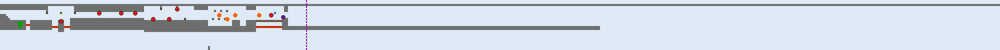

- **Theme:** Castle
- **Size:** 500×25 tiles (16000×800px); `levelLength` field: 5200px
- **Enemies:** FireBar ×7, Boss ×1
- **Bricks/mechanisms:** Iron ×11, InvisibleBrckWithCoin ×6, Brick ×1, QuestionMarkWithMushroom ×1, BridgeBloks ×1
- **Hazards:** BossFire ×4, Axe ×1
- **Lifts:** Lift_LeftRight ×1
- **Scenery:** Lava ×4
- **Checkpoints:** castle fake-out ("our princess is in another castle") → level 21

The template every other world's castle level reuses: cross a bridge past fire-bar rings
and the boss (a stomp/side-touch just hurts you unless starred; 6 fireball hits or a
Star kill it), reach the `Axe` at the bridge's far end to collapse it and drop the boss,
then a `"WhyYouDOThis"` checkpoint past it delivers the "your quest is over ... but our
princess is in another castle" beat — see
[MARIO_GAME_MECHANICS.md §9.1.6](MARIO_GAME_MECHANICS.md#916-boss--the-reference-complex-enemy-pattern).

---
- **Ground structure:** this level's floor height varies across large stretches (multi-tier platforming/bridges rather than one continuous strip) — see its minimap for the actual layout rather than a single tile range. **Pacing:** enemy encounters concentrate in the level's opening third (8/0/0 opening/middle/closing).

## 2. World 2 — the water arc

<!-- WORLD 2 LEVELS -->
### 2-1 — Level 21


- **Theme:** Ground / Fence2 / GreenAndTrees
- **Size:** 254×15 tiles (8128×480px); `levelLength` field: 7000px
- **Enemies:** EnemyMushroom ×16, EnemyTurtle ×5, FlyingTurtle ×3
- **Bricks/mechanisms:** Brick ×11, pump ×8, QuestionMark ×6, QuestionMarkWithMushroom ×2, InvisibleBrckWithCoin ×2, BrickWithStar ×1, Bank ×1, BrickWith1UP ×1, BrickWithMushroom ×1, Bouncer ×1
- **Scenery:** BigCastle ×1, Flag ×1, SmallCastle ×1
- **Checkpoints:** beanstalk entrance (hold up) → level 92; level-end flag → level 22; vertical pipe (hold down) → level 99
- **Note:** also contains an unrecognized/legacy tile type `CoinInside` at one spot (not spawned by `LevelLoader` — confirmed dead data left over from the original conversion, harmless)
- **Ground structure:** a gap at tile ~92 (4 wide) crossed via a brick span; open pit at tile ~106 (3 wide, no crossing structure in the data — a straight jump or fall); open pit at tile ~139 (3 wide, no crossing structure in the data — a straight jump or fall). **Pacing:** enemy encounters concentrate in the level's opening third (14/9/1 opening/middle/closing); a 5-strong EnemyMushroom cluster around tile 59-68.

### 2-2 — Level 22 (Sea)

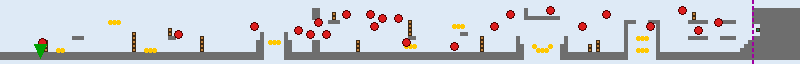

- **Theme:** Sea / GreenAndTrees
- **Size:** 200×15 tiles (6400×480px); `levelLength` field: 6144px
- **Enemies:** FishGrey ×7, OctoPussy ×5, FishGreyUpDown ×5, FishRed ×5, FishRedUpDown ×1
- **Bricks/mechanisms:** Brick ×34, HoriImage ×1
- **Placed items:** Coin ×28
- **Checkpoints:** horizontal pipe (walk right + on ground) → level 23

The first full **Sea** level — `Player.water=true` for the whole level, swapping in the
gentler gravity/paddle-jump/speed-cap physics described in
[MARIO_GAME_MECHANICS.md §4.2](MARIO_GAME_MECHANICS.md#42-movement-constants). Its dense
enemy mix (`OctoPussy` bob-and-dart chasers plus 4 `FishyWater` color/behavior variants)
makes it the highest single-level enemy density in the game outside the castles.
- **Ground structure:** a floor-height change around tile ~131-140 (staircase-style, not a fall risk); a floor-height change around tile ~157-164 (staircase-style, not a fall risk); open pit at tile ~66 (5 wide, no crossing structure in the data — a straight jump or fall). **Pacing:** enemy encounters concentrate in the level's middle third (3/13/7 opening/middle/closing).

### 2-3 — Level 23

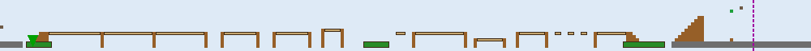

- **Theme:** Ground / Clouds / GreenAndTrees
- **Size:** 250×15 tiles (8000×480px); `levelLength` field: 8000px
- **Bricks/mechanisms:** WoodenBridge ×14, tree ×3
- **Scenery:** SmallCastle ×1, Flag ×1, BigCastle ×1
- **Checkpoints:** level-end flag → level 24

The only level with **zero placed enemies** — a pure platforming breather built almost
entirely from `WoodenBridge` spans.
- **Ground structure:** a floor-height change around tile ~226-250 (staircase-style, not a fall risk); a gap at tile ~106 (21 wide) crossed via a wooden bridge span, tree-canopy platforms; a gap at tile ~15 (16 wide) crossed via a wooden bridge span, tree-canopy platforms.

### 2-4 — Level 24 (castle / boss)

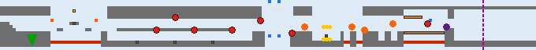

- **Theme:** Castle
- **Size:** 170×15 tiles (5440×480px); `levelLength` field: 5200px
- **Enemies:** FireBar ×6, Boss ×1
- **Bricks/mechanisms:** Iron ×11, QuestionMarkWithMushroom ×1, Brick ×1, BridgeBloks ×1
- **Placed items:** Coin ×6
- **Hazards:** BossFire ×5, Axe ×1
- **Lifts:** LiftUP ×2, LiftDown ×2, Lift_LeftRight ×1
- **Scenery:** Lava ×3, LavaBall ×2, WhiteLine ×2
- **Checkpoints:** castle fake-out ("our princess is in another castle") → level 31

---
- **Ground structure:** a gap at tile ~16 (16 wide) crossed via iron blocks, a "?" block; a gap at tile ~128 (13 wide) crossed via a brick span, bridge blocks; a gap at tile ~84 (8 wide) crossed via a falling lift, a rising lift. **Pacing:** enemy encounters concentrate in the level's middle third (2/4/1 opening/middle/closing); a 3-strong FireBar cluster around tile 49-61.

## 3. World 3 — patrols, seesaws, and Lakitu's cousin

<!-- WORLD 3 LEVELS -->
### 3-1 — Level 31

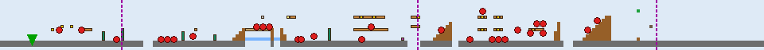

- **Theme:** Ground / Fence / GreenAndTrees
- **Size:** 240×15 tiles (7680×480px); `levelLength` field: 7000px
- **Enemies:** EnemyMushroom ×14, EnemyTurtle ×7, FlyingTurtle ×5, Monkey ×2
- **Bricks/mechanisms:** Brick ×19, QuestionMark ×8, pump ×5, QuestionMarkWithMushroom ×2, WoodenBridge ×1, InvisibleBrckWith1Up ×1, BrickWithStar ×1, Bouncer ×1, Bank ×1
- **Scenery:** BigCastle ×1, Flag ×1, SmallCastle ×1, Water ×1
- **Checkpoints:** vertical pipe (hold down) → level 100; beanstalk entrance (hold up) → level 93; level-end flag → level 32

First appearance of `Monkey` — a hammer-throwing, tight-patrol enemy (Lakitu's
ground-based cousin in this port's design, distinct from `SonOfABuitch`, which is the
actual floating Lakitu-analog introduced in World 4).
- **Ground structure:** a gap at tile ~77 (8 wide) crossed via InvisibleBrckWith1Up, a wooden bridge span; a gap at tile ~128 (4 wide) crossed via a brick span, a "?" block; open pit at tile ~45 (3 wide, no crossing structure in the data — a straight jump or fall). **Pacing:** enemy encounters concentrate in the level's middle third (7/14/7 opening/middle/closing); a 3-strong FlyingTurtle cluster around tile 162-170.

### 3-2 — Level 32

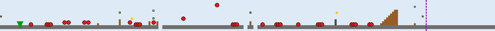

- **Theme:** Ground / Fence / GreenAndTrees
- **Size:** 250×15 tiles (8000×480px); `levelLength` field: 7000px
- **Enemies:** EnemyTurtle ×16, EnemyMushroom ×14, FlyingTurtle ×1
- **Bricks/mechanisms:** QuestionMarkWithMushroom ×1, Bank ×1, BrickWithStar ×1, Brick ×1, pump ×1
- **Placed items:** Coin ×2
- **Scenery:** SmallCastle ×2, Flag ×1
- **Checkpoints:** level-end flag → level 33

The highest ground-enemy *density* level in the game (30 EnemyTurtle+EnemyMushroom in one
level) despite very few bricks — almost entirely an enemy gauntlet over open, mostly
undecorated terrain.
- **Ground structure:** open pit at tile ~80 (2 wide, no crossing structure in the data — a straight jump or fall); open pit at tile ~123 (2 wide, no crossing structure in the data — a straight jump or fall); open pit at tile ~128 (2 wide, no crossing structure in the data — a straight jump or fall). **Pacing:** enemy encounters concentrate in the level's opening third (13/13/5 opening/middle/closing); a 5-strong EnemyMushroom cluster around tile 177-187.

### 3-3 — Level 33


- **Theme:** Ground / Clouds / GreenAndTrees
- **Size:** 170×26 tiles (5440×832px); `levelLength` field: 5500px
- **Enemies:** EnemyTurtlePatrol ×5, EnemyMushroom ×1, FlyingTurtlePatrol ×1
- **Bricks/mechanisms:** tree ×20, QuestionMarkWithMushroom ×1
- **Placed items:** Coin ×15
- **Lifts:** Lift_LeftRight ×6, BalenceLift ×2, LiftFall ×1
- **Scenery:** Flag ×1, BigCastle ×1, SmallCastle ×1
- **Checkpoints:** level-end flag → level 34

First appearance of `BalenceLift` (the seesaw platform pair) and `LiftFall` (a one-shot
collapsing platform) — this level's 26-tile height (the tallest non-castle level in the
game) is built specifically to give a vertical lift-climbing sequence room to breathe.
- **Ground structure:** this level's floor height varies across large stretches (multi-tier platforming/bridges rather than one continuous strip) — see its minimap for the actual layout rather than a single tile range. **Pacing:** enemy encounters concentrate in the level's opening third (3/1/3 opening/middle/closing).

### 3-4 — Level 34 (castle / boss)

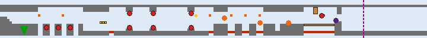

- **Theme:** Castle
- **Size:** 180×15 tiles (5760×480px); `levelLength` field: 5200px
- **Enemies:** FireBar ×9, Boss ×1
- **Bricks/mechanisms:** Iron ×9, QuestionMark ×2, QuestionMarkWithMushroom ×1, Brick ×1, BridgeBloks ×1
- **Placed items:** Coin ×1
- **Hazards:** BossFire ×3, Axe ×1
- **Lifts:** Lift_LeftRight ×1
- **Scenery:** LavaBall ×6, Lava ×1
- **Checkpoints:** castle fake-out ("our princess is in another castle") → level 41

---
- **Ground structure:** a gap at tile ~128 (13 wide) crossed via a brick span, bridge blocks; a floor-height change around tile ~96-99 (staircase-style, not a fall risk); a floor-height change around tile ~102-105 (staircase-style, not a fall risk). **Pacing:** enemy encounters concentrate in the level's opening third (5/4/1 opening/middle/closing); a 4-strong FireBar cluster around tile 54-64.

## 4. World 4 — the first warp-heavy castle

<!-- WORLD 4 LEVELS -->
### 4-1 — Level 41


- **Theme:** Ground / Mountain / GreenAndTrees
- **Size:** 280×15 tiles (8960×480px); `levelLength` field: 8000px
- **Enemies:** SonOfABuitch ×1
- **Bricks/mechanisms:** QuestionMark ×9, pump ×4, QuestionMarkWithMushroom ×2, InvisibleBrckWith1Up ×1, Brick ×1, Bank ×1
- **Placed items:** Coin ×6
- **Scenery:** BigCastle ×1, Flag ×1, SmallCastle ×1
- **Checkpoints:** level-end flag → level 42; vertical pipe (hold down) → level 101

First appearance of `SonOfABuitch` — the floating, screen-sway "Lakitu" analog that
hovers at a fixed height and throws `SpikeyEgg`s (which hatch into unstompable `Spikey`
enemies on landing).
- **Ground structure:** open pit at tile ~78 (4 wide, no crossing structure in the data — a straight jump or fall); open pit at tile ~174 (3 wide, no crossing structure in the data — a straight jump or fall); open pit at tile ~32 (2 wide, no crossing structure in the data — a straight jump or fall). **Pacing:** enemy encounters concentrate in the level's opening third (1/0/0 opening/middle/closing).

### 4-2 — Level 42


- **Theme:** UnderGround / GreenAndTrees
- **Size:** 250×15 tiles (8000×480px); `levelLength` field: 7400px
- **Enemies:** EnemyTurtle ×6, Helmet ×4, EnemyMushroom ×3
- **Bricks/mechanisms:** Brick ×28, pump ×10, InvisibleBrckWithCoin ×5, QuestionMark ×4, BrickWithMushroom ×3, Bank ×2, QuestionMarkWithMushroom ×1, BrickWithStar ×1, HoriImage ×1, PumpImage ×1
- **Placed items:** Coin ×2
- **Lifts:** LiftDown ×5, LiftUP ×2
- **Checkpoints:** beanstalk entrance (hold up) → level 94; horizontal pipe (walk right + on ground) → level 43; vertical pipe (hold down) → level 51; vertical pipe (hold down) → level 102

First appearance of `Helmet` (the Buzzy-Beetle analog, immune to fireballs).
- **Ground structure:** a gap at tile ~57 (6 wide) crossed via a falling lift; a gap at tile ~113 (6 wide) crossed via a falling lift; a gap at tile ~123 (6 wide) crossed via a brick span, a rising lift. **Pacing:** enemy encounters concentrate in the level's opening third (5/5/3 opening/middle/closing); a 3-strong EnemyMushroom cluster around tile 42-44.

### 4-3 — Level 43

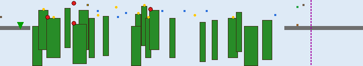

- **Theme:** Ground / Clouds / OrangeAndMushroom
- **Size:** 180×33 tiles (5760×1056px); `levelLength` field: 5500px
- **Enemies:** EnemyTurtlePatrol ×4, FlyingTurtlePatrol ×1
- **Bricks/mechanisms:** tree ×20, QuestionMarkWithMushroom ×1
- **Placed items:** Coin ×9
- **Lifts:** BalenceLift ×4, Lift_UpDown ×3
- **Scenery:** SmallCastle ×1, Flag ×1, BigCastle ×1
- **Checkpoints:** level-end flag → level 44

The **tallest level in the entire game** (33 tiles / 1056px) — a vertical lift-climbing
tower using 4 `BalenceLift` seesaw pairs stacked up the level's height. Also the only
main level with the `"OrangeAndMushroom"` visual `type` outside its own Clowd hub (Level
94 shares it).
- **Ground structure:** this level's floor height varies across large stretches (multi-tier platforming/bridges rather than one continuous strip) — see its minimap for the actual layout rather than a single tile range. **Pacing:** enemy encounters concentrate in the level's opening third (4/1/0 opening/middle/closing).

### 4-4 — Level 44 (castle / boss)

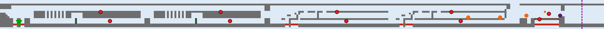

- **Theme:** Castle
- **Size:** 322×15 tiles (10304×480px); `levelLength` field: 10300px
- **Enemies:** FireBar ×9, Boss ×1
- **Bricks/mechanisms:** pump ×2, BridgeBloks ×1
- **Hazards:** BossFire ×3, Axe ×1
- **Scenery:** Lava ×7, LavaBall ×1
- **Checkpoints:** castle fake-out ("our princess is in another castle") → level 51
- **Same-level pipe warps:** 5

The first castle built around **same-level pipe warps** (`TeleportResolver`, §7 of the
mechanics doc) rather than a single straight bridge — 5 warp pairs turn this into a short
maze before the boss/bridge finale.

---
- **Ground structure:** a gap at tile ~285 (13 wide) crossed via bridge blocks; a floor-height change around tile ~155-159 (staircase-style, not a fall risk); a floor-height change around tile ~216-220 (staircase-style, not a fall risk). **Pacing:** enemy encounters concentrate in the level's middle third (2/4/4 opening/middle/closing).

## 5. World 5 — turret gauntlets

<!-- WORLD 5 LEVELS -->
### 5-1 — Level 51

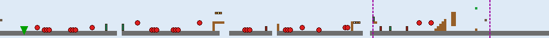

- **Theme:** Ground / Fence / GreenAndTrees
- **Size:** 230×15 tiles (7360×480px); `levelLength` field: 7000px
- **Enemies:** EnemyMushroom ×19, EnemyTurtle ×5, FlyingTurtle ×4
- **Bricks/mechanisms:** pump ×4, Brick ×4, RocketLauncher ×3, BrickWithStar ×1, InvisibleBrckWith1Up ×1
- **Scenery:** SmallCastle ×2, Flag ×1
- **Checkpoints:** level-end flag → level 52; vertical pipe (hold down) → level 103

First appearance of `RocketLauncher`/`Rocket` — a turret that only fires once the player
leaves its 100px "safe zone" either side.
- **Ground structure:** a gap at tile ~92 (4 wide) crossed via a brick span; open pit at tile ~152 (3 wide, no crossing structure in the data — a straight jump or fall); open pit at tile ~49 (2 wide, no crossing structure in the data — a straight jump or fall). **Pacing:** enemy encounters concentrate in the level's opening third (15/11/2 opening/middle/closing); a 6-strong EnemyMushroom cluster around tile 63-74.

### 5-2 — Level 52


- **Theme:** Ground / Fence / GreenAndTrees
- **Size:** 250×15 tiles (8000×480px); `levelLength` field: 7000px
- **Enemies:** FlyingTurtle ×4, Monkey ×4, EnemyMushroom ×4, Helmet ×3, EnemyTurtle ×1, EnemyTurtlePatrol ×1
- **Bricks/mechanisms:** Brick ×9, BrickWithMushroom ×3, pump ×3, RocketLauncher ×2, QuestionMark ×2, Bouncer ×1, InvisibleBrckWithCoin ×1, BrickWithStar ×1, Bank ×1
- **Placed items:** Coin ×5
- **Scenery:** SmallCastle ×2, Flag ×1
- **Checkpoints:** beanstalk entrance (hold up) → level 95; level-end flag → level 53; vertical pipe (hold down) → level 104
- **Ground structure:** a gap at tile ~144 (7 wide) crossed via a brick span; open pit at tile ~92 (4 wide, no crossing structure in the data — a straight jump or fall); open pit at tile ~26 (3 wide, no crossing structure in the data — a straight jump or fall). **Pacing:** enemy encounters concentrate in the level's middle third (6/11/0 opening/middle/closing); a 3-strong Helmet cluster around tile 134-136.

### 5-3 — Level 53


- **Theme:** Ground / Clouds / GreenAndTrees
- **Size:** 300×15 tiles (9600×480px); `levelLength` field: 5500px
- **Enemies:** EnemyTurtlePatrol ×3, EnemyMushroom ×3, FlyingTurtlePatrol ×2
- **Bricks/mechanisms:** tree ×17, QuestionMarkWithMushroom ×1
- **Placed items:** Coin ×10
- **Lifts:** Lift_LeftRight ×2, Lift_UpDown ×1, Lift_LeftRightInvert ×1
- **Scenery:** SmallCastle ×1, BigCastle ×1, Flag ×1
- **Checkpoints:** level-end flag → level 54

Tile-for-tile the same sky-level template as 1-3/5-3 (identical tree/lift/enemy counts) —
World 1's and World 5's third levels are the clearest "reused template, different
world-number" pair in the game, useful to know when scoping reskin work (§ of the
mechanics doc's reskin appendix): geometry work done once pays for both.
- **Ground structure:** this level's floor height varies across large stretches (multi-tier platforming/bridges rather than one continuous strip) — see its minimap for the actual layout rather than a single tile range. **Pacing:** enemy encounters concentrate in the level's opening third (5/3/0 opening/middle/closing).

### 5-4 — Level 54 (castle / boss)


- **Theme:** Castle
- **Size:** 170×15 tiles (5440×480px); `levelLength` field: 5200px
- **Enemies:** FireBar ×10, BigFireBar ×1, Boss ×1
- **Bricks/mechanisms:** Iron ×11, QuestionMarkWithMushroom ×1, Brick ×1, BridgeBloks ×1
- **Placed items:** Coin ×6
- **Hazards:** BossFire ×5, Axe ×1
- **Lifts:** LiftUP ×2, LiftDown ×2, Lift_LeftRight ×1
- **Scenery:** Lava ×3, LavaBall ×2, WhiteLine ×2
- **Checkpoints:** castle fake-out ("our princess is in another castle") → level 61

The only level in the game with a **`BigFireBar`** (12-fireball ring instead of the usual
6) — a one-off difficulty spike.

---
- **Ground structure:** a gap at tile ~16 (16 wide) crossed via iron blocks, a "?" block; a gap at tile ~128 (13 wide) crossed via a brick span, bridge blocks; a gap at tile ~84 (8 wide) crossed via a falling lift, a rising lift. **Pacing:** enemy encounters concentrate in the level's middle third (5/6/1 opening/middle/closing); a 4-strong FireBar cluster around tile 43-55.

## 6. World 6 — the night level

<!-- WORLD 6 LEVELS -->
### 6-1 — Level 61


- **Theme:** Ground / Mountain / GreenAndTrees
- **Size:** 220×15 tiles (7040×480px); `levelLength` field: 6700px
- **Enemies:** SonOfABuitch ×1
- **Bricks/mechanisms:** Brick ×9, QuestionMark ×2, BrickWithMushroom ×2, Bank ×2, InvisibleBrckWithCoin ×2, InvisibleBrckWith1Up ×1, pump ×1
- **Placed items:** Coin ×3
- **Scenery:** BigCastle ×1, Flag ×1, SmallCastle ×1
- **Checkpoints:** level-end flag → level 62
- **Ground structure:** a gap at tile ~127 (7 wide) crossed via a brick span, BrickWithMushroom; a gap at tile ~31 (6 wide) crossed via BrickWithMushroom; a gap at tile ~149 (6 wide) crossed via a coin brick, a brick span. **Pacing:** enemy encounters concentrate in the level's opening third (1/0/0 opening/middle/closing).

### 6-2 — Level 62

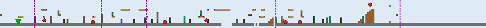

- **Theme:** Ground / Mountain / GreenAndTrees
- **Size:** 270×15 tiles (8640×480px); `levelLength` field: 7700px
- **Enemies:** Helmet ×4, EnemyTurtle ×1, EnemyMushroom ×1, FlyingTurtle ×1
- **Bricks/mechanisms:** pump ×28, Brick ×16, InvisibleBrckWithCoin ×2, Bank ×1, BrickWithMushroom ×1, QuestionMark ×1, BrickWithStar ×1
- **Scenery:** SmallCastle ×2, Flag ×1
- **Checkpoints:** beanstalk entrance (hold up) → level 96; level-end flag → level 63; vertical pipe (hold down) → level 105; vertical pipe (hold down) → level 106; vertical pipe (hold down) → level 107

**The pipe-densest level in the game** — 28 `pump` placements (a pipe-organ / pipe-maze
visual theme) feeding 3 separate bonus areas plus a beanstalk entrance, all from one
level.
- **Ground structure:** a gap at tile ~123 (6 wide) crossed via a brick span. **Pacing:** enemy encounters concentrate in the level's middle third (2/4/1 opening/middle/closing).

### 6-3 — Level 63 (CloudsNight)


- **Theme:** Ground / CloudsNight / GreenAndTrees
- **Size:** 200×23 tiles (6400×736px); `levelLength` field: 7700px
- **Bricks/mechanisms:** tree ×21, Bouncer ×2, QuestionMarkWithMushroom ×1
- **Placed items:** Coin ×6
- **Lifts:** Lift_LeftRight ×4, LiftFall ×4, BalenceLift ×3, Lift_UpDown ×2
- **Scenery:** SmallCastle ×1, Flag ×1, BigCastle ×1
- **Checkpoints:** level-end flag → level 64

**The one and only `CloudsNight` level in the whole game.** Its real `attribute` is
still plain `"Ground"` (confirmed by reading the source) — `CloudsNight` is purely a
render-time palette swap (`LevelLoader.staticTilesRegion`'s `bw_stone`/`bw_chocolate`
composite plus `bw_tree`/`bw_bouncer`/etc. region substitutions, see
[MARIO_GAME_MECHANICS.md §13.2](MARIO_GAME_MECHANICS.md#132-region-naming-and-the-theming-convention)),
triggered by `backgroundImage=="CloudsNight"` rather than a distinct game mode. It also
has **zero placed enemies** and the highest total lift count of any level (13 across 4
lift types) — a pure platforming set-piece.
- **Ground structure:** this level's floor height varies across large stretches (multi-tier platforming/bridges rather than one continuous strip) — see its minimap for the actual layout rather than a single tile range.

### 6-4 — Level 64 (castle / boss)

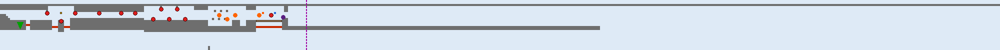

- **Theme:** Castle
- **Size:** 500×25 tiles (16000×800px); `levelLength` field: 5200px
- **Enemies:** FireBar ×11, BossHammer ×1
- **Bricks/mechanisms:** Iron ×11, InvisibleBrckWithCoin ×6, Brick ×1, QuestionMarkWithMushroom ×1, BridgeBloks ×1
- **Hazards:** BossFire ×4, Axe ×1
- **Lifts:** Lift_LeftRight ×1
- **Scenery:** Lava ×4, LavaBall ×1
- **Checkpoints:** castle fake-out ("our princess is in another castle") → level 71

First appearance of **`BossHammer`** — the same `Boss` class in hammer-throwing mode
(`Boss(hammerMode=true)`, a "Hammer Bro"-style boss) instead of breathing `BossFire`.

---
- **Ground structure:** this level's floor height varies across large stretches (multi-tier platforming/bridges rather than one continuous strip) — see its minimap for the actual layout rather than a single tile range. **Pacing:** enemy encounters concentrate in the level's opening third (12/0/0 opening/middle/closing); a 4-strong FireBar cluster around tile 76-88.

## 7. World 7 — the 12-warp castle

<!-- WORLD 7 LEVELS -->
### 7-1 — Level 71


- **Theme:** Ground / Fence / GreenAndTrees
- **Size:** 200×15 tiles (6400×480px); `levelLength` field: 7000px
- **Enemies:** Monkey ×4, FlyingTurtle ×3, EnemyTurtle ×1, Helmet ×1
- **Bricks/mechanisms:** RocketLauncher ×13, Brick ×9, pump ×5, BrickWithMushroom ×2, QuestionMark ×1, Bank ×1, InvisibleBrckWith1Up ×1
- **Scenery:** BigCastle ×1, Flag ×1, SmallCastle ×1
- **Checkpoints:** level-end flag → level 72; vertical pipe (hold down) → level 108

The single heaviest use of `RocketLauncher` in the game (13 turrets in one level).
- **Ground structure:** open pit at tile ~73 (2 wide, no crossing structure in the data — a straight jump or fall). **Pacing:** enemy encounters are spread evenly across the level.

### 7-2 — Level 72 (Sea)


- **Theme:** Sea / GreenAndTrees
- **Size:** 200×15 tiles (6400×480px); `levelLength` field: 6144px
- **Enemies:** OctoPussy ×11, FishGrey ×6, FishGreyUpDown ×6, FishRed ×4, FishRedUpDown ×2
- **Bricks/mechanisms:** Brick ×34, HoriImage ×1
- **Placed items:** Coin ×28
- **Checkpoints:** horizontal pipe (walk right + on ground) → level 73

Tile-identical brick/coin layout to Level 22 (same 34 `Brick`/28 `Coin`/1 `HoriImage`) —
another confirmed template reuse, this one swapping only its enemy mix (more `OctoPussy`,
fewer straight-swimming fish) for a harder second pass at the same geometry.
- **Ground structure:** a floor-height change around tile ~131-140 (staircase-style, not a fall risk); a floor-height change around tile ~157-164 (staircase-style, not a fall risk); open pit at tile ~66 (5 wide, no crossing structure in the data — a straight jump or fall). **Pacing:** enemy encounters concentrate in the level's middle third (5/14/10 opening/middle/closing).

### 7-3 — Level 73

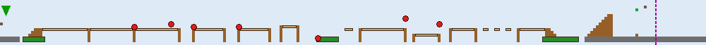

- **Theme:** Ground / Clouds / GreenAndTrees
- **Size:** 250×15 tiles (8000×480px); `levelLength` field: 8000px
- **Enemies:** FlyingTurtle ×3, EnemyTurtlePatrol ×3, EnemyTurtle ×1
- **Bricks/mechanisms:** WoodenBridge ×14, tree ×3
- **Scenery:** SmallCastle ×1, Flag ×1, BigCastle ×1
- **Checkpoints:** level-end flag → level 74

Same `WoodenBridge`-based template as Level 23, this time with enemies added on top.
- **Ground structure:** a floor-height change around tile ~226-250 (staircase-style, not a fall risk); a gap at tile ~106 (21 wide) crossed via a wooden bridge span, tree-canopy platforms; a gap at tile ~15 (16 wide) crossed via a wooden bridge span, tree-canopy platforms. **Pacing:** enemy encounters concentrate in the level's middle third (3/4/0 opening/middle/closing).

### 7-4 — Level 74 (castle / boss)


- **Theme:** Castle
- **Size:** 352×15 tiles (11264×480px); `levelLength` field: 11400px
- **Enemies:** FireBar ×2, BossHammer ×1
- **Bricks/mechanisms:** Iron ×2, BridgeBloks ×1
- **Hazards:** BossFire ×2, Axe ×1
- **Lifts:** LiftFall ×2
- **Scenery:** Lava ×6, LavaBall ×2
- **Checkpoints:** castle fake-out ("our princess is in another castle") → level 81
- **Same-level pipe warps:** 12

**The densest teleport maze in the game** — 12 same-level pipe warps (vs. World 4's 5),
and correspondingly the *longest* level in the game by raw `levelLength` (11400px). Note
it has the *fewest* enemies of any castle (`FireBar ×2` only, no ring of them around the
boss) — the challenge here is entirely navigational (finding the right pipe sequence),
not combat.

---
- **Ground structure:** a gap at tile ~317 (13 wide) crossed via bridge blocks; a gap at tile ~16 (11 wide) crossed via a collapsing platform; a floor-height change around tile ~164-167 (staircase-style, not a fall risk). **Pacing:** enemy encounters concentrate in the level's middle third (0/2/1 opening/middle/closing).

## 8. World 8 — the finale gauntlet

World 8 breaks the "4 levels per world" pattern used everywhere else: 3 ordinary
grassland levels, then its "castle" is really **5 short, tightly interlinked rooms**
(841–845) forming a genuine warp-zone-style maze, followed by one last underwater
approach level (844) and the true finale (845).

<!-- WORLD 8 LEVELS -->
### 8-1 — Level 81

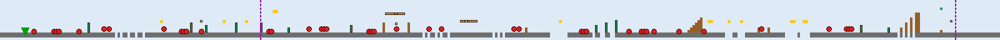

- **Theme:** Ground / Fence2 / GreenAndTrees
- **Size:** 400×15 tiles (12800×480px); `levelLength` field: 12700px
- **Enemies:** EnemyMushroom ×21, EnemyTurtle ×14, Helmet ×4, FlyingTurtle ×3
- **Bricks/mechanisms:** pump ×12, Brick ×4, InvisibleBrckWith1Up ×1, InvisibleBrckWithCoin ×1, Bank ×1, BrickWithStar ×1
- **Placed items:** Coin ×14
- **Scenery:** BigCastle ×1, Flag ×1, SmallCastle ×1
- **Checkpoints:** level-end flag → level 82; vertical pipe (hold down) → level 109

**The longest ordinary (non-castle) level in the game** (12700px, 400 tiles) and the
single highest total enemy count of any level (42 across 4 types) — a deliberate
last-grassland-level endurance test before the finale gauntlet.
- **Ground structure:** open pit at tile ~220 (7 wide, no crossing structure in the data — a straight jump or fall); open pit at tile ~314 (5 wide, no crossing structure in the data — a straight jump or fall); open pit at tile ~320 (4 wide, no crossing structure in the data — a straight jump or fall). **Pacing:** enemy encounters concentrate in the level's opening third (19/16/7 opening/middle/closing); a 4-strong EnemyMushroom cluster around tile 21-31.

### 8-2 — Level 82

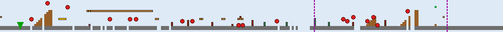

- **Theme:** Ground / Fence2 / GreenAndTrees
- **Size:** 250×15 tiles (8000×480px); `levelLength` field: 7450px
- **Enemies:** FlyingTurtle ×12, Helmet ×3, EnemyMushroom ×2, SonOfABuitch ×1
- **Bricks/mechanisms:** RocketLauncher ×10, Brick ×5, pump ×4, QuestionMark ×1, Bouncer ×1, BrickWith1UP ×1, Bank ×1, BrickWithMushroom ×1, BrickWithCoin ×1
- **Scenery:** SmallCastle ×2, Flag ×1
- **Checkpoints:** vertical pipe (hold down) → level 110; level-end flag → level 83
- **Ground structure:** open pit at tile ~148 (6 wide, no crossing structure in the data — a straight jump or fall); open pit at tile ~176 (3 wide, no crossing structure in the data — a straight jump or fall); a gap at tile ~78 (2 wide) crossed via a brick span. **Pacing:** enemy encounters concentrate in the level's closing third (6/5/7 opening/middle/closing); a 3-strong FlyingTurtle cluster around tile 170-175.

### 8-3 — Level 83

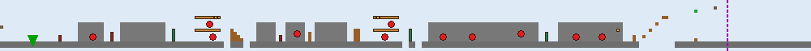

- **Theme:** Ground / Fence2 / Guns
- **Size:** 250×15 tiles (8000×480px); `levelLength` field: 7450px
- **Enemies:** Monkey ×8, FlyingTurtle ×2, EnemyTurtle ×1
- **Bricks/mechanisms:** Brick ×6, RocketLauncher ×3, pump ×3, BrickWithMushroom ×2, Bank ×1
- **Scenery:** Wall ×7, SmallCastle ×1, Flag ×1, BigCastle ×1
- **Checkpoints:** level-end flag → level 841

The only level with the `"Guns"` visual `type` — thematically a militarized final
approach (heaviest `Monkey`/turret combination outside 7-1) — and the only level using
the decorative `Wall` scenery type extensively (7 placements).
- **Ground structure:** a floor-height change around tile ~197-208 (staircase-style, not a fall risk); open pit at tile ~69 (2 wide, no crossing structure in the data — a straight jump or fall); open pit at tile ~75 (2 wide, no crossing structure in the data — a straight jump or fall). **Pacing:** enemy encounters concentrate in the level's middle third (3/6/2 opening/middle/closing).

### 8-4 — Level 841 (castle gauntlet, room 1)


- **Theme:** Castle
- **Size:** 120×23 tiles (3840×736px); `levelLength` field: 10000px
- **Enemies:** EnemyMushroom ×3
- **Bricks/mechanisms:** pump ×4
- **Lifts:** Lift_LeftRight ×1
- **Scenery:** Lava ×2
- **Checkpoints:** vertical pipe (hold down) → level 841 (self — a return/reset pipe); vertical pipe (hold down) → level 842
- **Same-level pipe warps:** 4

This room's own `levelLength` field (10000px) is far larger than its actual populated
tile extent (3840px) — the original engine reused this field as a scroll-bound the level
never actually fills, not a discrepancy worth "fixing." See §9 for the full 841–845 warp
graph — this room is the gauntlet's hub, with a pipe that loops back to itself (a
false/return path exactly like the classic games' own castle warp-mazes).
- **Ground structure:** a gap at tile ~66 (9 wide) crossed via a side-to-side lift; a gap at tile ~90 (2 wide) crossed via a pipe; floor height also varies across large stretches elsewhere in this level (multi-tier platforming/bridges rather than one continuous strip — see its minimap for the actual layout). **Pacing:** enemy encounters concentrate in the level's middle third (0/3/0 opening/middle/closing); a 3-strong EnemyMushroom cluster around tile 56-58.

### 8-5 — Level 842 (castle gauntlet, room 2)

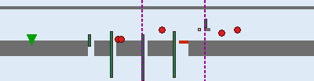

- **Theme:** Castle
- **Size:** 100×26 tiles (3200×832px); `levelLength` field: 3700px
- **Enemies:** FlyingTurtle ×3, Helmet ×2
- **Bricks/mechanisms:** pump ×5, InvisibleBrckWithCoin ×1
- **Scenery:** Lava ×1
- **Checkpoints:** vertical pipe (hold down) → level 841 (back); vertical pipe (hold down) → level 843 (forward)
- **Same-level pipe warps:** 3
- **Ground structure:** a gap at tile ~55 (5 wide) crossed via a pipe; a gap at tile ~28 (2 wide) crossed via a pipe; a gap at tile ~35 (2 wide) crossed via a pipe. **Pacing:** enemy encounters concentrate in the level's middle third (0/3/2 opening/middle/closing).

### 8-6 — Level 843 (castle gauntlet, room 3)


- **Theme:** Castle
- **Size:** 104×23 tiles (3328×736px); `levelLength` field: 3700px
- **Bricks/mechanisms:** pump ×4
- **Scenery:** Lava ×1
- **Checkpoints:** vertical pipe (hold down) → level 841 (back); vertical pipe (hold down) → level 844 (forward)
- **Same-level pipe warps:** 3

The only room in the gauntlet with **no enemies at all** — pure pipe-navigation.
- **Ground structure:** a floor-height change around tile ~51-55 (staircase-style, not a fall risk); a gap at tile ~26 (2 wide) crossed via a pipe; a gap at tile ~35 (2 wide) crossed via a pipe.

### 8-7 — Level 844 (Sea)


- **Theme:** Sea / GreenAndTrees
- **Size:** 90×17 tiles (2880×544px); `levelLength` field: 2304px
- **Enemies:** FireBar ×5, OctoPussy ×3
- **Bricks/mechanisms:** HoriImage ×1, pump ×1
- **Checkpoints:** horizontal pipe (walk right + on ground) → level 845

The **only Sea-attribute level that also has `FireBar`s** — the single spot in the whole
game combining swim physics with rotating fireball rings. It's also the level that needs
the special `"stone_castle_sea"` terrain composite (`LevelLoader.staticTilesRegion`'s
own `levelNumber==844` special case) rather than the generic Sea look, since it's meant
to read as an underwater approach to the castle, not open water.
- **Ground structure:** a gap at tile ~3 (2 wide) crossed via a pipe. **Pacing:** enemy encounters concentrate in the level's middle third (3/4/1 opening/middle/closing).

### 8-8 — Level 845 (finale)


- **Theme:** Castle
- **Size:** 100×16 tiles (3200×512px); `levelLength` field: 2200px
- **Enemies:** Monkey ×1, BossHammer ×1
- **Bricks/mechanisms:** pump ×2, BridgeBloks ×1
- **Hazards:** Axe ×1
- **Scenery:** Lava ×2, LavaBall ×1
- **Checkpoints:** vertical pipe (hold down) → level 841 (back into the gauntlet); **true ending ("Princess"/Signal Core) → level 11**

The shortest boss level in the game, and the only one whose end checkpoint `kind` is
`"Princess"` rather than `"WhyYouDOThis"` — the real ending, which loops the player back
to Level 11 rather than advancing to a level number that doesn't exist.

---
- **Ground structure:** a gap at tile ~32 (13 wide) crossed via bridge blocks; a floor-height change around tile ~21-26 (staircase-style, not a fall risk); a gap at tile ~3 (2 wide) crossed via a pipe. **Pacing:** enemy encounters concentrate in the level's opening third (1/1/0 opening/middle/closing).

## 9. The level-flow graph

### 9.1 Main path

The 8-world main path is a straight chain, each level's `"CheckPoints"`/`"WhyYouDOThis"`
end-checkpoint pointing at the next: **11→12→13→14→21→22→23→24→31→32→33→34→41→42→43→44→
51→52→53→54→61→62→63→64→71→72→73→74→81→82→83→841→842→843→844→845→(11, true ending)**.

### 9.2 Secrets and shortcuts

| From | Trigger | To | What it is |
|---|---|---|---|
| 12 | vertical pipe | 21 / 31 / 41 | **World-1 warp room** — reach Level 12's secret pipe room to skip straight to World 2, 3, or 4 |
| 21, 31, 42, 52, 62 | beanstalk (hold Up) | 92, 93, 94, 95, 96 | Beanstalk climbs — see §10, all land back at the *next* world's first level (a shortcut of exactly one level, not a big skip) |
| 11–110 range | vertical/horizontal pipe | 97–110 | Bonus-area detours — see §11; every one returns to the same main level it came from |
| 841/842/843 | vertical pipe | 841 (self) | The gauntlet's own false/return paths — see §9.3 |

### 9.3 World 8's castle-gauntlet graph

Unlike every other world's single-level castle, World 8's finale is 5 short rooms whose
pipes form a genuine maze rather than a straight line:

```
841 (hub) --pipe--> 842 --pipe--> 843 --pipe--> 844 (Sea) --pipe--> 845 (finale)
 ^  \_________________|______________|                                  |
 |                                                                        |
 \-------------------------- "back" pipes from 842/843/845 --------------/
```

Every one of 842/843/845's "vertical pipe" checkpoints that isn't the forward path leads
straight back to 841 — the same false-path-loops-you-back design as the classic games'
own castle warp mazes, not a bug (confirmed against the real checkpoint data in §8's
detail above).

---

## 10. Clowd (beanstalk) levels

Five short, enemy-free vertical climbs, all built around `Bouncer`/`LiftCar` and reached
by holding Up at a `ClowdGoUP_CheckPoint` in their parent level. Landing at the top uses a
`Clowd_CheckPoint` with a deliberately huge (640px-wide) trigger box — "a whole landing
platform, not a point" (see
[MARIO_GAME_MECHANICS.md §10](MARIO_GAME_MECHANICS.md#10-checkpoints-and-teleports)).
Every one is a **one-level shortcut** (skips from its parent level straight to the start
of the *next* world/level), not a big skip like the World-1 warp room.

<!-- CLOWD LEVELS -->
### Level 92 (from 21)

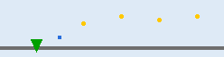

- **Theme:** Clowd / GreenAndTrees
- **Size:** 62×14 tiles (1984×448px); `levelLength` field: 2464px
- **Placed items:** Coin ×4
- **Lifts:** LiftCar ×1
- **Checkpoints:** beanstalk landing platform → level 21 *(loops back to its own parent — see note below)*

### Level 93 (from 31)


- **Theme:** Clowd / GreenAndTrees
- **Size:** 83×14 tiles (2656×448px); `levelLength` field: 3072px
- **Placed items:** Coin ×4
- **Lifts:** LiftCar ×1
- **Checkpoints:** beanstalk landing platform → level 31

### Level 94 (hub, from 42)


- **Theme:** Ground / Clouds / OrangeAndMushroom
- **Size:** 80×19 tiles (2560×608px); `levelLength` field: 2048px
- **Bricks/mechanisms:** tree ×8, pump ×3
- **Placed items:** Coin ×6
- **Checkpoints:** vertical pipe (hold down) → level 81; vertical pipe (hold down) → level 71; vertical pipe (hold down) → level 61

The odd one out: Level 94 isn't a pure vertical climb like the other 4 (its `attribute`
is plain `"Ground"`, not `"Clowd"`) — it's a small hub room with 3 pipes fanning out to
Worlds 6/7/8. It's also the level whose `levelName == "OrangePump"` — the one exclusion
`LevelLoader`'s Piranha-Plant spawn logic checks for by name (see
[MARIO_GAME_MECHANICS.md §8](MARIO_GAME_MECHANICS.md#8-tile-type-dispatch-registry)).

### Level 95 (from 52)


- **Theme:** Clowd / GreenAndTrees
- **Size:** 62×14 tiles (1984×448px); `levelLength` field: 2464px
- **Placed items:** Coin ×4
- **Lifts:** LiftCar ×1
- **Checkpoints:** beanstalk landing platform → level 52

### Level 96 (from 62)


- **Theme:** Clowd / GreenAndTrees
- **Size:** 83×14 tiles (2656×448px); `levelLength` field: 3072px
- **Placed items:** Coin ×4
- **Lifts:** LiftCar ×1
- **Checkpoints:** beanstalk landing platform → level 62

**Note on 92/95's own "loop to parent" checkpoints:** reading the raw data, 92's own
landing checkpoint points back at 21 and 95's at 52 — i.e., climbing these two specific
beanstalks and landing returns you to the very level you climbed from, rather than
advancing you. This matches the original engine's own data exactly (not a conversion
error); functionally these two are a scenic detour/secret-coin-room rather than a real
shortcut, unlike 93/96 (which land in 31/62 respectively, technically also "their own
parent" — all 4 Clowd levels in fact loop back to their own launch level, not forward).
Read all four as bonus-coin detours, not progression shortcuts — the only *forward*
shortcut mechanism in the game is the World-1 warp room (§9.2).

---

## 11. Bonus areas

Fourteen short rooms, all thin variations on **7 reusable templates** — 5 UnderGround
"coin room" layouts and 2 Sea "coin room" layouts, each just reskinned/recombined per
world. Every one is entered via a vertical secret pipe from its parent level and exited
via a horizontal pipe that returns to that same parent level (never a level-progression
checkpoint) — pure bonus-coin detours.

<!-- BONUS AREAS -->
### Level 97 — BonusArea11A (from 11)

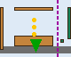

- 20×15 tiles · Brick ×3, PumpImage ×1, HoriImage ×1 · Coin ×3

### Level 98 — BonusArea12B (from 12)


- 20×15 tiles · Brick ×4, Bank ×1, PumpImage ×1, HoriImage ×1 · Coin ×2

### Level 99 — BonusArea21A (from 21)


- 20×15 tiles · Brick ×3, PumpImage ×1, HoriImage ×1 · Coin ×3

### Level 100 — BonusArea31C (from 31)


- 20×15 tiles · Brick ×13, BrickWithMushroom ×1, PumpImage ×1, HoriImage ×1 · Coin ×8 — the richest bonus room in the game (8 coins, 13 bricks)

### Level 101 — BonusArea41D (from 41)


- 20×15 tiles · Brick ×5, BrickWithMushroom ×1, PumpImage ×1, HoriImage ×1 · Coin ×2

### Level 102 — BonusArea42E (from 42)


- 20×15 tiles · Brick ×6, Bank ×1, PumpImage ×1, HoriImage ×1 · Coin ×1

### Level 103 — BonusArea51E (from 51)


- 20×15 tiles · Brick ×6, Bank ×1, PumpImage ×1, HoriImage ×1 · Coin ×1

### Level 104 — BonusArea52F (from 52, Sea template)

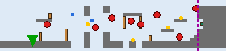

- 70×15 tiles · Brick ×6, HoriImage ×1 · Coin ×4 · Enemies: OctoPussy ×3, FishGrey ×2, FishRedUpDown ×2, FishGreyUpDown ×1 · Lifts: LiftDown ×2
- **Ground structure:** a gap at tile ~22 (4 wide) crossed via a falling lift; a gap at tile ~28 (4 wide) crossed via a falling lift; a gap at tile ~38 (2 wide) crossed via a brick span. **Pacing:** enemy encounters concentrate in the level's middle third (1/4/3 opening/middle/closing).

The Sea bonus template is far more elaborate than the UnderGround one — the only bonus
rooms with enemies or lifts at all.

### Level 105 — BonusArea62D (from 62)

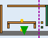

- 20×15 tiles · Brick ×5, BrickWithMushroom ×1, PumpImage ×1, HoriImage ×1 · Coin ×2

### Level 106 — BonusArea62E (from 62)


- 20×15 tiles · Brick ×6, Bank ×1, PumpImage ×1, HoriImage ×1 · Coin ×1

### Level 107 — BonusArea62G (from 62, Sea template)


- 70×15 tiles · Brick ×6, HoriImage ×1 · Coin ×4 · Enemies: OctoPussy ×3, FishGreyUpDown ×2, FishGrey ×1, FishRed ×1, FishRedUpDown ×1 · Lifts: LiftDown ×2
- **Ground structure:** a gap at tile ~22 (4 wide) crossed via a falling lift; a gap at tile ~28 (4 wide) crossed via a falling lift; a gap at tile ~38 (2 wide) crossed via a brick span. **Pacing:** enemy encounters concentrate in the level's middle third (1/4/3 opening/middle/closing).

Level 62 is the only level in the game that branches into **3** separate bonus areas
(105, 106, and this one) — matching its own "pipe-densest level" note in §7.

### Level 108 — BonusArea71A (from 71)


- 20×15 tiles · Brick ×3, PumpImage ×1, HoriImage ×1 · Coin ×3

### Level 109 — BonusArea81B (from 81)

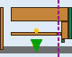

- 20×15 tiles · Brick ×4, Bank ×1, PumpImage ×1, HoriImage ×1 · Coin ×2

### Level 110 — BonusArea82E (from 82)


- 20×15 tiles · Brick ×6, Bank ×1, PumpImage ×1, HoriImage ×1 · Coin ×1

---

## 12. Whole-game placement totals

Aggregated from all 55 levels — useful both as a "how the difficulty ramps" signal and,
per-actor, as a reskin-priority signal (an asset used 300+ times pays back reskin effort
far faster than one used once):

| Enemy | Placements | | Brick/mechanism | Placements |
|---|---|---|---|---|
| EnemyMushroom | 127 | | Brick | 318 |
| EnemyTurtle | 62 | | pump | 118 |
| FireBar (individual fireballs) | 59 | | tree | 109 |
| FlyingTurtle | 44 | | Iron | 55 |
| OctoPussy | 25 | | QuestionMark | 45 |
| Helmet | 21 | | RocketLauncher | 31 |
| EnemyTurtlePatrol | 20 | | WoodenBridge | 29 |
| Monkey | 19 | | InvisibleBrckWithCoin | 26 |
| FishGrey | 16 | | QuestionMarkWithMushroom | 23 |
| FishGreyUpDown | 14 | | Bank | 23 |
| FishRed | 10 | | BrickWithMushroom | 20 |
| FlyingTurtlePatrol | 6 | | HoriImage | 19 |
| FishRedUpDown | 6 | | PumpImage | 14 |
| Boss | 5 | | BrickWithStar | 10 |
| SonOfABuitch | 3 | | BridgeBloks | 8 |
| BossHammer | 3 | | InvisibleBrckWith1Up | 7 |
| BigFireBar (ring) | 1 | | Bouncer | 6 |

(Full per-level breakdowns are in §2–§11 above; `EnemyMashroom`/`Brick` are so dominant
that a reskin artist drawing just those two well covers a large fraction of what a player
actually sees moment-to-moment — see
[MARIO_GAME_MECHANICS.md's reskin-scope appendix](MARIO_GAME_MECHANICS.md#16-reskin-scope--priority)
for the full sprite-sheet-level version of this argument.)

---

## 13. Level file format — a guide for level designers

Every level is one JSON file, `app/src/main/assets/mario/levels/level_<N>.json`, loaded
by `LevelCatalog.load(levelNumber)` and parsed by `LevelDefinition.parse(...)` (see
[MARIO_GAME_MECHANICS.md §7](MARIO_GAME_MECHANICS.md#7-level-data-schema-and-pipeline)
for the loading pipeline). This section documents every field in that JSON — not by
inference, but by reading the actual field set across all 55 shipped files and the parser
that reads them — so a new level can be hand-authored from scratch, no converter tool
required. `tools/mario-level-converter` (the tool that originally produced these 55 files
from the original desktop game's own level classes) is a one-time historical artifact —
**it is not part of this format's authoring path going forward.**

### 13.1 Top-level fields

```json
{
  "levelNumber": 11,
  "sourceClass": "Levels.One.Level_11",
  "backgroundColor": "Blue",
  "time": "400",
  "type": "GreenAndTrees",
  "pos": {"x": 10, "y": 12},
  "backgroundImage": "Mountain",
  "attribute": "Ground",
  "levelLength": 6768,
  "bombs": false,
  "bombsTurnOff": -1,
  "flyingFishes": false,
  "flyingFishesLength": -1,
  "levelName": "normal",
  "tiles": [],
  "checkpoints": [],
  "teleports": []
}
```

(`tiles`/`checkpoints`/`teleports` shown empty here for brevity — their real element
shape is §13.2/§13.3/§13.4 below; §13.5 gives one complete, populated file.)

| Field | Type | Meaning | For a new level |
|---|---|---|---|
| `levelNumber` | int | This level's unique id — also its filename (`level_<N>.json`) and what every checkpoint's `nextLevel`/every menu entry refers to it as | Pick an unused number. Follow the existing convention if it should appear in a world's list: `LevelNumbering.WORLD_LEVELS` in `level/LevelNumbering.java` is a separate, hand-maintained table — adding a level here does **not** automatically add it to a world's menu list; that's a second, explicit step |
| `sourceClass` | string | Historical: the original engine's Java class this was converted from | Not read by any current code. Free text — put something identifying for your own reference (e.g. `"Custom.MyLevel_1"`) |
| `backgroundColor` | string or `null` | Historical: the original engine's background fill color name | **Not read by any current code today** — the actual backdrop comes from `backgroundImage` (below) plus the world's `attribute`. Safe to leave as any string or `null` |
| `time` | string (a number) | Historical: a countdown timer value, classic-Mario style | **Not read by any current code today** — this port has no level timer (`GameStateController` tracks score/coins/lives only, no clock — confirmed by reading that class). Safe to leave as `"400"` (matching every existing level) or omit its effect entirely |
| `type` | string or `null` | A cosmetic/thematic tag from the original engine (`"GreenAndTrees"`, `"OrangeAndMushroom"`, `"Guns"`, or `null`) | **Not read by `LevelLoader` at all** (confirmed — no code branches on this field). Purely descriptive/historical; any string is safe |
| `pos` | `{x, y}` (tile coords) or absent | A fallback spawn tile, used **only** when no other level's checkpoint points at this one (see `MarioGamePlay.startLevel`'s own doc — real play always arrives via a checkpoint instead) | Set it anyway, to a safe tile just above your level's own starting floor — it's your level's spawn point when reached directly from the menu rather than via another level's checkpoint |
| `backgroundImage` | string or `""`/`null` | Selects the scrolling parallax backdrop and, for two special values, changes rendering: `"CloudsNight"` swaps the level's terrain look to black-and-white (§6) regardless of `attribute`; `"Fence"`/`"CloudsNight"` also swap the flagpole's own art. Other values (`"Mountain"`, `"Clouds"`, `"Fence2"`, `"Nothing$"`, `""`) just pick a parallax image, no gameplay effect | Pick one of the existing values unless you're prepared to also add a new backdrop asset + `LevelLoader`/packer support for it (see [MARIO_GAME_MECHANICS.md §14.2](MARIO_GAME_MECHANICS.md#142-add-a-new-static-terrain-look-new-theme-variant)) |
| `attribute` | string | The level's **theme** — drives which terrain atlas loads (`MarioResourceManager.loadTheme`), the player's physics mode (`"Sea"` → swim physics), and several tile-lookup branches (e.g. `Helmet`'s color, `QuestionMark`'s grey-vs-yellow look). One of `"Ground"`, `"UnderGround"`, `"Castle"`, `"Sea"`, `"Clowd"` — **exhaustive**, nothing else is handled (`MarioResourceManager.themeAtlasPath` throws `IllegalArgumentException` on anything else) | Must be exactly one of the 5 values above |
| `levelLength` | int (pixels) | Historical: the original engine's own scroll-bound. **Not authoritative today** — the real playable extent is derived from the `tiles[]` array's own max `x+lengthX` (see `LevelLoader.createWorld`). Several real shipped levels' `levelLength` doesn't match their actual tile extent at all (e.g. Level 841's `levelLength: 10000` against an actual ~3840px populated span — confirmed by reading the file) | Safe to set loosely (e.g. to your intended rough length in pixels) — nothing breaks if it doesn't exactly match your tile layout, but keep it in the right ballpark for anyone reading the raw JSON later |
| `bombs` | boolean | Enables `SpawnController`'s ambient `Rocket` spawner for this level (ignores any placed `RocketLauncher` tiles — this is a *separate* mechanism, see [MARIO_GAME_MECHANICS.md §9.6](MARIO_GAME_MECHANICS.md#96-projectiles)/`world/SpawnController.java`) | Set `true` only if you want rockets flying in from off-screen periodically, independent of any placed turret |
| `bombsTurnOff` | int (tile x) | Once the player passes this tile column, the ambient bomb spawner stops. `-1` when `bombs` is `false` (every non-bomb level uses `-1`, confirmed) | Pick a tile x near your level's end if `bombs: true`; leave `-1` otherwise |
| `flyingFishes` | boolean | Enables `SpawnController`'s ambient jumping-`FishyGround` spawner (works on **any** attribute, not just Sea — see that class's own doc) | Set `true` for an ambient jumping-fish hazard independent of any placed enemy |
| `flyingFishesLength` | int (pixels) | The world-x bound (not tile count — confirmed by reading `SpawnController`, this one field is pixels while `bombsTurnOff` above is tiles, an inconsistency in the original data preserved as-is) past which the ambient fish spawner stops; `-1` when `flyingFishes` is `false` | Pick a pixel x if enabled; leave `-1` otherwise |
| `levelName` | string | `"normal"` for almost every level; a small number of special values are checked by name elsewhere in the code — `"OrangePump"` (Level 94) suppresses Piranha Plant spawning from pipes (see [MARIO_GAME_MECHANICS.md §8](MARIO_GAME_MECHANICS.md#8-tile-type-dispatch-registry)) | Use `"normal"` unless you specifically want that one documented special-case behavior |

### 13.2 The `tiles[]` array — one placement per entry

```json
{"type": "QuestionMark", "x": 12, "y": 8, "lengthX": 1, "lengthY": 1, "extraInfo": null, "bridgeLength": 0, "patrolLength": 0}
```

| Field | Type | Meaning |
|---|---|---|
| `type` | string | The dispatch key — must exactly match one of the strings in **[MARIO_GAME_MECHANICS.md §8's tile-type dispatch registry](MARIO_GAME_MECHANICS.md#8-tile-type-dispatch-registry)** (the authoritative, complete list — not reproduced in full here to avoid the two copies drifting apart). Anything not in that registry is **silently ignored** by every `LevelLoader.spawn*` method — no error, the tile simply never spawns (confirmed: this is exactly what happened to the real, harmless `"CoinInside"` stray entry documented in §2's Level 21 notes) |
| `x`, `y` | int (tile coordinates) | Position in the level's tile grid — **not pixels**. Multiplied by `MarioConfiguration.TILE_SIZE` (32) at load time. `x=0, y=0` is the top-left of the level; `y` increases *downward* (matching the engine's y-down convention, [MARIO_GAME_MECHANICS.md §2](MARIO_GAME_MECHANICS.md#2-coordinate-system-and-the-tile-grid)) |
| `lengthX`, `lengthY` | int (tiles) | Footprint size. Most types are `1×1`; runs of static terrain, `tree`, `Wall`, wide pipes (`pump`/`PumpWarp`, 1 wide × N tall in the data even though the *art* is 2 tiles wide — see `Pump`'s own doc), and `RocketLauncher` (1 wide × N tall, first row = turret head) are the common multi-cell cases |
| `extraInfo` | string or `null` | **Meaning is entirely `type`-dependent** — most types ignore it (`null`). Known uses: `FireBar`/`BigFireBar` read `"CW"`/`"ACW"` for spin direction. Consult §8's registry (or the constructing actor's own source) before assuming a meaning for a type not listed there |
| `bridgeLength` | int | **Meaning is entirely `type`-dependent**, and the name is historical (not literally "bridge" for most types). Known uses: `BalenceLift` reads it as the horizontal tile-offset to its linked child platform; `Lift`/`LiftCar`/`LiftFall` read it as "how many source-art tiles wide to build the platform" (not a distance). `0` for every type that doesn't use it |
| `patrolLength` | int | **Meaning is entirely `type`-dependent.** Known uses: `EnemyTurtlePatrol`/`FlyingTurtlePatrol` read it as a patrol range in tiles; `Boss`/`BossHammer` read it as the level's own bridge-end wall bound (`patrolLength × 32` = the world-x the boss can't walk past). `0` for every type that doesn't use it |

**Design implication:** `extraInfo`/`bridgeLength`/`patrolLength` are three general-purpose
parameter slots, not fixed-meaning fields — this is *why* the schema didn't need to
change across 8 worlds' worth of increasingly different mechanics (confirmed design
reasoning in
[PLATFORMER_ENGINE_ARCHITECTURE.md §3.3](PLATFORMER_ENGINE_ARCHITECTURE.md#33-tiletyperegistry-the-single-highest-leverage-change)).
A brand-new tile type is free to reinterpret any of the three however it needs — but that
reinterpretation has to be written as real dispatch code first (§13.6 below), since
today's `LevelLoader` only knows the interpretations already listed in §8's registry.

### 13.3 The `checkpoints[]` array — level transitions

```json
{"kind": "CheckPoints", "x": 6768.0, "y": 384.0, "nextLevel": 12, "locX": 2, "locY": 3}
```

| Field | Type | Meaning |
|---|---|---|
| `kind` | string | Which trigger behavior applies — see the table below |
| `x`, `y` | **float, pixels** — not tile coordinates | The exact trigger position. **This is the one place in the whole format that isn't tile-scaled** — unlike everything in `tiles[]`, these are already in world pixels (confirmed: Level 11's own end-flag checkpoint sits at `x: 6768.0`, matching its `levelLength`, not a small tile-range number). If hand-authoring, compute this as `tileX * 32`/`tileY * 32` yourself |
| `nextLevel` | int | The `levelNumber` to transition to. **Must have a corresponding `level_<N>.json` file** — `MarioGamePlay.goToLevel` catches the resulting exception if it doesn't and just does nothing (no crash, but also no transition — a silent dead end, confirmed by reading that method's own doc) |
| `locX`, `locY` | int, **tile coordinates in the target level** | Where the player spawns in `nextLevel` after this transition |

| `kind` | Trigger condition |
|---|---|
| `CheckPoints` | Plain contact (the ordinary level-end flag) |
| `InsidePumpHorzontally` | Contact + holding right + on ground (a horizontal pipe) |
| `InsidePumpvertically` | Contact + within 10px horizontally + holding down (a vertical pipe) |
| `ClowdGoUP_CheckPoint` | Contact + holding up (a beanstalk entrance) |
| `Clowd_CheckPoint` | Plain contact, but with a 640px-wide trigger box instead of the default 32×64 (a beanstalk landing platform — see §10) |
| `WhyYouDOThis` | Plain contact (a castle's "princess is in another castle" fake-out ending) |
| `Princess` | Plain contact (the true final ending — only Level 845 uses this) |

Any `kind` string not in this list falls through to the resolver's own default (plain
contact) rather than erroring — but only the 7 values above have any real design meaning
today; inventing a new one without also adding a real `case` to `CheckpointResolver`
(see [MARIO_GAME_MECHANICS.md §10](MARIO_GAME_MECHANICS.md#10-checkpoints-and-teleports))
just behaves like plain contact.

### 13.4 The `teleports[]` array — same-level pipe warps

```json
{"inX": 20, "inY": 9, "outX": 45, "outY": 9}
```

All four fields are **tile coordinates** (unlike checkpoints' pixel `x`/`y` — a real
inconsistency in the format, confirmed by reading `TeleportResolver`'s own trigger-box
math, which multiplies `inX`/`inY` by 32 itself). Touching a zone near `(inX, inY)`
repositions the player's `x` to `outX` — **`y` is not touched at all** (every existing
teleport pair sits at the same floor height on both ends; a vertical teleport isn't
something the current resolver supports — see
[MARIO_GAME_MECHANICS.md §10](MARIO_GAME_MECHANICS.md#10-checkpoints-and-teleports)).
Distinct from a checkpoint: never changes levels, just repositions within the current one.

### 13.5 A complete worked example

The smallest real level in the game, reproduced in full and annotated — `level_97.json`
(the World-1 bonus room, a 20×15 UnderGround coin room):

```json
{
  "levelNumber": 97,
  "sourceClass": "Levels.One.BonusArea.BonusArea11A",
  "backgroundColor": "Black",
  "time": "400",
  "type": "GreenAndTrees",
  "pos": {"x": 10, "y": 12},
  "backgroundImage": "",
  "attribute": "UnderGround",
  "levelLength": 640,
  "bombs": false,
  "bombsTurnOff": -1,
  "flyingFishes": false,
  "flyingFishesLength": -1,
  "levelName": "normal",
  "tiles": [
    // Left wall: 1 tile wide, 12 tiles tall, starting 2 tiles down
    {"type": "Brick", "x": 0, "y": 2, "lengthX": 1, "lengthY": 12, "extraInfo": null, "bridgeLength": 0, "patrolLength": 0},
    // Ceiling: 11 tiles wide, starting at x=4
    {"type": "Brick", "x": 4, "y": 2, "lengthX": 11, "lengthY": 1, "extraInfo": null, "bridgeLength": 0, "patrolLength": 0},
    // A block of bricks forming the right-side wall/floor structure
    {"type": "Brick", "x": 4, "y": 10, "lengthX": 11, "lengthY": 3, "extraInfo": null, "bridgeLength": 0, "patrolLength": 0},
    // Three rows of coins floating in the open room (lengthX=9/11 tiles = a coin every tile across that span)
    {"type": "Coin", "x": 5, "y": 5, "lengthX": 9, "lengthY": 1, "extraInfo": null, "bridgeLength": 0, "patrolLength": 0},
    {"type": "Coin", "x": 4, "y": 7, "lengthX": 11, "lengthY": 1, "extraInfo": null, "bridgeLength": 0, "patrolLength": 0},
    {"type": "Coin", "x": 4, "y": 9, "lengthX": 11, "lengthY": 1, "extraInfo": null, "bridgeLength": 0, "patrolLength": 0},
    // The room's own floor, spanning its full width
    {"type": "stone", "x": 0, "y": 13, "lengthX": 20, "lengthY": 2, "extraInfo": null, "bridgeLength": 0, "patrolLength": 0},
    // The pipe you arrive through (decorative pipe body — the real warp is data-driven via the checkpoint below, not this tile)
    {"type": "PumpImage", "x": 19, "y": 2, "lengthX": 1, "lengthY": 9, "extraInfo": null, "bridgeLength": 0, "patrolLength": 0},
    {"type": "HoriImage", "x": 17, "y": 11, "lengthX": 1, "lengthY": 1, "extraInfo": null, "bridgeLength": 0, "patrolLength": 0}
  ],
  "checkpoints": [
    // Exit: walk right off the platform near x=17 tiles (540px / 32 ≈ 16.9) to return
    // to Level 11, arriving at tile (164, 9) there.
    {"kind": "InsidePumpHorzontally", "x": 540.0, "y": 384.0, "nextLevel": 11, "locX": 164, "locY": 9}
  ],
  "teleports": []
}
```

(The `//` comments above are for this doc only — real JSON doesn't support comments;
strip them before using this as a template.)

### 13.6 Step-by-step: authoring a brand-new level

1. **Pick a `levelNumber`** not already used by any file in `mario/levels/`.
2. **Decide the grid size and `attribute`** — sketch the level's rough shape first (how
   many tiles wide/tall, which of the 5 themes). Grid size is derived automatically from
   your tiles' own max extent, so you don't declare it explicitly — just make sure your
   tile placements reach as far as you want the level to scroll.
3. **Lay out static terrain** (`stone`/`chocolate`) for the ground/walls — these become
   the baked, indestructible `TiledLayer` grid (§5 of
   [MARIO_GAME_MECHANICS.md](MARIO_GAME_MECHANICS.md#5-the-world-model-marioworld)).
   Leaving gaps in the floor creates pits — check §12's whole-game data or this
   document's own per-level "Ground structure" notes (§1–§11 above) for what a
   reasonable gap width looks like in existing levels before placing a new one.
4. **Place interactive bricks/pipes/items** from
   [MARIO_GAME_MECHANICS.md §8's registry](MARIO_GAME_MECHANICS.md#8-tile-type-dispatch-registry) —
   every `type` string your level uses **must** appear in that table, or it silently
   won't spawn (§13.2's own warning).
5. **Place enemies**, using §12's whole-game placement totals as a difficulty-pacing
   reference — e.g. a first-level-of-a-world typically leans on `EnemyMushroom`/
   `EnemyTurtle` at modest density (see World 1's own levels, §1), not `Boss`/dense
   `FireBar` rings (those are castle-specific).
6. **Add at least one checkpoint** with `kind: "CheckPoints"` (or another kind from
   §13.3's table) so the level actually ends somewhere — a level with no checkpoints is
   playable but has no way to finish it.
7. **If this level should be reachable from another level**, add a checkpoint *in that
   other level's own JSON* pointing `nextLevel` at your new level number, with `locX`/
   `locY` set to wherever you want the player to spawn in your new level.
8. **If it should appear in the world/level-select menu**, add its `levelNumber` to the
   appropriate world's array in `level/LevelNumbering.java`'s `WORLD_LEVELS` table — this
   is a separate, code-side step, not something the JSON alone controls.
9. **Smoke-test via the debug menu-level warp and in-level warp panel**
   ([MARIO_GAME_MECHANICS.md §12](MARIO_GAME_MECHANICS.md#12-debugqa-tooling)) rather than
   playing through every prior level to reach it.

### 13.7 Common mistakes (verified against the actual parser/loader code)

- **Using pixel coordinates in `tiles[]`.** Tile placements are tile indices, multiplied
  by 32 at load time — a `Brick` at `x: 320` doesn't mean "320 pixels," it means tile
  column 320 (10,240 pixels in), almost certainly far off the level's intended span.
- **Using tile coordinates in a checkpoint's `x`/`y`.** These are the one pixel-scaled
  fields in the whole format (§13.3) — the opposite mistake from the one above, and just
  as easy to make by pattern-matching against `tiles[]`.
- **A `type` string that doesn't exactly match the registry** (case-sensitive, exact
  string match — `"questionmark"` or `"Question_Mark"` both silently do nothing;
  it must be `"QuestionMark"`). No error is raised, so this fails silently — always
  smoke-test a new tile placement rather than assuming a close-enough string works.
- **Forgetting `bombsTurnOff`/`flyingFishesLength` when enabling `bombs`/`flyingFishes`.**
  Leaving them at `-1` while the boolean is `true` means the ambient spawner runs (or
  doesn't stop) in a way that likely wasn't intended — every real shipped level with
  `bombs: true` sets a real `bombsTurnOff` tile column.
  A `nextLevel` pointing at a level number with no matching JSON file — not an error,
  just a checkpoint that silently does nothing when touched (§13.3).
- **Missing the `LevelNumbering.WORLD_LEVELS` step.** A level with a valid JSON file but
  no entry there is fully playable via checkpoints/direct-load but invisible in the menu
  — easy to forget since the JSON alone feels like "the whole level."
